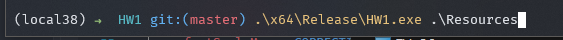
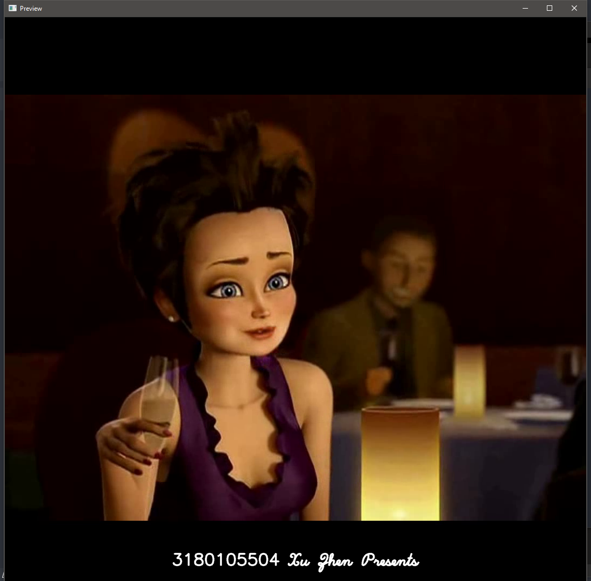
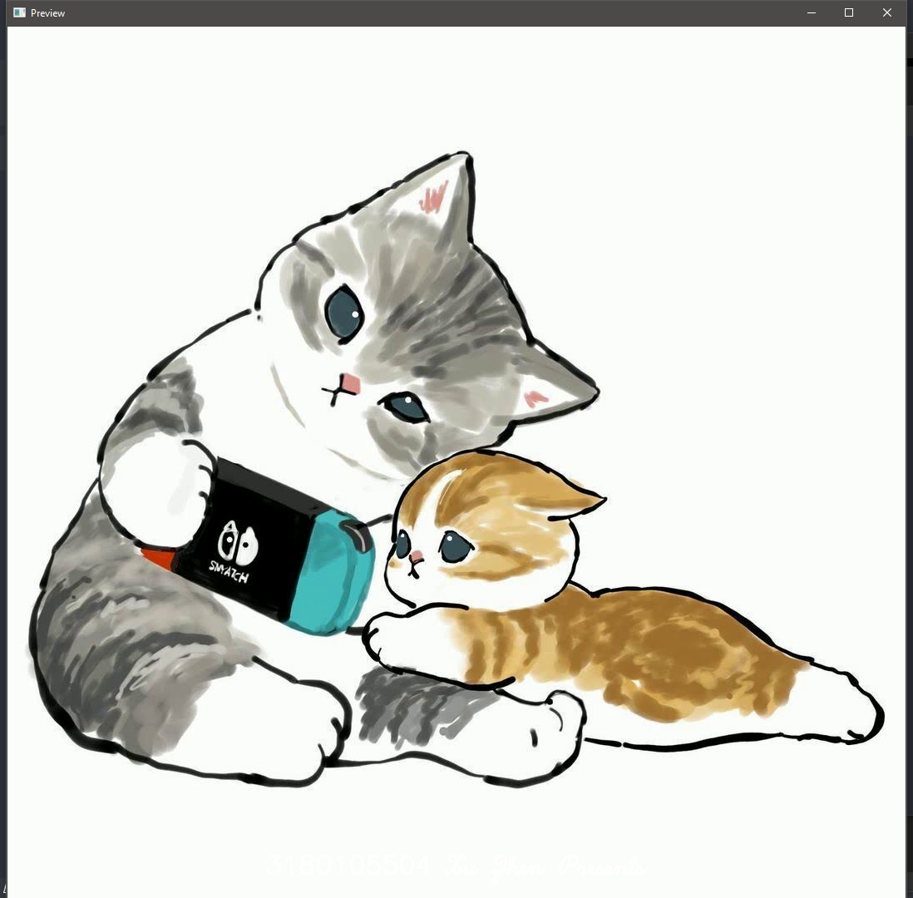
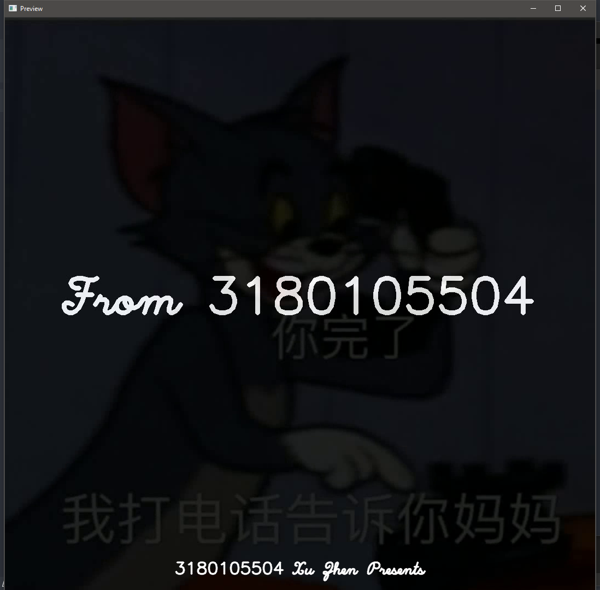
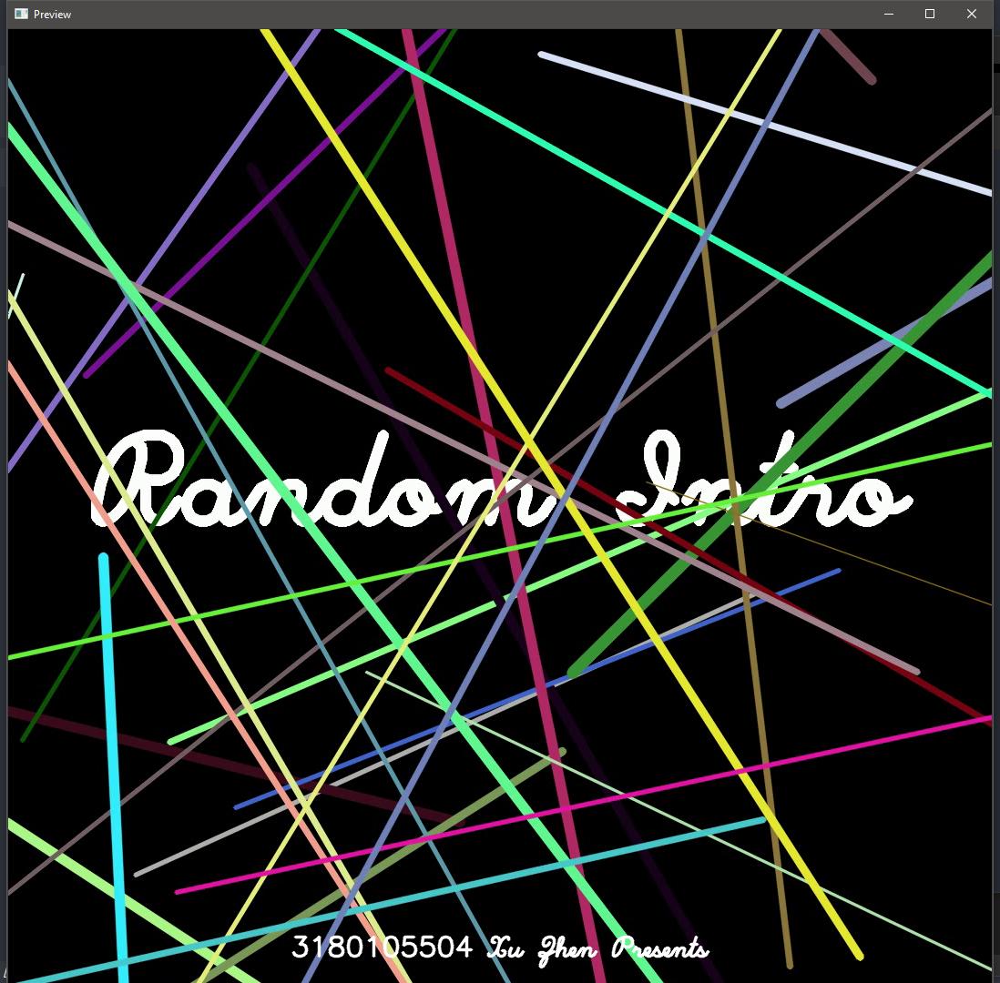
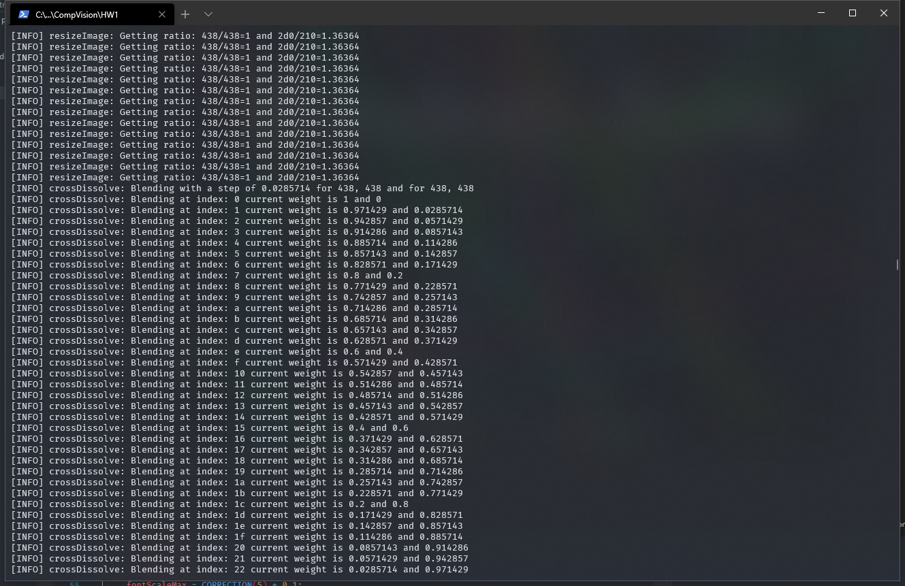
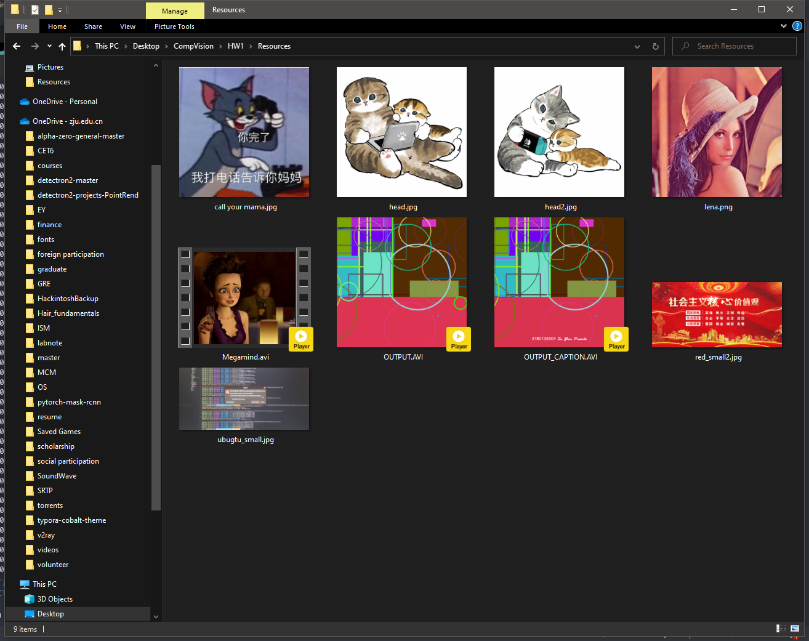
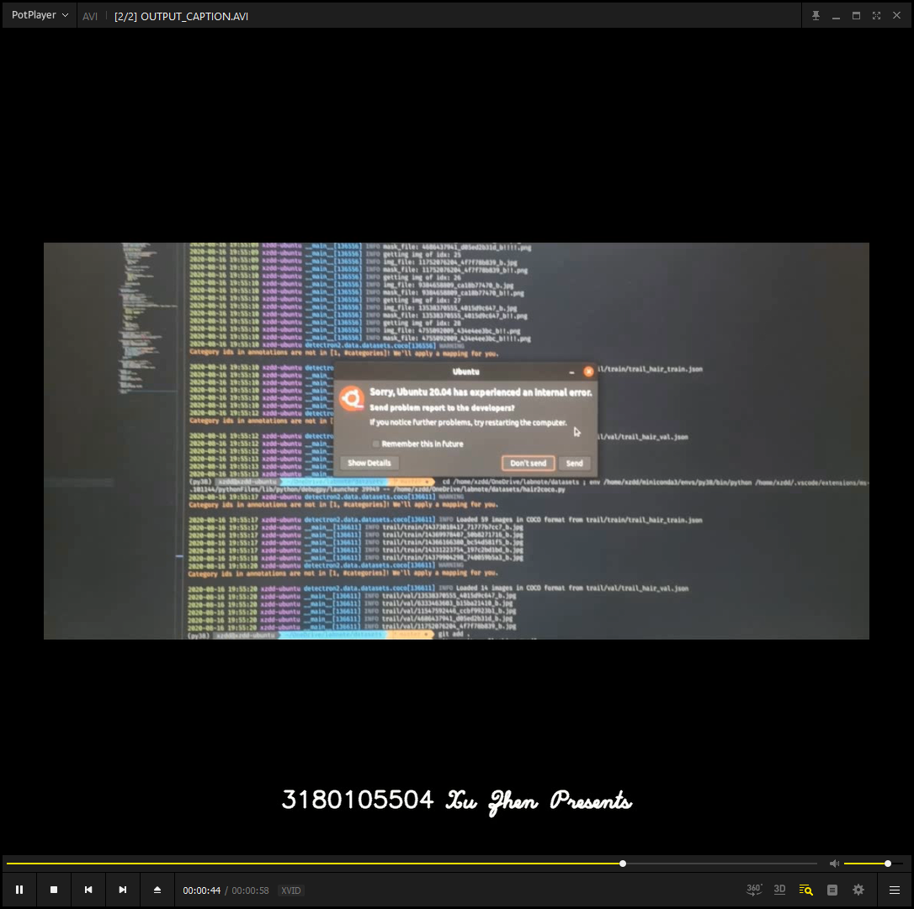
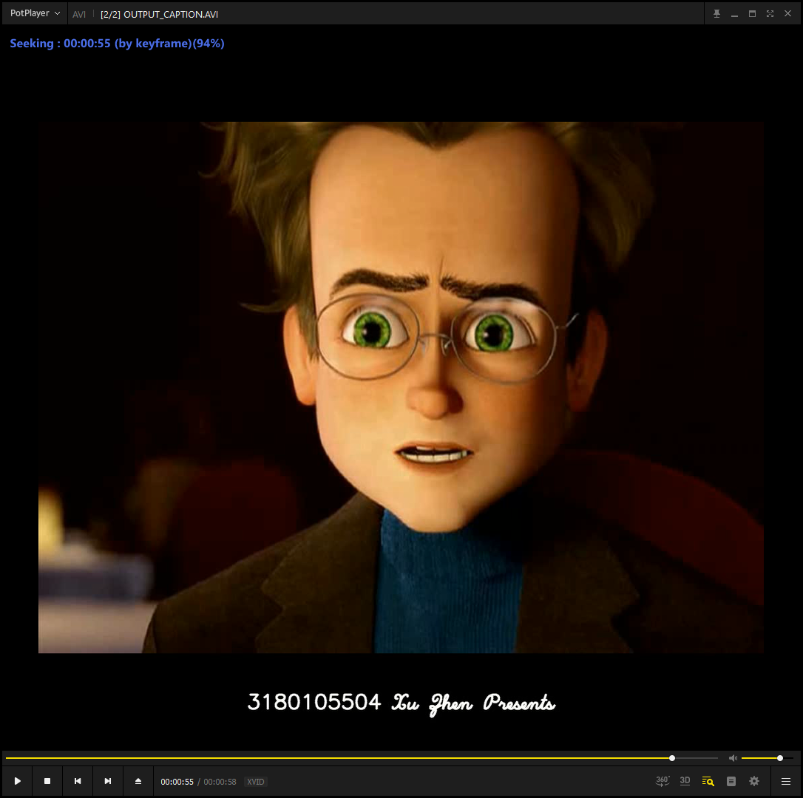

# Homework 1: Familiarize with OpenCV

## File Specification

- `Source`: Contains the source code for this homework, along with a Visual Studio 2019 Solution file
    - `main.cpp`: The main function
    - `include.hpp`: Some header stuff
    - `introVideo.cpp`: Implementation of this homework
    - `random.cpp`: Random introduction generator's implementation
    - **`OTHER FILES`**: NOT IMPORTANT, THOSE FILES ARE OUR LEARNING MATERIAL FOR OPENCV. THEY PAVED THE WAY FOR THIS PROJECT.
- `Resource`: Where the input images and videos exist
- `Readme`: Contains this file, which contains IO specification and IO screenshots
- `Executable`: Visual Studio 2019 Release x64 executable for this homework

## IO Specification

1. You should provide the input directory through **Command-line Arguments**

2. All `.avi`(upper/lower case) in the directory specified above will be treated as video

    All other files will be treated as image

3. We will generate two videos named `OUTPUT.AVI` and `OUTPUT_CAPTION.AVI` to the directory specified above

    So make sure no file with such names exists there

    `OUTPUT.AVI`: The output video without caption, which is my name and student ID

    `OUTPUT_CAPTION.AVI`: The output video with caption, which is my name and student ID

4. We will arrange the output video in such order:

    1. Random Intro
    2. Images
    3. Videos

    All blended with `cross-dissolve`.

    All resized (preserving aspect ratio) to the max size of all the input (max width and max height)

    A caption including my name and student ID will be added to the bottom of the generated video

5. We've provided some sample videos and images, located at `Resource` folder

6. Example:

    ```shell
    .\Executable\HW1.exe .\Resource
    ```


## IO Screenshots


















