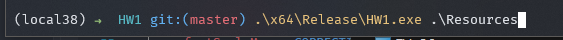
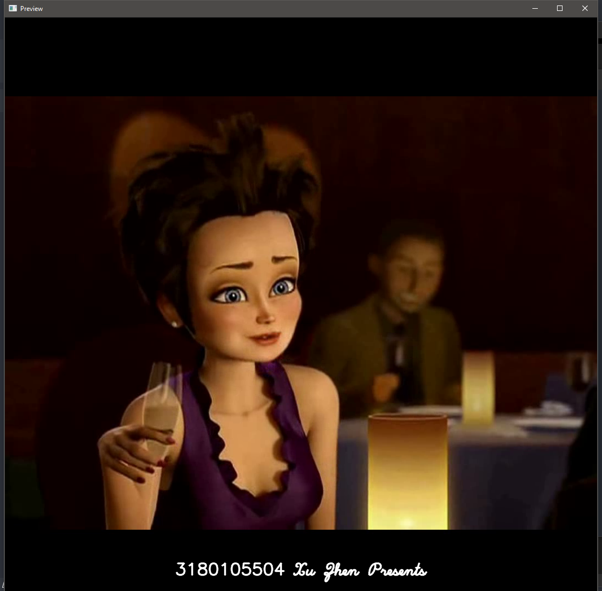
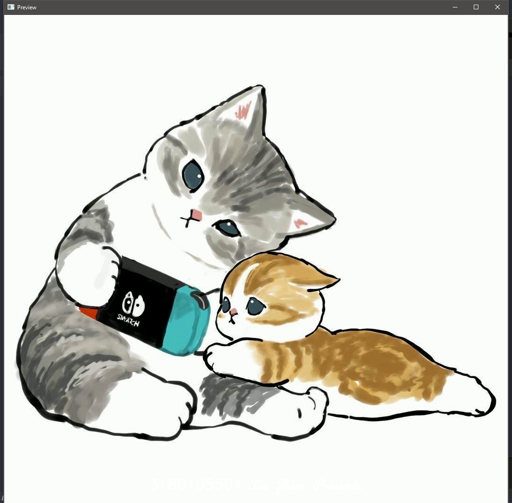
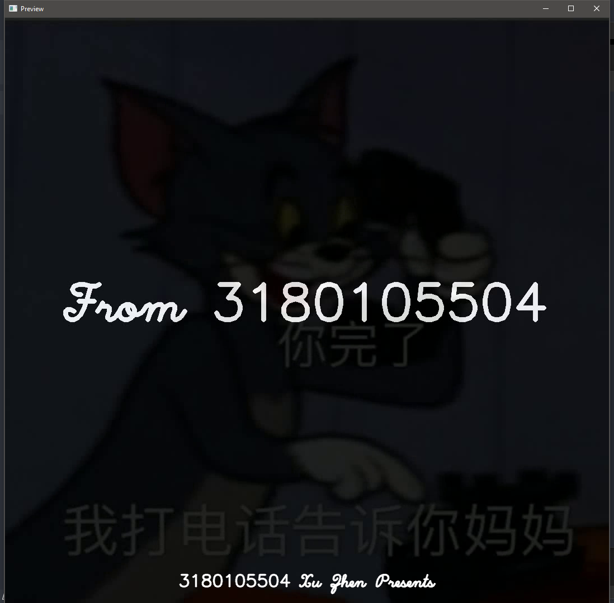
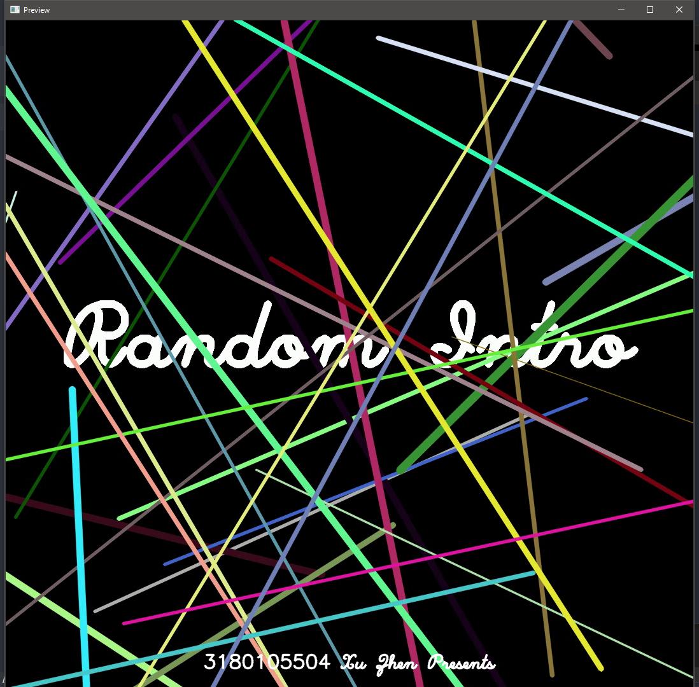
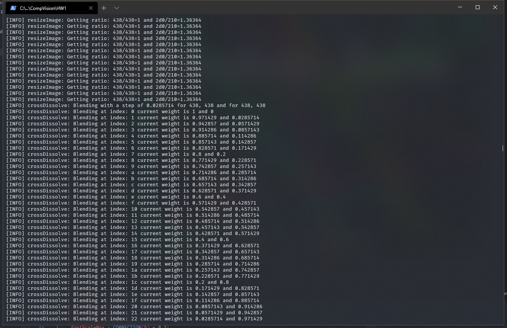
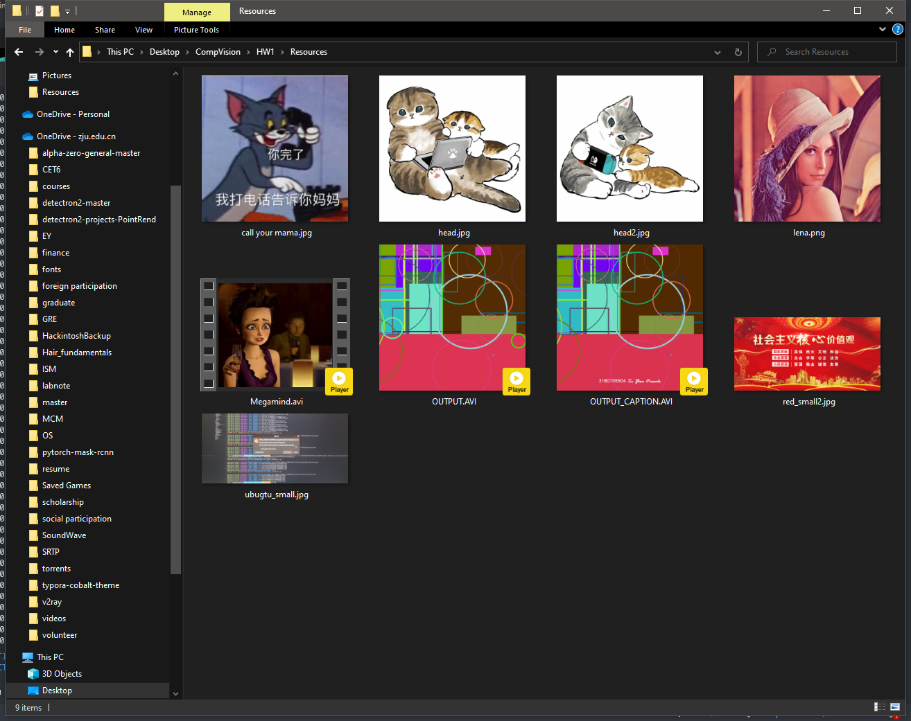
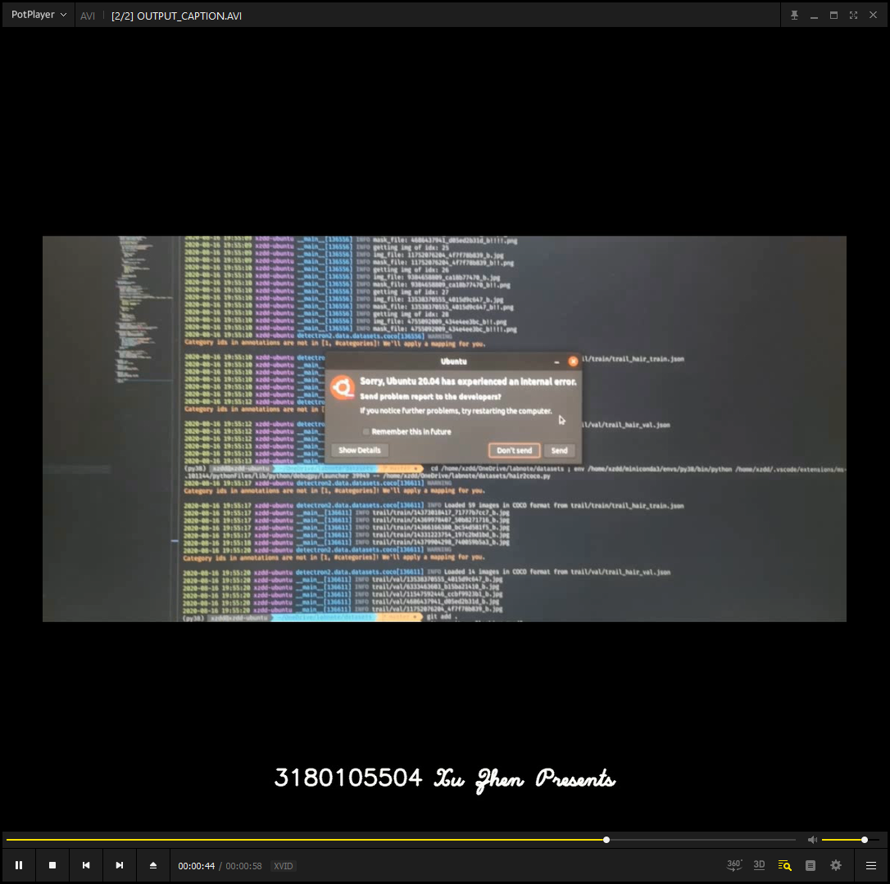
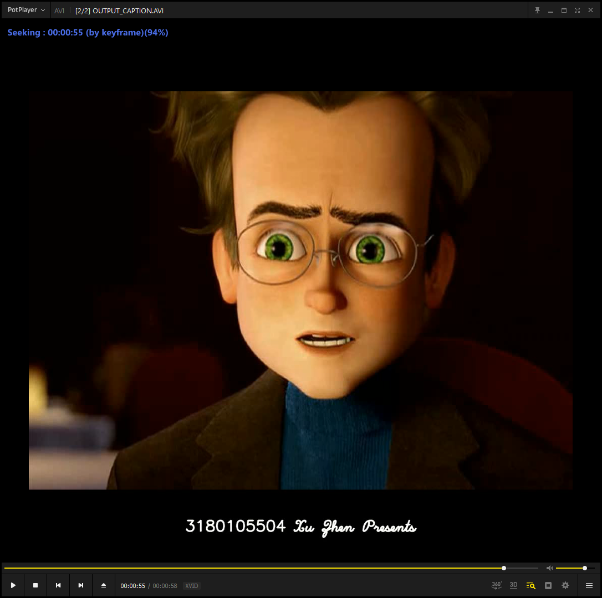

# Homework 1: Familiarize with OpenCV

## Basic Information

- Name: Xu Zhen
- Student ID: 3180105504
- Date: 2020.12.06
- Course: Computer Vision
- Instructor: Mingli Song
- Homework Name: Familiarize with OpenCV

## Homework Requirements and Purpose

**对输入的一个彩色视频与五张以上照片，用OpenCV实现以下功能或要求**: 

1. 命令行格式: “xxx.exe 放视频与照片的文件夹路径” ,（例如 MyMakeVideo.exe C:\input ）【假设该文件夹下面只有一个avi视频文件与若干jpg文件】
    2. 将输入的视频与照片处理成同样长宽后，合在一起生成一个视频；
    3. 这个新视频中，编程生成一个片头，然后按幻灯片形式播放这些输入照片，最后按视频原来速度播放输入的视频；
    4. 新视频中要在底部打上含自己学号与姓名等信息的字幕； 
    5. 有能力的同学，可以编程实现镜头切换效果；
    6. 视频文件无需上载 ，但在实验报告里必须贴图展示输入输出效果


## Homework Principles and Content

### OpenCV

> **OpenCV** (*Open Source Computer Vision Library*) is a [library of programming functions](https://en.wikipedia.org/wiki/Library_(computing)) mainly aimed at real-time [computer vision](https://en.wikipedia.org/wiki/Computer_vision).[[1\]](https://en.wikipedia.org/wiki/OpenCV#cite_note-1) Originally developed by [Intel](https://en.wikipedia.org/wiki/Intel_Corporation), it was later supported by [Willow Garage](https://en.wikipedia.org/wiki/Willow_Garage) then Itseez (which was later acquired by Intel[[2\]](https://en.wikipedia.org/wiki/OpenCV#cite_note-2)). The library is [cross-platform](https://en.wikipedia.org/wiki/Cross-platform) and free for use under the [open-source](https://en.wikipedia.org/wiki/Open-source_software) [Apache 2 License](https://en.wikipedia.org/wiki/Apache_License). Starting with 2011, OpenCV features GPU acceleration for real-time operations[[3\]](https://en.wikipedia.org/wiki/OpenCV#cite_note-3).

> OpenCV is written in [C++](https://en.wikipedia.org/wiki/C%2B%2B) and its primary interface is in C++, but it still retains a less comprehensive though extensive older [C interface](https://en.wikipedia.org/wiki/C_(programming_language)). All of the new developments and algorithms appear in the C++ interface. There are bindings in [Python](https://en.wikipedia.org/wiki/Python_(programming_language)), [Java](https://en.wikipedia.org/wiki/Java_(programming_language)) and [MATLAB](https://en.wikipedia.org/wiki/MATLAB)/[OCTAVE](https://en.wikipedia.org/wiki/GNU_Octave). The API for these interfaces can be found in the online documentation.[[12\]](https://en.wikipedia.org/wiki/OpenCV#cite_note-Cdocs-12) Wrappers in several programming languages have been developed to encourage adoption by a wider audience. In version 3.4, [JavaScript](https://en.wikipedia.org/wiki/JavaScript) bindings for a selected subset of OpenCV functions was released as OpenCV.js, to be used for web platforms.[[13\]](https://en.wikipedia.org/wiki/OpenCV#cite_note-13)

In this homework, we mainly adopted the C++ API as it's OpenCV's main language.

### Video IO

In this homework, we use `VideoCapture` to interact with the video files (currently AVI files) stored on our hard disk.

Full documentation can be found at [VideoCapture Reference](https://docs.opencv.org/3.4/d8/dfe/classcv_1_1VideoCapture.html)

And during the process of learning about video IO, I found these particular tutorials quite helpful:

- [Video Input with OpenCV and similarity measurement](https://docs.opencv.org/master/d5/dc4/tutorial_video_input_psnr_ssim.html)
- [Creating a video with OpenCV](https://docs.opencv.org/master/d7/d9e/tutorial_video_write.html)

### Mat Operations

OpenCV operates around a specific class `Mat` in almost all applications.

`Mat` is a container for matrices. It adopts ARC (automatic reference count), which frees the programmer from managing memory in C++. And it's quite smart and intuitive in case of memory usage: a `Mat` will use the least number it requires to perform some operations.

This (official tutorial)[https://docs.opencv.org/master/d6/d6d/tutorial_mat_the_basic_image_container.html] illustrates some basic operations regarding this class.

### Others

We also need some basic C++ knowledge to make this homework work.

- `std::filesystem` for file operations
- `vector`
- `macros`
- ...

Sadly, we didn't adopt OOP principles in this homework because we're still quite new to OpenCV.

There're some other small modules of OpenCV we're using in this homework:

- `RNG` Random Number Generator
- `namedWindow` `imshow` `destroyWindow` ... for windows operations
- ...


## Homework Procedures

### Main Program

```c++
#include "include.hpp"

int main(int argc, char* argv[])
{
    return IntroVideo(argc, argv);
}
```

Quite self-explanatory.


```c++
/** Main function to call if we want to generate the introVideo for HW1 */
int IntroRandom(int argc, char* argv[])
{
    const string window_name = "Drawing Random Stuff";

    RNG rng(0xffffffff);                                          /** A random generator, same seed, persistant results */
    Mat image = Mat::zeros(WINDOW_HEIGHT, WINDOW_WIDTH, CV_8UC3); /** The mat to draw on */

    imshow(window_name, image);
    waitKey(frameTime);

    /** Intro Video' introduction's title */
    headFontScale = headFontScale * 1.5;
    headFontThickness = headFontThickness * 1.5;
    displayBigEnd(image, window_name, rng, "Random Intro");
    headFontScale = headFontScale / 1.5;
    headFontThickness = headFontThickness / 1.5;

    /** Draw random stuff */
    drawRandomLines(image, window_name, rng);
    drawRandomRectangles(image, window_name, rng);
    drawRandomCircles(image, window_name, rng);

    /** Draw random text */
    displayRandomText(image, window_name, rng, "Initializing...");
    /** Display some big text */
    displayBigEnd(image, window_name, rng, "From 3180105504");
    /** Discard the window unless it covers the terminal */
    destroyWindow(window_name);
    return 0;
}
```

Draws random stuff for our intro video

The specific functions called in this one will be illustrated later.


```c++
/** Main function of generating a intro video for homework 1 */
int IntroVideo(int argc, char* argv[])
{
    // TODO: WRITE HELP MESSAGE
    if (argc < 2) {
        OUTPUTERROR << "Not enough parameters" << endl;
    }
    string path = argv[1];
    Size maxSize(0, 0);
    vector<VideoCapture> videos;  // all videos in the folder
    vector<Mat> images;           // all images in the fiolder

    /** Get the maximum width/height */
    for (const auto& entry : directory_iterator(path)) {
        auto ext = entry.path().extension();  // Find extension
        OUTPUTINFO << entry.path() << " with extension: " << ext << endl;
        if (toLowerCase(ext.string()) == ".avi") {
            videos.emplace_back(entry.path().string());
            if (videos.back().isOpened()) {
                int curWidth = (int)videos.back().get(CAP_PROP_FRAME_WIDTH);
                int curHeight = (int)videos.back().get(CAP_PROP_FRAME_HEIGHT);
                if (curHeight > maxSize.height) {
                    maxSize.height = curHeight;
                }
                if (curWidth > maxSize.width) {
                    maxSize.width = curWidth;
                }
            } else {
                OUTPUTERROR << "Cannot open video: " << entry.path() << endl;
            }
        } else {
            // MARK: RECOGNIZING EVERYTHING ELSE AS IMAGES!
            //images.emplace_back(entry.path().string());
            Mat image;
            image = imread(entry.path().string());
            images.push_back(image);
            if (!images.back().empty()) {
                int curWidth = images.back().cols;
                int curHeight = images.back().rows;
                if (curHeight > maxSize.height) {
                    maxSize.height = curHeight;
                }
                if (curWidth > maxSize.width) {
                    maxSize.width = curWidth;
                }
            } else {
                OUTPUTERROR << "Cannot open image: " << entry.path() << endl;
            }
        }
    }

    OUTPUTINFO << "Getting size " << maxSize << endl;

    /** Properties to be used in VideoWriter */
    int codec = VideoWriter::fourcc('H', '2', '6', '4');
    double fps = 29.97;
    if (videos.empty()) {
        OUTPUTERROR << "NO VIDEO IS PROVIDED, USING DEFAULT FPS/CODEC" << endl;
    } else {
        // MARK: USING THE FIRST VIDEO'S CODEC ANF FPS
        // MARK: ASSUMING AT LEAST ONE VIDEO
        codec = static_cast<int>(videos.front().get(CAP_PROP_FOURCC));  // Get Codec Type- Int form
        fps = videos.front().get(CAP_PROP_FPS);
    }

    string outputPath = (fs::path(path) / "OUTPUT.AVI").string();

    VideoWriter output(outputPath, codec, fps, maxSize, true);
    if (!output.isOpened()) {
        OUTPUTERROR << "Cannot open " << outputPath << " for output" << endl;
        return 1;
    }

    // MARK: 1 ms per frame generation
    randomInit(maxSize, 100, 1, output); /** Set static variable for random.cpp */
    IntroRandom(argc, argv);             /** Generate random introduction for the video */

    const int blendFrame = (int)(1.5 * fps);
    const int staticFrame = (int)(1.5 * fps);

    Mat prev = getRandomLastFrame();
    //images.push_back(prev.clone());
    Mat resized;
    for (const auto& curr : images) {
        resizeImage(curr, resized, maxSize);
        crossDissolve(prev, resized, output, blendFrame); /** Add cross-dissolve blending */
        staticImage(resized, output, staticFrame);        /** Make the image last a while */
        resized.copyTo(prev);                             // ! if we use assignment here, prev will use the same underlying matrix as resized
    }

    for (auto& curr : videos) {
        resizeImage(getFirstFrame(curr), resized, maxSize);  // resizing is done in place
        crossDissolve(prev, resized, output, blendFrame);    /** Add cross-dissolve blending */
        resizeVideo(curr, output, maxSize);                  /** Generated the resized video */
        resizeImage(getLastFrame(curr), resized, maxSize);   /** Get the last frame to be cross-dissolved later */
        resized.copyTo(prev);                                // ! if we use assignment here, prev will use the same underlying matrix as resized
    }
    crossDissolve(prev, Mat::zeros(maxSize, CV_8UC3), output, blendFrame);

    output.release();  // ! close the new video for caption

    VideoCapture raw(outputPath); // Reopen the closed video for input
    if (!raw.isOpened()) {
        OUTPUTERROR << "Cannot open " << outputPath << " for reading" << endl;
    }
    string outputPathCaption = (fs::path(path) / "OUTPUT_CAPTION.AVI").string();
    output = VideoWriter(outputPathCaption, codec, fps, maxSize, true);  // reassign the output variable

    addCaption("3180105504 Xu Zhen Presents", raw, output);

    return 0;
}
```

This functions is the main worker for generating the intro video for this homework. It does the following:

1. Parse the files as **videos or images** and open them
2. Determine a proper size for the generated video
3. Determine other properties for the `VideoWriter` and open it
4. Draw the random intro with the above mentioned size
5. Resize the images and play them as slides, using cross-dissolve to blend them together
6. Resize the videos and blend them using cross-dissolve
7. Close the `VideoWriter` and open the output video as a `VideoCapture`
8. Add an caption to the bottom of the generated video, output it to a separate file

### Video Operations

```c++
/** Add a single line caption to a video
 * Note that the fontScale and fontThickness is in proportion to the video's size
 * We'd open a window "Preview" to preview the generated video
 * ! Speed of "Preview" is NOT the actuall FPS of the output video
 */
void addCaption(string text, VideoCapture& src, VideoWriter& dst)
{
    int width = (int)src.get(CAP_PROP_FRAME_WIDTH);
    int height = (int)src.get(CAP_PROP_FRAME_HEIGHT);
    double fps = src.get(CAP_PROP_FPS);

    int fontScale = 1.0 / 1080 * width;
    int fontThickness = 2.0 / 1080 * width;
    int offset = 40.0 / 1080 * height;
    Size textsize = getTextSize(text, FONT_HERSHEY_SCRIPT_SIMPLEX, fontScale, fontThickness, 0);
    Point org((width - textsize.width) / 2, (height - textsize.height) - offset);
    Mat frame;
    int frameCount = 0;
    namedWindow("Preview");
    while (1) {
        src >> frame;
        if (frame.empty()) {
            break;
        }
        OUTPUTINFO << "Writing caption \"" << text << "\" to frame #" << dec << frameCount << endl;
        putText(frame, text, org, FONT_HERSHEY_SCRIPT_SIMPLEX, fontScale, Scalar(255, 255, 255), fontThickness, LINE_AA);
        imshow("Preview", frame);
        dst << frame;
        frameCount++;
        // MARK: 1 ms
        waitKey(1);
    }
}
```

This function is used to add a caption to an already generated video file (opened as a `VideoCapture` object).

It also creates a named window for the user to preview the result in the process.

We used `getTextSize` to determine a rendered text's proper position on the canvas.

We also adjust the caption's size base on the `Size` of the output video.


```c++
/** Resize a video
 * You can choose to preserve its aspect ratio
 * And you can also choose to rewind the video to the beginning
 * before the resizing starts
 */
void resizeVideo(VideoCapture& src, VideoWriter& dst, Size size, bool preserveRatio, bool rewind)
{
    Mat frame, newFrame;
    if (rewind) src.set(CAP_PROP_POS_FRAMES, 0);  // last frame
    while (1) {
        src >> frame;
        if (frame.empty()) break;  // check if at end
        resizeImage(frame, newFrame, size, preserveRatio);
        dst << newFrame;
    };
    //return newFrame; // ! return last frame
}
```

Quite self-explanatory.

It uses `resizeImage`, which will be illustrated later.


```c++
/** Blend two frames: f1 and f2
 * With cross-dissolve and write the generated sequence to video
 * count is the number of blending frame you need
 */
void crossDissolve(const Mat& f1, const Mat& f2, VideoWriter& video, int count)
{
    // ! manually blending the two images
    double step = 1.0 / count;
    double weight = 1;
    Mat frame;
    // ! from 0 to 1, including 1 here
    OUTPUTINFO << "Blending"
               << " with a step of " << step
               << " for " << f1.cols << ", " << f1.rows
               << " and for " << f2.cols << ", " << f2.rows
               << endl;

    for (int i = 0; i <= count; i++, weight -= step) {
        OUTPUTINFO << "Blending at index: " << i
                   << " current weight is " << weight
                   << " and " << (1 - weight)
                   << endl;
        frame = f1 * weight + f2 * (1 - weight);
        video << frame;
    }
}
```

This is actually an Image operation, but the output destination is a `VideoWriter`.

This function uses **cross-dissolve** to blend two frames to make a segue for the whole video.


```c++
/** Print a static image to a video writer
 * count is the number of frames the image is to be printed
 */
void staticImage(const Mat& image, VideoWriter& video, int count)
{
    for (int i = 0; i < count; i++) {
        video << image;
    }
}
```

This function basically let an image occupy a sequence of frames of a video.


```c++
/** Get the last frame of a video
 * Note that the VideoCapture object's video pointer will be modified
 */
Mat getLastFrame(VideoCapture& video)
{
    Mat last;
    video.set(CAP_PROP_POS_FRAMES, video.get(CAP_PROP_FRAME_COUNT) - 1);  // Last but one frame
    video >> last;                                                        // Get last frame
    return last;
}

/** Get the first (non-black) frame of a video
 * You can choose to skip the first few black frames
 */
Mat getFirstFrame(VideoCapture& video, bool skipBlack)
{
    Mat first;
    video.set(CAP_PROP_POS_FRAMES, 0);  // last frame

    if (skipBlack) {
        double minVal, maxVal = 0;
        while (first.empty() || maxVal == 0) {
            video >> first;
            minMaxLoc(first, &minVal, &maxVal);
            OUTPUTINFO << "Getting maxVal: " << maxVal << endl;
        }

    } else {
        video >> first;
    }
    return first;
}
```

These two functions get the start and end frame for a video, which are quite useful when blending two videos (or video with images) with a segue function like `crossDissolve`

Note that some video may contain black frames for the first one, we've implemented the discarding logic in `getFirstFrame`


### Image Operations

```c++
/** Resize a image (Mat)
 * You can choose to preserve aspect ratio
 */
void resizeImage(const Mat& src, Mat& dst, Size size, bool preserveRatio)
{
    // ? should we use dst.create here?
    dst = Mat::zeros(size, src.type());
    Point origin;
    Size imageSize;

    if (!preserveRatio) {
        imageSize = size;
        origin = Point(0, 0);
    } else {
        OUTPUTINFO << "Getting ratio: " << size.width << "/" << size.height << "=" << (double)size.width / size.height
                   << " and " << src.cols << "/" << src.rows << "=" << (double)src.cols / src.rows
                   << endl;
        if (size.aspectRatio() < (double)src.cols / src.rows) {  // width/height
            imageSize.width = size.width;
            imageSize.height = src.rows * size.width / src.cols;
            origin.x = 0;
            origin.y = (size.height - imageSize.height) / 2;
        } else {
            imageSize.height = size.height;
            imageSize.width = src.cols * size.height / src.rows;
            origin.x = (size.width - imageSize.width) / 2;
            origin.y = 0;
        }
    }

    Rect roiRect(origin, imageSize);
    Mat roiMat = dst(roiRect);
    resize(src, roiMat, imageSize);  // resizing into the region of interest
}
```

This function will resize an image intuitively and it gives you the ability to preserve aspect ratio for an resizing operation.

It adopts region of interest (RoI) mechanism to make this operation memory efficient.

### Drawing Stuff

```c++
/** Generate a random color in cv::Scalar */
Scalar randomColor(RNG& rng)
{
    uint color = (uint)rng;
    OUTPUTINFO << "Getting random number: 0x" << hex << setfill('0') << setw(6) << color << endl;
    return Scalar(color & 0xff, (color >> 8) & 0xff, (color >> 16) & 0xff);
}
```

This function generates a random color using a RNG (Random Number Generator)


```c++
/** write frame to video/preview window */
#define WRITEOUTPUT                                                               \
    imshow(window_name, image);                                                   \
    if (output.isOpened()) output << image;                                       \
    randomLastFrame = image;                                                      \
    if (waitKey(frameTime) >= 0) {                                                \
        OUTPUTERROR << "User want to stop it when drawing: " << dec << i << endl; \
        return -1;                                                                \
    }
```

This Macro writes an image to a window and, if possible, to an opened `VideoWriter` as well.


```c++
int drawRandomLines(Mat image, const string window_name, RNG rng)
{
    Point pt1, pt2;

    for (int i = 0; i < repeatCount; i++) {
        pt1.x = rng.uniform(xMin, xMax);
        pt1.y = rng.uniform(yMin, yMax);
        pt2.x = rng.uniform(xMin, xMax);
        pt2.y = rng.uniform(yMin, yMax);

        line(image, pt1, pt2, randomColor(rng), rng.uniform(1, lineWidthMax), LINE_AA);
        WRITEOUTPUT
    }
    return 0;
}
```

This function draws a random line on the canvas (an image in our case), then it calls the previously defined macro to write its output.


```c++
int drawRandomRectangles(Mat image, const string window_name, RNG rng)
{
    Point pt1, pt2;

    for (int i = 0; i < repeatCount; i++) {
        pt1.x = rng.uniform(xMin, xMax);
        pt1.y = rng.uniform(yMin, yMax);
        pt2.x = rng.uniform(xMin, xMax);
        pt2.y = rng.uniform(yMin, yMax);

        rectangle(image, pt1, pt2, randomColor(rng), MAX(rng.uniform(-3, recLineWidthMax), -1), LINE_AA);
        WRITEOUTPUT
    }

    return 0;
}

int drawRandomEllipses(Mat image, const string window_name, RNG rng)
{
    Point center;
    Size axes;
    double angle;
    for (int i = 0; i < repeatCount; i++) {
        center.x = rng.uniform(xMin, xMax);
        center.y = rng.uniform(yMin, yMax);
        axes.width = rng.uniform(axesMin, axesMax);
        axes.height = rng.uniform(axesMin, axesMax);
        angle = rng.uniform(angleMin, angleMax);

        OUTPUTINFO << "Getting axes" << axes << "for index: " << i << endl;

        ellipse(image, center, axes, angle, angle - 100, angle + 200, randomColor(rng), rng.uniform(-1, elliLineWidthMax), LINE_AA);
        WRITEOUTPUT
    }
    return 0;
}

int drawRandomPolylines(Mat image, const string window_name, RNG rng)
{
    Point pt[2][3];
    const Point* ppt[2] = {pt[0], pt[1]};
    int npt[] = {3, 3};
    for (int i = 0; i < repeatCount; i++) {
        pt[0][0].x = rng.uniform(xMin, xMax);
        pt[0][0].y = rng.uniform(yMin, yMax);
        pt[0][1].x = rng.uniform(xMin, xMax);
        pt[0][1].y = rng.uniform(yMin, yMax);
        pt[0][2].x = rng.uniform(xMin, xMax);
        pt[0][2].y = rng.uniform(yMin, yMax);
        pt[1][0].x = rng.uniform(xMin, xMax);
        pt[1][0].y = rng.uniform(yMin, yMax);
        pt[1][1].x = rng.uniform(xMin, xMax);
        pt[1][1].y = rng.uniform(yMin, yMax);
        pt[1][2].x = rng.uniform(xMin, xMax);
        pt[1][2].y = rng.uniform(yMin, yMax);
        polylines(image, ppt, npt, 2, true, randomColor(rng), rng.uniform(1, lineWidthMax), LINE_AA);
        WRITEOUTPUT
    }
    return 0;
}
int drawRandomFilledPolygons(Mat image, const string window_name, RNG rng)
{
    Point pt[2][3];
    const Point* ppt[2] = {pt[0], pt[1]};
    int npt[] = {3, 3};
    for (int i = 0; i < repeatCount; i++) {
        pt[0][0].x = rng.uniform(xMin, xMax);
        pt[0][0].y = rng.uniform(yMin, yMax);
        pt[0][1].x = rng.uniform(xMin, xMax);
        pt[0][1].y = rng.uniform(yMin, yMax);
        pt[0][2].x = rng.uniform(xMin, xMax);
        pt[0][2].y = rng.uniform(yMin, yMax);
        pt[1][0].x = rng.uniform(xMin, xMax);
        pt[1][0].y = rng.uniform(yMin, yMax);
        pt[1][1].x = rng.uniform(xMin, xMax);
        pt[1][1].y = rng.uniform(yMin, yMax);
        pt[1][2].x = rng.uniform(xMin, xMax);
        pt[1][2].y = rng.uniform(yMin, yMax);
        fillPoly(image, ppt, npt, 2, randomColor(rng), LINE_AA);
        WRITEOUTPUT
    }
    return 0;
}
int drawRandomCircles(Mat image, const string window_name, RNG rng)
{
    for (int i = 0; i < repeatCount; i++) {
        Point center;
        center.x = rng.uniform(xMin, xMax);
        center.y = rng.uniform(yMin, yMax);
        circle(image, center, rng.uniform(0, 300), randomColor(rng), rng.uniform(-1, elliLineWidthMax), LINE_AA);
        WRITEOUTPUT
    }
    return 0;
}
```

These functions adopts a similar logic as `drawRandomLine`

**They're adapted from one of the tutorials mentioned above. We found them interesting to look at so we used them as our introduction section.**


```c++
int displayRandomText(Mat image, const string window_name, RNG rng, string text)
{
    Point org;
    for (int i = 1; i < repeatCount; i++) {
        org.x = rng.uniform(xMin, xMax);
        org.y = rng.uniform(yMin, yMax);

        putText(image, text, org, rng.uniform(0, 8), rng.uniform(fontScaleMin, fontScaleMax), randomColor(rng), rng.uniform(1, fontThickness), LINE_AA);
        WRITEOUTPUT
    }
    return 0;
}
```

This function calls `putText` to draw some text on the output window.


```c++
/** Similar to cross-dissolve */
int displayBigEnd(Mat image, const string window_name, RNG rng, string text, int font)
{
    Size textsize = getTextSize(text, font, headFontScale, headFontThickness, 0);
    Point org((WINDOW_WIDTH - textsize.width) / 2, (WINDOW_HEIGHT) / 2);
    Scalar startColor = randomColor(rng) / 10;

    int step = 2;
    for (int i = 0; i < 255; i += step) {
        image -= Scalar::all(step * 2);  // ! The image should fade faster than the text
        for (auto& value : startColor.val) {
            value += step;
            value = saturate_cast<uchar>(value);
        }
        putText(image, text, org, font, headFontScale, startColor, headFontThickness, LINE_AA);
        WRITEOUTPUT
    }
    return 0;
}
```

This function displays a bigger text on the canvas and use a similar logic as cross-dissolve to make the text pop.


## File Specification

- `Source`: Contains the source code for this homework, along with a Visual Studio 2019 Solution file
    - `main.cpp`: The main function
    - `include.hpp`: Some header stuff
    - `introVideo.cpp`: Implementation of this homework
    - `random.cpp`: Random introduction generator's implementation
    - **`OTHER FILES`**: NOT IMPORTANT, THOSE FILES ARE OUR LEARNING MATERIAL FOR OPENCV. THEY PAVED THE WAY FOR THIS PROJECT.
- `Resource`: Where the input images and videos exist
- `Readme`: Contains this file, which contains IO specification and IO screenshots
- `Executable`: Visual Studio 2019 Release x64 executable for this homework
- `Results`: Sample results after executing `.\Executable\HW1.exe .\Resources\`
    - **==YOU WILL FIND THE GENERATED VIDEO IN THE `SAME` DIR AS YOUR COMMAND LINE ARGUMENT SUGGESTS==**

## IO Specification

1. You should provide the input directory through **Command-line Arguments**

2. All `.avi`(upper/lower case) in the directory specified above will be treated as video

    All other files will be treated as image

3. We will generate two videos named `OUTPUT.AVI` and `OUTPUT_CAPTION.AVI` to the directory specified above

    So make sure no file with such names exists there

    `OUTPUT.AVI`: The output video without caption, which is my name and student ID

    `OUTPUT_CAPTION.AVI`: The output video with caption, which is my name and student ID

    The generated video will adopt the same properties as the first input video.

    If you have multiple videos of different `fps`, only the first one will run optimally.

    But if you have multiple videos of the same `fps`, they will be blended beautifully.

    And it will use `codec=h.264` `fps=29.97` as default if no video is provided.

4. We will arrange the output video in such order:

    1. Random Intro
    2. Images
    3. Videos

    All blended with `cross-dissolve`.

    All resized (preserving aspect ratio) to the max size of all the input (max width and max height)

    A caption including my name and student ID will be added to the bottom of the generated video

5. We've provided some sample videos and images, located at `Resource` folder

6. Example:

    ```shell
    .\Executable\HW1.exe .\Resource
    ```


## IO Screenshots

Under our resource directory, the maximum width and height is `1080*1080`, so our generated video is of that size.

`Megamind.avi` is a `720*528` video to be tested.

==**NOTE THAT WE WILL PROCESS ALL THE AVI FILES IN THE INPUT DIRECTORY (INSTEAD OF ONLY ONE!). IF YOU RUN THE PROGRAM TWICE, YOU'LL INCLUDE THE GENERATED `OUTPUT.AVI` AND `OUTPUT_CAPTION.AVI` AS WELL. SO DELETE THEM BEFORE THE SECOND RUN.**==




















## Thoughts

### OpenCV C++ is quite hard to use...

I personally used `opencv-python` previously, which is seamlessly combined with `numpy` in python, generating a series of intuitive and consistent matrix APIs, whereas in OpenCV C++, we have to learn about a new class `Mat` to be able to operate on images.

And it's **hard**?(maybe "**complicated**" but "**tedious**" is a more accurate description). Good for me, I'm running this homework on a Windows machine with Visual Studio 2019 installed. If I'm to use OpenCV on Linux, I'll have learn about CMake as well...

It's never a bad thing to learn more. But I think I'll use `opencv-python` in the following projects (if possible)

`import opencv` solves it all (on almost all platforms...)

### Alpha Channel

OpenCV seems to be having a problem with alpha channel color, which is actually quite common in modern applications.

> OpenCV is not Photoshop.

I understand we can use weight to achieve the same drawing results, but it's not quite intuitive and convenient. Guess this is just what happens when we're approaching fundamental stuff.

### Division

It's soooo common to forget to convert integers to `double` before we perform a division.

Lots of bug comes from the this missing `static_cast<double>(SOME_STUFF)`.

### SSIM and PSNR

When learning about `VideoCapture` and `VideoWriter`'s basic operations, we explored the famous SSIM (Structural Similarity) for image comparison. It's fun to read the paper when we've got a picture in our head.

The implementation in OpenCV is this:

```c++
// ![get-mssim]: Structural similarity: Image quality assessment from error visibility to structural similarity
Scalar getMSSIM(const Mat& I1, const Mat& I2)
{
    const double C1 = (255 * 0.01) * (255 * 0.01);  // 6.5025
    const double C2 = (255 * 0.03) * (255 * 0.03);  // 58.5225

    int d = CV_32F;
    Mat I1_1, I2_1;
    I1.convertTo(I1_1, d);
    I2.convertTo(I2_1, d);

    Mat I1_2 = I1_1.mul(I1_1);
    Mat I2_2 = I2_1.mul(I2_1);
    Mat I1_I2 = I1_1.mul(I2_1);

    Mat mu1, mu2;
    GaussianBlur(I1_1, mu1, Size(11, 11), 1.5);
    GaussianBlur(I2_1, mu2, Size(11, 11), 1.5);

    Mat mu1_2 = mu1.mul(mu1);
    Mat mu2_2 = mu2.mul(mu2);
    Mat mu1_mu2 = mu1.mul(mu2);

    Mat sigma1_2, sigma2_2, sigma1_sigma2;

    GaussianBlur(I1_2, sigma1_2, Size(11, 11), 1.5);
    sigma1_2 -= mu1_2;
    GaussianBlur(I2_2, sigma2_2, Size(11, 11), 1.5);
    sigma2_2 -= mu2_2;
    GaussianBlur(I1_I2, sigma1_sigma2, Size(11, 11), 1.5);
    sigma1_sigma2 -= mu1_mu2;

    Mat t1, t2, t3;

    t1 = 2 * mu1_mu2 + C1;
    t2 = 2 * sigma1_sigma2 + C2;
    t3 = t1.mul(t2);  // t3 = ((2*mu1_mu2 + C1).*(2*sigma1_sigma_2 + C2))

    t1 = mu1_2 + mu2_2 + C1;
    t2 = sigma1_2 + sigma2_2 + C2;
    t1 = t1.mul(t2);  // t1 =((mu1_2 + mu2_2 + C1).*(sigma1_2 + sigma2_2 + C2))

    Mat ssim_map;
    divide(t3, t1, ssim_map);       // ssim_map = t3./t1;
    Scalar mssim = mean(ssim_map);  // average of ssim_map
    return mssim;
}
// ![get-mssim]: Structural similarity: Image quality assessment from error visibility to structural similarity
```

