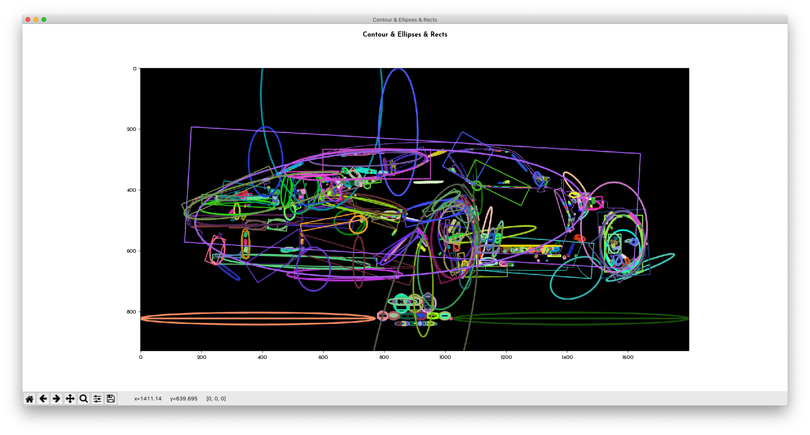
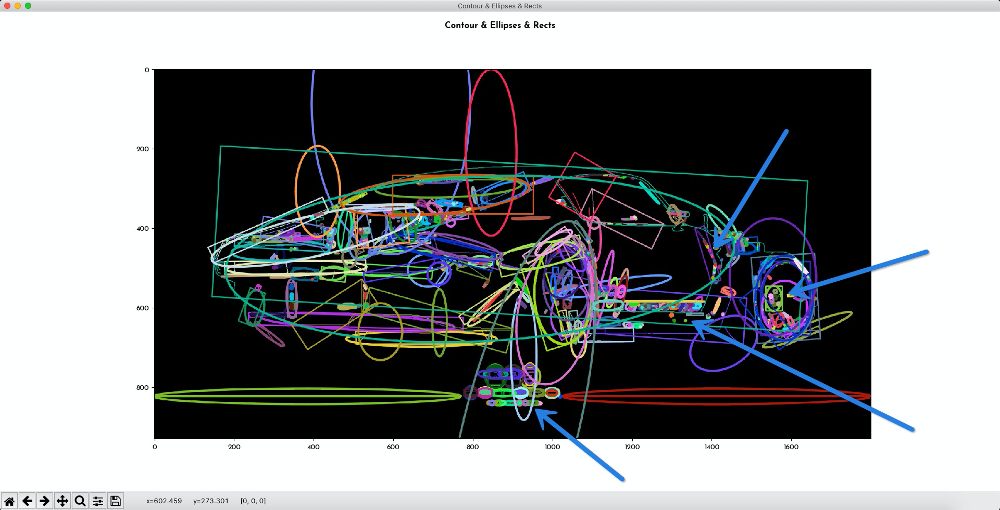

# Homework 2

## Basic Info

Student ID: 3180105504

Student Name: Xu Zhen

Instructor Name: Song Mingli

Course Name: Computer Vision

Homework Name: **Fit Ellipses on an Image**

## Homework Purposes and Requirements

Call *OpenCV*'s `CvBox2D` and `cvFitEllipse2( const CvArr* points )` to fit ellipses on an image.

Actually, the interfaces provided here are already deprecated.

In *OpenCV*'s C++ API, the fitting function is changed to `cv::fitEllipse`

In Python API, the fitting function is `cv2.fitEllipse`

## Homework Principles

We use `Python` to implement this homework.

In this project, we used these packages

```python
#!python
import matplotlib.pyplot as plt
import matplotlib as mpl
import os
import sys  # for commandline arguments
import cv2
import random
import logging
import coloredlogs
import numpy as np
```

Some of them are free since they come with a clean python installation

But `numpy, matplotlib, opencv-python, coloredlogs` should be installed using either `pip` or `conda` manually.

Note that you don't have to explicitly install them all since there're dependency in between. For example, when `matplotlib` is installed before `numpy`, the latter will be automatically installed by `pip` or `conda`.

These're the core functionalities we used from `OpenCV` for this homework:

```python
cv2.Canny(gray, 100, 200)  # using Canny to get edge
cv2.findContours(edge, cv2.RETR_TREE, cv2.CHAIN_APPROX_SIMPLE)
cv2.minAreaRect(contour)
cv2.fitEllipse(contour)
```

The functionality for them are quite self explanatory.

And they're listed here in the sequence in which they will be called by our homework project.

## Homework Procedure

In this homework, we do:

1. Read the image specified by the first user defined parameter

    ```python
    def main():
        if len(sys.argv) > 1:
            imgName = sys.argv[1]
        else:
            imgName = "camaro.jpg"
    
        if not os.path.exists(imgName):
            log.error(f"Cannot find the file specified: {imgName}")
            log.info(f"This program fits ellipses to an image, usage:\npython hw2.py <image name>")
            return 1
        ...
        ...
        ...
    ```

    

2. Convert the image to `rgb` 3 channel image, `grayscale` image and detect edge using `Canny` operator

    ```python
    def getImg(imgName):
        img = cv2.imread(imgName)
        rgb = cv2.cvtColor(img, cv2.COLOR_BGR2RGB)
        gray = cv2.cvtColor(img, cv2.COLOR_BGR2GRAY)
        # img = cv2.imread(imgName, cv2.IMREAD_GRAYSCALE) # assuming the first user defined arg as img name
        edge = cv2.Canny(gray, 100, 200)  # using Canny to get edge
        return img, rgb, gray, edge
    ```

    

3. Find `contours` on the detected `edge` map and fit the contours with `rectangles` and `ellipses` using *OpenCV*

    ```python
    def getFeatures(edge):
        contours, _ = cv2.findContours(edge, cv2.RETR_TREE, cv2.CHAIN_APPROX_SIMPLE)
        rects = [None]*len(contours)
        ellipses = [None]*len(contours)
        for index, contour in enumerate(contours):
            rects[index] = cv2.minAreaRect(contour)
            if contour.shape[0] > 5:
                ellipses[index] = cv2.fitEllipse(contour)
        return contours, rects, ellipses
    ```

    

4. Render the `contours, rectangles, and ellipses` using *OpenCV*

    ```python
    def render(shape, contours, rects, ellipses):
        # plt.figure()
        drawing = np.zeros(shape, dtype='uint8')
        log.info(f"Drawing on shape: {shape}")
        for index, contour in enumerate(contours):
            color = randcolor()
            log.debug(f"Getting random color: {color}")
            cv2.drawContours(drawing, contours, index, color, 1, cv2.LINE_AA)
            if contour.shape[0] > 5:
                cv2.ellipse(drawing, ellipses[index], color, 3, cv2.LINE_AA)
    
            box = cv2.boxPoints(rects[index])
            box = box.astype(int)
            if box.shape[0] > 0:
                cv2.drawContours(drawing, [box], 0, color, 2, cv2.LINE_AA)
    
            # plt.imshow(drawing)
            # plt.show()
    
        return drawing
    ```

    

5. Display the `rgb`, `grayscale`, `edge` map and `render` result using `matplotlib`

    ```python
    def main():
    	...
        ...
        ...
    
        # plt.figure(figsize=(16, 9))
        plt.figure("Fitting")
        plt.suptitle("Fitting ellipses and finding min-area rectangles", fontweight="bold")
        plt.subplot(221)
        plt.title("Original", fontweight="bold")
        plt.imshow(rgb)
        plt.subplot(222)
        plt.title("Grayscale", fontweight="bold")
        plt.imshow(gray, cmap="gray")
        plt.subplot(223)
        plt.title("Canny Edge", fontweight="bold")
        plt.imshow(edge, cmap="gray")
        plt.subplot(224)
        plt.title("Contour & Ellipses & Rects", fontweight="bold")
        plt.imshow(drawing)
        plt.show()
    
    ```

6. Utilities

    ```python
    mpl.rc("font", family=["Josefin Sans", "Trebuchet MS", "Inconsolata"])
    
    log = logging.getLogger(__name__)
    coloredlogs.install(level='INFO')  # Change this to DEBUG to see more info.
    
    
    def randcolor():
        return [random.randint(0, 256) for i in range(3)]
    ```

7. Main function

    ```python
    def main():
        if len(sys.argv) > 1:
            imgName = sys.argv[1]
        else:
            imgName = "camaro.jpg"
    
        if not os.path.exists(imgName):
            log.error(f"Cannot find the file specified: {imgName}")
            log.info(f"This program fits ellipses to an image, usage:\npython hw2.py <image name>")
            return 1
        
        img, rgb, gray, edge = getImg(imgName)
        contours, rects, ellipses = getFeatures(edge)
        drawing = render(img.shape, contours, rects, ellipses)
    
        # plt.figure(figsize=(16, 9))
        plt.figure("Fitting")
        plt.suptitle("Fitting ellipses and finding min-area rectangles", fontweight="bold")
        plt.subplot(221)
        plt.title("Original", fontweight="bold")
        plt.imshow(rgb)
        plt.subplot(222)
        plt.title("Grayscale", fontweight="bold")
        plt.imshow(gray, cmap="gray")
        plt.subplot(223)
        plt.title("Canny Edge", fontweight="bold")
        plt.imshow(edge, cmap="gray")
        plt.subplot(224)
        plt.title("Contour & Ellipses & Rects", fontweight="bold")
        plt.imshow(drawing)
        plt.show()
    ```


## Homework Results




## Thoughts

Python forever...

It's just muuuuch easier to implement things and see how they work out, especially with the recent development of `cv2` API.

With `cv2` we get rid of `CvArr` or `CvMat`, and we embrace `numpy.ndarray`, which is intuitive and easy to work on.

And it's much easier to *borrow* other packages' functionalities too. For example, it's not gonna be as easy to plot figures and stuff using C++, where `matplotlib` doesn't exist.

Although it's a fact that C++ is much faster. But we're not developing a full fledge application here. We're only defining some execution logic to make a toy example to experiment on things and explore around, which will NOT bring too much performance impact because *OpenCV* is doing the heavy lifting with C++ implementation in the background for us to enjoy.


The results look okay, but for a well detailed image, a lot of ellipses will pop up. So a possible improvements among this is try to set a lower bound for the radius in the ellipses (like in hough transform)



But I personally assume this is mainly a result of a too detailed image.


## Appendix

Full source code:

```python
#!python
import matplotlib.pyplot as plt
import matplotlib as mpl
import os
import sys  # for commandline arguments
import cv2
import random  # random color generator
import logging
import coloredlogs
import numpy as np

# Setting up font for matplotlib
mpl.rc("font", family=["Josefin Sans", "Trebuchet MS", "Inconsolata"], weight="medium")

# Setting up logger for the project
log = logging.getLogger(__name__)
coloredlogs.install(level='INFO')  # Change this to DEBUG to see more info.


def randcolor():
    '''
    Generate a random color, as list
    '''
    return [random.randint(0, 256) for i in range(3)]


def getImg(imgName):
    '''
    Load image by name (relative or absolute path)
    Convert BGR to RGB/Grayscale
    Get edge using Canny
    '''
    img = cv2.imread(imgName)
    rgb = cv2.cvtColor(img, cv2.COLOR_BGR2RGB)
    gray = cv2.cvtColor(img, cv2.COLOR_BGR2GRAY)
    edge = cv2.Canny(gray, 100, 200)  # using Canny to get edge
    return img, rgb, gray, edge


def getFeatures(edge):
    '''
    Detect contours in an image
    Get minimum area box / best fit ellilpse of contours
    '''
    contours, _ = cv2.findContours(edge, cv2.RETR_TREE, cv2.CHAIN_APPROX_SIMPLE)
    rects = [None]*len(contours)  # [None, None, None, ...]
    ellipses = [None]*len(contours)  # [None, None, None, ...]

    # All detected contour will have a min area box
    # But only those with more than 5 points will have a ellipse
    for index, contour in enumerate(contours):
        rects[index] = cv2.minAreaRect(contour)
        if contour.shape[0] > 5:
            ellipses[index] = cv2.fitEllipse(contour)
    return contours, rects, ellipses


def render(shape, contours, rects, ellipses):
    '''
    Render the contours, rectangles and ellipses to an image
    for later display
    '''
    # Specifying the data type so that matplotlib won't treat this as a floating point image
    # which will be truncated to [0, 1] (we're uint8 in [0, 255])
    drawing = np.zeros(shape, dtype='uint8')
    log.info(f"Drawing on shape: {shape} with type {drawing.dtype}")
    for index, contour in enumerate(contours):
        color = randcolor()
        log.debug(f"Getting random color: {color}")
        cv2.drawContours(drawing, contours, index, color, 1, cv2.LINE_AA)

        # All detected contour will have a min area box
        # But only those with more than 5 points will have a ellipse
        if contour.shape[0] > 5:
            cv2.ellipse(drawing, ellipses[index], color, 3, cv2.LINE_AA)

        box = cv2.boxPoints(rects[index])
        box = box.astype(int)
        cv2.drawContours(drawing, [box], 0, color, 2, cv2.LINE_AA)

    return drawing


def main():
    '''
    The main logic for this homework
    '''
    # help message
    log.info(f"This program fits ellipses to an image, usage:\npython hw2.py <image name>")
    # User might forget to give any commandline argument
    if len(sys.argv) > 1:
        imgName = sys.argv[1]
    else:
        imgName = "camaro.jpg"
    # Or he/she might mistype the file name
    if not os.path.exists(imgName):
        log.error(f"Cannot find the file specified: {imgName}")
        return 1

    img, rgb, gray, edge = getImg(imgName)
    contours, rects, ellipses = getFeatures(edge)
    drawing = render(img.shape, contours, rects, ellipses)

    # Display all four images in the same figure window
    plt.figure("Fitting")
    plt.suptitle("Fitting ellipses and finding min-area rectangles", fontweight="bold")
    plt.subplot(221)
    plt.title("Original", fontweight="bold")
    plt.imshow(rgb)
    plt.subplot(222)
    plt.title("Grayscale", fontweight="bold")
    plt.imshow(gray, cmap="gray")
    plt.subplot(223)
    plt.title("Canny Edge", fontweight="bold")
    plt.imshow(edge, cmap="gray")
    plt.subplot(224)
    plt.title("Contour & Ellipses & Rects", fontweight="bold")
    plt.imshow(drawing)
    plt.show()

    # Display the detected contours rectangles and ellipses separatedly for examination
    plt.figure("Contour & Ellipses & Rects")
    plt.suptitle("Contour & Ellipses & Rects", fontweight="bold")
    plt.imshow(drawing)
    plt.show()


# with the #!python at the beginning of this file
# you can ommit the python when executing this program
if __name__ == "__main__":
    main()

```

