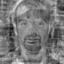

# EigenFace Implementation

大家好，以下为第三次作业内容及注意事项：

 **内容：**

自己写代码实现 Eigenface 人脸识别的训练与识别过程：

1. 假设每张人脸图像只有一张人脸，且两只眼睛位置已知（即可人工标注给出）。每张图像的眼睛位置存在相应目录下的一个与图像文件名相同但后缀名为 txt 的文本文件里，文本文件中用一行、以空格分隔的4个数字表示，分别对应于两只眼睛中心在图像中的位置；

1. 实现两个程序过程（两个执行文件），分别对应训练与识别；

1. 自己构建一个人脸库（至少 40 人，包括自己），课程主页提供一个人脸库可选用；

1. 不能直接调用 OpenCV 里面与 Eigenface 相关的一些函数，特征值与特征向量求解函数可以调用；只能用 C/C++/Python，不能用其他编程语言；GUI只能用 OpenCV 自带的 HighGUI，不能用QT或其他的；平台可以用 Win/Linux/MacOS，建议 Win 优先；

1. 训练程序格式大致为：“mytrain.exe <*能量百分比>* <*model文件名> <其他参数>*…”，用能量百分比决定取多少个特征脸，将训练结果输出保存到 model 文件中。同时将前 10 个特征脸拼成一张图像，然后显示出来；

1. 识别程序格式大致为：“mytest.exe <*人脸图像文件名> <model文件名> <其他参数>*…”，将 model 文件装载进来后，对输入的人脸图像进行识别，并将识别结果叠加在输入的人脸图像上显示出来，同时显示人脸库中跟该人脸图像最相似的图像。

**注意：**

1. 可任意使用钉钉群内给出的三个数据集，其中BioFaceDatabase内.eye文件包含对应图片眼睛位置；Caltec Database内ImageData.mat包含人脸bounding box位置；JAFFE无额外标注；
1. 在实验报告或readme中注明运行环境和运行方法；
1. 截止时间为2021/01/01 23:59。


## Basic Info

- Student ID: 3180105504

- Student Name: Xu Zhen

- Instructor Name: Song Mingli

- Course Name: Computer Vision

- Homework Name: ==EigenFace Implementation==

- Basic Requirements:
    - Implement an EigenFace face recognition trainer/tester pair
    
    - Construct a face database of at least 40 persons (including the author)
    
    - ==Don't== use OpenCV's API for eigenfaces
    
    - APIs relating to eigenvalues/eigenvectors ==can== be used
    
    - No Qt for GUI, only HighGUI that comes with OpenCV can be used
    
        I really don't know why this requirements should exist
    
        OpenCV uses Qt as a backend to display stuff, at least it does so with modern Python interfaces
    
        This is a screenshot when I accidentally discovered this trying to open a window with an SSH connection to my server
    
        

## Experiment Principles

### Matrix & Eigenvalues & Eigenvectors

==Matrix is a form of transformation (square matrices)==

This is especially useful when we're trying to unveal the true nature of a lot of linear algebra concepts with the help of geometry (visualization).

Of course, one can always write abstract symbols and prove one's way throughout the linear algebra sea without having to draw even a single checkerboard, it's still gonna be extremely helpful, especially for us beginners, to understand some of the most basic concepts so deeply that, they're like imprinted into our heads.

Hereby I highly recommend the series brought to you by *3Blue1Brown*, a famous YouTuber, and a mathematician. Link below

[Essence of linear algebra](https://www.youtube.com/watch?v=fNk_zzaMoSs&list=PLZHQObOWTQDPD3MizzM2xVFitgF8hE_ab)

I found these masterpiece series when trying to understand eigen stuff better (eigenvalues, eigenvectors, eigenbasis and of course, eigenfaces)


The most important takeways are:

- Matrices (square) can and should be viewed as a transform where each columns represents the new basis's location

    We can visualize this process by **dragging** [1, 0] to the first column of the transformation matrix, and [0, 1] to the second, assuming a 2 by 2 matrix

- Eigenvectors are vectors that doesn't get knocked off their span when performing the transfromation decribed in the previous term

    Typically, for a 2 by 2 matrix, there's two directions, which, during the **dragging** in the previous item, don't rotate around, but just scales up to a certain degree

    And that **certain degree**, are the eigenvalues


OpenCV gives us some API for computing eigenvectors and eigenvalues. Unfortunately, those direct methods are a bit outdated and don't exist anymore in modern interfaces (especially so if we're using Python as the programming language for performing these CV tasks).

But as we can probably guess from the importance of eigen stuff, there's tons of other resources for us to call. And they all got optimized the heck out of them because people use them sooooo often.


### PCA: Principal Component Analysis

==Intuitively, principal components are the axes, onto which if data points are projected, the projections' distances to the origin get the largest variance==

Similar to eigen stuff, we find it much easier to understand PCA with a few visualization and a detailed illustration with a lot of examples.

This is the script that inspired me the most. Masterpiece indeed. As a techincal report, it got over 2500 citations on Google Scholar

[A tutorial on Principal Components Analysis](https://ourarchive.otago.ac.nz/bitstream/handle/10523/7534/OUCS-2002-12.pdf)


The main takeways are:

- Principal Components are those axes that preserve information about the original data the most

    Take a 2-d checkerboard for example, there's a bunch of points on this plane and they roughly form a straight line

    For simplicity, we assume this rough line to be `y=x`

    Then intuitively, if we memorize the points as the distance to the origin, we'll lose one degree of freedom

    But we'll be able to roughly reconstruct the points by drawing them on the line `y=x` using there distance to the origin

    And this `y=x` would be the **Principal Components** for those bunch of points

- Mathematically, one can compute the principal components by getting the eigenvectors sorted by their corresponding eigenvalues reversely of the covariance matrix of those data points

    A long sentence, right?

    A covariance matrix is a convenient way to write down all the covariance of the data points in question, where its index indicates the orginal data. For example, the value at `[i, j]` is the covariance of `data[i]` and `data[j]`


### Core APIs

#### OpenCV API

```python
def PCACompute(data, mean, eigenvectors=..., maxComponents=...) -> typing.Any:
"""
PCACompute(data, mean[, eigenvectors[, maxComponents]]) -> mean, eigenvectors
.   wrap PCA::operator()


PCACompute(data, mean, retainedVariance[, eigenvectors]) -> mean, eigenvectors
.   wrap PCA::operator()
"""
    ...
```

In our implementation, we provided the user with the option of using `PCACompute` of OpenCV to compute the principal components efficiently.

Note that if we take the most basic approach, we'd have to construct a giant covariance matrix and compute the eigenvectors/eigenvalues of it.

For example, if we're to compute the covariance matrix of some 512 by 512 color image, meaning the covariance matrix would be 3*2^18: 786432 by 786432

**Consider 64-bit double for the entries, we'd be needing 2^36 * 9 * 2^3 Bytes -> 4.5 TiB memory to just store the matrix.**

And this would be totally unacceptable. 

So we advise you to use the OpenCV's implementation for PCA, as long as you provide us with the nEigenFaces you want instead of trying to achieve some sort of **energy percentage**. This would be another issue will discuss later.


Well, but the instructions advise us to use our custom implementation of PCA, so we still implmented that version. You should use that version by tweaking the configuration file for our program.

Don't try computing covariance matrix for a 512*512 color image set, or we'll be asking you for 4.5TiB memory.

Instead, use a smaller image for that kind of computation, which can be set through the configuration file.

Like 128*128 gray image, 2^17 Bytes are pretty reasonable for matrix generation. And a small matrix like that CAN STILL REQUIRE TONS OF TIME TO COMPUTE EIGEN STUFF.


#### Scipy API

```python
@array_function_dispatch(_cov_dispatcher)
def cov(m, y=None, rowvar=True, bias=False, ddof=None, fweights=None,
        aweights=None):
```

As mentioned above, to implement our own version of PCA computation, we'd first construct the covariance matrix for the image data using `numpy.cov`.

We're aware that there's covariance matrix API in OpenCV but the `numpy` one just comes in real handy


Then, with the covariance matrix, we're gonna have to compute its eigenvalues/eigenvectors. Here we used:

```python
def eigsh(A, k=6, M=None, sigma=None, which='LM', v0=None,
          ncv=None, maxiter=None, tol=0, return_eigenvectors=True,
          Minv=None, OPinv=None, mode='normal'):
    """
    Find k eigenvalues and eigenvectors of the real symmetric square matrix
    or complex hermitian matrix A.
    """
```

to compute the eigenvalues and eigenvectors with more efficiency on a real symmetrix square matrix.

Full path of the API is

`scipy.sparse.linalg.eigen.eigsh`

If you're wondering why we're not using the eigenvalue/eigenvector interface of OpenCV, they don't come provided in the new interface `cv2`


#### Others

If we're to retain certain amount of energy when selecting the principal componenets from all eigenvectors, we'll have to firstly compute all the eigenvalues and sum them up. Eventually we'll have to decide how many eigenvalues' sum (descending order) can add up to take the right proportion we want.

Yeah, we do know **the trace of a matrix** is also the sum of all eigenvalues it has. But without the actual eigenvalues, we're not able to determine **how many** eigenvalues we need (when sorted) to take up a fixed proportion of the sum.

So in the previous two sets of APIs, we gave user the priviledge to compute only a fixed number of eigenvalues/eigenvectors, **which is hugely efficient compared to computing all eigenvalues for some matrix.** 

```python
def PCACompute2(data, mean, eigenvectors=..., eigenvalues=..., maxComponents=...) -> typing.Any:
"""
PCACompute2(data, mean[, eigenvectors[, eigenvalues[, maxComponents]]]) -> mean, eigenvectors, eigenvalues
.   wrap PCA::operator() and add eigenvalues output parameter


PCACompute2(data, mean, retainedVariance[, eigenvectors[, eigenvalues]]) -> mean, eigenvectors, eigenvalues
.   wrap PCA::operator() and add eigenvalues output parameter
"""
    ...
```

For OpenCV's implementation, we should use PCACompute2 to compute the eigenvalues/eigenvectors effieciently. By not providing the `maxComponents` parameter, we're to get all the eigenvalues/eigenvectors.

**Note that `PCACompute`, the previous interface, doesn't compute eigenvalues**


### Other APIs

We used `cv2.warpAffine` to transform the input image (to match the eye with our mask)

```python
def warpAffine(src, M, dsize, dst=..., flags=..., borderMode=..., borderValue=...) -> typing.Any:
"""
warpAffine(src, M, dsize[, dst[, flags[, borderMode[, borderValue]]]]) -> dst
.   @brief Applies an affine transformation to an image.
.
.   The function warpAffine transforms the source image using the specified matrix:
.
.   \f[\texttt{dst} (x,y) =  \texttt{src} ( \texttt{M} _{11} x +  \texttt{M} _{12} y +  \texttt{M} _{13}, \texttt{M} _{21} x +  \texttt{M} _{22} y +  \texttt{M} _{23})\f]
.
.   when the flag #WARP_INVERSE_MAP is set. Otherwise, the transformation is first inverted
.   with #invertAffineTransform and then put in the formula above instead of M. The function cannot     
.   operate in-place.
.
.   @param src input image.
.   @param dst output image that has the size dsize and the same type as src .
.   @param M \f$2\times 3\f$ transformation matrix.
.   @param dsize size of the output image.
.   @param flags combination of interpolation methods (see #InterpolationFlags) and the optional        
.   flag #WARP_INVERSE_MAP that means that M is the inverse transformation (
.   \f$\texttt{dst}\rightarrow\texttt{src}\f$ ).
.   @param borderMode pixel extrapolation method (see #BorderTypes); when
.   borderMode=#BORDER_TRANSPARENT, it means that the pixels in the destination image corresponding to  
.   the "outliers" in the source image are not modified by the function.
.   @param borderValue value used in case of a constant border; by default, it is 0.
.
.   @sa  warpPerspective, resize, remap, getRectSubPix, transform
"""
    ...
```

And along the way we also used `cv2.getRotationMatrix2D`

```python
def getRotationMatrix2D(center, angle, scale) -> typing.Any:
"""
getRotationMatrix2D(center, angle, scale) -> retval
.   @brief Calculates an affine matrix of 2D rotation.
.
.   The function calculates the following matrix:
.
.   \f[\begin{bmatrix} \alpha &  \beta & (1- \alpha )  \cdot \texttt{center.x} -  \beta \cdot \texttt{center.y} \\ - \beta &  \alpha &  \beta \cdot \texttt{center.x} + (1- \alpha )  \cdot \texttt{center.y} \end{bmatrix}\f]
.
.   where
.
.   \f[\begin{array}{l} \alpha =  \texttt{scale} \cdot \cos \texttt{angle} , \\ \beta =  \texttt{scale} 
\cdot \sin \texttt{angle} \end{array}\f]
.
.   The transformation maps the rotation center to itself. If this is not the target, adjust the shift. 
.
.   @param center Center of the rotation in the source image.
.   @param angle Rotation angle in degrees. Positive values mean counter-clockwise rotation (the        
.   coordinate origin is assumed to be the top-left corner).
.   @param scale Isotropic scale factor.
.
.   @sa  getAffineTransform, warpAffine, transform
"""
    ...
```

We also used `cv2.equalizeHist` to equalize the histogram for grayscale image:

```python
def equalizeHist(src, dst=...) -> typing.Any:
"""
equalizeHist(src[, dst]) -> dst
.   @brief Equalizes the histogram of a grayscale image.
.
.   The function equalizes the histogram of the input image using the following algorithm:
.
.   - Calculate the histogram \f$H\f$ for src .
.   - Normalize the histogram so that the sum of histogram bins is 255.
.   - Compute the integral of the histogram:
.   \f[H'_i =  \sum _{0  \le j < i} H(j)\f]
.   - Transform the image using \f$H'\f$ as a look-up table: \f$\texttt{dst}(x,y) = H'(\texttt{src}(x,y))\f$
.
.   The algorithm normalizes the brightness and increases the contrast of the image.
.
.   @param src Source 8-bit single channel image.
.   @param dst Destination image of the same size and type as src 
"""
    ...
```

For color images, we shouldn't just do the histogram equalization on all RGB channels, instead we converted the image to `YCbCr` color space, then do a `histEqulization` on the Y component

> **YCbCr**, **Y′CbCr**, or **Y Pb/Cb Pr/Cr**, also written as **YCBCR** or **Y′CBCR**, is a family of [color spaces](https://en.wikipedia.org/wiki/Color_space) used as a part of the [color image pipeline](https://en.wikipedia.org/wiki/Color_image_pipeline) in [video](https://en.wikipedia.org/wiki/Video) and [digital photography](https://en.wikipedia.org/wiki/Digital_photography) systems. Y′ is the [luma](https://en.wikipedia.org/wiki/Luma_(video)) component and CB and CR are the blue-difference and red-difference [chroma](https://en.wikipedia.org/wiki/Chrominance) components. Y′ (with prime) is distinguished from Y, which is [luminance](https://en.wikipedia.org/wiki/Luminance_(relative)), meaning that light intensity is nonlinearly encoded based on [gamma corrected](https://en.wikipedia.org/wiki/Gamma_correction) [RGB](https://en.wikipedia.org/wiki/RGB) primaries.
>
> Y′CbCr color spaces are defined by a mathematical [coordinate transformation](https://en.wikipedia.org/wiki/Coordinate_transformation) from an associated [RGB](https://en.wikipedia.org/wiki/RGB) color space. If the underlying RGB color space is absolute, the Y′CbCr color space is an [absolute color space](https://en.wikipedia.org/wiki/Absolute_color_space) as well; conversely, if the RGB space is ill-defined, so is Y′CbCr.
>
> See [Wikipedia](https://en.wikipedia.org/wiki/YCbCr) for more.

We used `HighGUI` for image display and some other basic image IO functionality from OpenCV

We used `argparse` for constructing a user-friendly interface for our program

We used `JSON` format to store our configuration file. User can check the comment on `EigenFaceUtils.loadConfig` for a detailed illustration on the functionality of all the parameteres available

We'll put it here for convenience

```python
    def loadConfig(self, filename):
        with open(filename, "rb") as f:
            data = json.load(f)
        log.info(f"Loading configuration from {filename}, with content: {data}")
        self.w = data["width"] # mask width
        self.h = data["height"] # mask height
        self.l = np.array(data["left"]) # left eye coordinates, x, y
        self.r = np.array(data["right"]) # right eye coordinates, x, y
        self.isColor = data["isColor"] # whether we should treat the model/input images as colored ones
        self.nEigenFaces = data["nEigenFaces"] # target eigenfaces to construct

        # setting this to null will reduce computation significantly
        # since we'll only have to compute nEigenFaces eigenvalues/eigenvectors
        # setting to a value would disable nEigenFaces parameter, computing from target information retain rate "targetPercentage"
        self.targetPercentage = data["targetPercentage"]

        # whether we should use cv2.PCACompute/cv2.PCACompute2 or our own PCA computation
        # note the builtin methods are much faster and memory efficient if we're only requiring
        # a small subset of all eigenvectors (don't have to allocate the covariance matrix)
        # enabling us to do large scale computation, even with colored image of 512 * 512
        self.useBuiltin = data["useBuiltin"]

        # ! depricated
        # Only HighGUI of OpenCV is supported.\nOther implementation removed due to regulation.
        # whether we should use matplotlib to draw results or HIGHGUI of opencv
        # I think HIGHGUI sucks at basic figure management, I'd prefer matplotlib for figure drawing
        # but if we're looking for a more general solution for GUI, it is a choice
        self.useHighgui = data["useHighgui"]
```

And we used `numpy` and `scipy` for matrix (arrays) manipulation heavily.

Like

- `matmul`
- `norm`
- `transpose`
- `flatten`
- `expand_dims`
- `copy`
- `squeeze`
- `zeros`
- `mean`
- `min`
- `max`

- `reshape`

The model is saved using compression API for numpy

```python
@array_function_dispatch(_savez_compressed_dispatcher)
def savez_compressed(file, *args, **kwds):
    """
    Save several arrays into a single file in compressed ``.npz`` format.

    If keyword arguments are given, then filenames are taken from the keywords.
    If arguments are passed in with no keywords, then stored filenames are
    arr_0, arr_1, etc.
    """
    ...
```

We used `coloredlogs` to make our log info more intuitive for a reader and for us debugger.


### Eigenfaces

There're some basic steps to take when constructing an eigenface-based face recognizor.

We'll have to:

1. Find the eye position of a given database image

    This can be done by hand (annotated by a human)

    Or, for convenience we can also use a haar cascade recognizor, which just comes with OpenCV

    ==I'm aware of the fact that you asked us not to use face recognizor to get the face of the image==

    But I think we're performing this experiment to **learn more about eigenfaces, not to hone our own face recognition skills by labelling all eyes by hand** when already existing eye recognizor can to things much faster. Ain't computational machines created to free us human from doing those repetative work of computation?

    We can say we're rewriting some code to **learn more**

    But I don't think we can learn more **by labelling more eyes**

2. Align all the eyes to the given position of our mask.

    In this process, we'll have to do some image transfor:

    - Translation can be determined from the difference of the mask's two eye center and the given image
    - Rotation can be determined from the tangent of the vector from the left eye to the right one (or the other way around)
    - Scale can be determined from length (norm) of the vector of the previous term

3. Do a **histogram equilization** on the image

    For gray ones, we'd only have to perform a standard equalization, but for the colored image we'll have to firstly convert RGB to a color space including grayscale (or luminance) and perform the histogram equalization on that channel.

4. Compute the **mean face** and subtract it from all the original image data

5. Construct the **covariance matrix**. Let's flatten the aligned, equalized face to batch and compute covariance matrix of all the possible pixel indices

6. Compute the **eigenvalues/eigenvectors** of the above mentioned covariance matrix.

    The eigenvectors with the largest eigenvalues are eigenfaces

7. To express the face in the form of eigenfaces, we'd take the dot product between the flattened image with all the above mentioned eigenvectors. The results that pop out are the compressed version of the image data with respect to the eigenfaces.

8. To reconstruct the face, simple to a matrix multiplication to sum up the weighted eigenvectors and add the mean face mentioned in 4. Unflatten it and we'll get the face

9. To recognize the face. Do a euclidean distance between the weights of the faces in the database and the weights computed in 8. The one with the smallest distance would be the most similar face in the database


## Implementation

**You'll notice that our implementation is pretty long, this is because we adopted detailed logging for a better debugging experience and we supported a tons of options:**

1. You can choose to treat image as grayscale or color image (reconstruction is still done to a color image)

2. You can choose to set the number of eigenfaces beforehand or just set a target information retain rate

3. You can choose the size of the mask and the eye position of the left and the right one

4. You can choose to use OpenCV's implementation of PCA or ours

5. You were also able to choose to use HighGUI or just `matplotlib`, but this part is explicitly removed due to regulation

6. Theoretically, you can use whatever dataset you want, even the eyes/face are not annotated or they're of strange size.

    ==You don't have to stick with the dataset provided by us==

    Because we've done carefully alignment

7. Our implementation doesn't have to be bounded with a certain dataset

    As long as it has some recognizable eye in it

    (And if you provide us with the eye position, we'll polite ask you to say the as:)

    ```python
    """
    We're assuming a <imageFileNameNoExt>.txt for eye position like
    474 247 607 245
    """
    ```

8. The `EigenFaceUtils` class can be configured using a configuration file

    And the configuration can also be saved from a instantiated object

9. The configuration file doesn't have to have a model associated with it explicitly

    The only requirements are that the mask's size are matched and `isColor` field is set correctly

    So you can literally have multiple models linked to a configuration file

### Training

```python
    def train(self, path, imgext, txtext, modelName="model.npz"):
        self.updateEyeDict(path, txtext)
        self.updateBatchData(path, imgext)
        if self.useBuiltin:
            if self.targetPercentage is not None:
                log.info(f"Beginning builtin PCACompute2 for all eigenvalues/eigenvectors")
                # ! this is bad, we'll have to compute all eigenvalues/eigenvectors to determine energy percentage
                self.mean, self.eigenVectors, self.eigenValues = cv2.PCACompute2(self.batch, None)
                log.info(f"Getting eigenvalues/eigenvectors: {self.eigenValues}, {self.eigenVectors}")
                self.updatenEigenFaces()
                # ! dangerous, losing smaller eigenvectors (eigenvalues is small)
                self.eigenVectors = self.eigenVectors[0:self.nEigenFaces]
            else:
                log.info(f"Beginning builtin PCACompute for {self.nEigenFaces} eigenvalues/eigenvectors")
                self.mean, self.eigenVectors = cv2.PCACompute(self.batch, None, maxComponents=self.nEigenFaces)
            log.info(f"Getting mean vectorized face: {self.mean} with shape: {self.mean.shape}")
            log.info(f"Getting sorted eigenvectors:\n{self.eigenVectors}\nof shape: {self.eigenVectors.shape}")
        else:
            self.updateMean()
            self.updateCovarMatrix()
            self.updateEigenVs()

        self.updateFaceDict()
        self.saveModel(modelName)
```

Essentially, this is the training procedure illustated in the previous section

### Reconstruction

```python
    def reconstruct(self, img: np.ndarray) -> np.ndarray:
        assert self.eigenVectors is not None and self.mean is not None

        dst = self.unflatten(self.mean).copy()  # mean face
        flat = img.flatten().astype("float64")  # loaded image with double type
        flat = np.expand_dims(flat, 0)  # viewed as 1 * (width * height * color)
        flat -= self.mean  # flatten subtracted with mean face
        flat = np.transpose(flat)  # (width * height * color) * 1
        log.info(f"Shape of eigenvectors and flat: {self.eigenVectors.shape}, {flat.shape}")

        # nEigenFace *(width * height * color) matmal (width * height * color) * 1
        weights = np.matmul(self.eigenVectors, flat)  # new data, nEigenFace * 1

        # getting the most similar eigenface
        eigen = self.unflatten(self.eigenVectors[np.argmax(weights)])

        # getting the most similar face in the database
        minDist = Infinity
        minName = ""
        for name in tqdm(self.faceDict.keys(), "Recognizing"):
            faceWeight = self.faceDict[name]
            dist = la.norm(weights-faceWeight)
            # log.info(f"Getting distance: {dist}, name: {name}")
            if dist < minDist:
                minDist = dist
                minName = name

        log.info(f"MOST SIMILAR FACE: {minName} WITH RESULT {minDist}")
        face = self.unflatten(self.mean).copy()  # mean face
        faceFlat = np.matmul(np.transpose(self.eigenVectors), self.faceDict[minName])  # restored
        faceFlat = np.transpose(faceFlat)
        face += self.unflatten(faceFlat)

        # luckily, transpose of eigenvector is its inversion
        # Eigenvectors of real symmetric matrices are orthogonal
        # ! the magic happens here
        # data has been lost because nEigenFaces is much smaller than the image dimension span
        # which is width * height * color
        # but because we're using PCA (principal components), most of the information will still be retained
        flat = np.matmul(np.transpose(self.eigenVectors), weights)  # restored
        log.info(f"Shape of flat: {flat.shape}")
        flat = np.transpose(flat)
        dst += self.unflatten(flat)
        if self.isColor:
            ori = np.zeros((self.h, self.w, 3))
        else:
            ori = np.zeros((self.h, self.w))
        try:
            ori = self.getImage(minName)
            log.info(f"Successfully loaded the original image: {minName}")
        except FileNotFoundError as e:
            log.error(e)
        dst = self.normalizeImg(dst)
        eigen = self.normalizeImg(eigen)
        face = self.normalizeImg(face)
        return dst, eigen, face, ori, minName
```

The reconstruction procedure are also already illustrated.

### Modules

#### Face Alignment

Align all the eyes to the given position of our mask.

In this process, we'll have to do some image transfor:

- Translation can be determined from the difference of the mask's two eye center and the given image
- Rotation can be determined from the tangent of the vector from the left eye to the right one (or the other way around)
- Scale can be determined from length (norm) of the vector of the previous term

```python
    def alignFace2Mask(self, face: np.ndarray, left: np.ndarray, right: np.ndarray) -> np.ndarray:
        faceVect = left - right
        maskVect = self.l - self.r
        log.info(f"Getting faceVect: {faceVect} and maskVect: {maskVect}")
        faceNorm = np.linalg.norm(faceVect)
        maskNorm = np.linalg.norm(maskVect)
        log.info(f"Getting faceNorm: {faceNorm} and maskNorm: {maskNorm}")
        scale = maskNorm / faceNorm
        log.info(f"Should scale the image to: {scale}")
        faceAngle = np.degrees(np.arctan2(*faceVect))
        maskAngle = np.degrees(np.arctan2(*maskVect))
        angle = maskAngle - faceAngle
        log.info(f"Should rotate the image: {maskAngle} - {faceAngle} = {angle} degrees")
        faceCenter = (left+right)/2
        maskCenter = (self.l+self.r) / 2
        log.info(f"Getting faceCenter: {faceCenter} and maskCenter: {maskCenter}")
        translation = maskCenter - faceCenter
        log.info(f"Should translate the image using: {translation}")

        if scale > 1:
            # if we're scaling up, we should first translate then do the scaling
            # else the image will get cropped
            # and we'd all want to use the larger destination width*height
            M = np.array([[1, 0, translation[0]],
                          [0, 1, translation[1]]])
            face = cv2.warpAffine(face, M, (self.w, self.h))
            M = cv2.getRotationMatrix2D(tuple(maskCenter), angle, scale)
            face = cv2.warpAffine(face, M, (self.w, self.h))
        else:
            # if we're scaling down, we should first rotate and scale then translate
            # else the image will get cropped
            # and we'd all want to use the larger destination width*height
            M = cv2.getRotationMatrix2D(tuple(faceCenter), angle, scale)
            face = cv2.warpAffine(face, M, (face.shape[1], face.shape[0]))
            M = np.array([[1, 0, translation[0]],
                          [0, 1, translation[1]]])
            face = cv2.warpAffine(face, M, (self.w, self.h))
        return face
```

#### Histogram Equlization

Do a **histogram equilization** on the image

For gray ones, we'd only have to perform a standard equalization, but for the colored image we'll have to firstly convert RGB to a color space including grayscale (or luminance) and perform the histogram equalization on that channel.

```python
    @staticmethod
    def equalizeHistColor(img):
        ycrcb = cv2.cvtColor(img, cv2.COLOR_BGR2YCR_CB)
        channels = cv2.split(ycrcb)
        log.info(f"Getting # of channels: {len(channels)}")
        cv2.equalizeHist(channels[0], channels[0])
        cv2.merge(channels, ycrcb)
        cv2.cvtColor(ycrcb, cv2.COLOR_YCR_CB2BGR, img)
        return img
```

#### Automate the above procedure

```python

    def getImage(self, name, manual_check=False) -> np.ndarray:
        # the load the image accordingly
        if self.isColor:
            img = cv2.imread(name, cv2.IMREAD_COLOR)
        else:
            img = cv2.imread(name, cv2.IMREAD_GRAYSCALE)

        # try getting eye position
        eyes = self.getEyes(name, img)
        log.info(f"Getting eyes: {eyes}")
        if not len(eyes) == 2:
            log.warning(f"Cannot get two eyes from this image: {name}, {len(eyes)} eyes")
            raise EigenFaceException("Bad image")

        # align according to eye position
        dst = self.alignFace2Mask(img, eyes[0], eyes[1])

        # hist equalization
        if self.isColor:
            dst = self.equalizeHistColor(dst)
        else:
            dst = cv2.equalizeHist(dst)

        # should we check every image before/after loading?
        if manual_check:
            cv2.imshow(name, dst)
            cv2.waitKey()
            cv2.destroyWindow(name)
        return dst

    def getImageFull(self, imgname) -> np.ndarray:
        # Load the image specified and check for corresponding txt file to get the eye position from the file
        txtname = f"{os.path.splitext(imgname)[0]}.txt"
        if os.path.isfile(txtname):
            self.updateEyeDictEntry(txtname)

        log.info(f"Loading image: {imgname}")
        return self.getImage(imgname)

    def updateBatchData(self, path="./", ext=".jpg", manual_check=False, append=False) -> np.ndarray:
        # get all image from a path with a specific extension
        # align them, update histogram and add the to self.batch
        # adjust logging level to be quite or not
        prevLevel = coloredlogs.get_level()
        if not manual_check:
            coloredlogs.set_level("WARNING")

        self.pathList = os.listdir(path)
        self.pathList = [os.path.join(path, name) for name in self.pathList if name.endswith(ext)]
        names = self.pathList
        if not append:
            if self.isColor:
                self.batch = np.ndarray((0, self.colorLen))  # assuming color
            else:
                self.batch = np.ndarray((0, self.grayLen))
        bads = []
        for index, name in tqdm(enumerate(names), desc="Processing batch"):
            try:
                dst = self.getImage(name, manual_check)
                flat = dst.flatten()
                flat = np.reshape(flat, (1, len(flat)))
                self.batch = np.concatenate([self.batch, flat])
            except EigenFaceException as e:
                log.warning(e)
                bads.append(index)
        for bad in bads[::-1]:
            del names[bad]

        coloredlogs.set_level(prevLevel)
        log.info(f"Getting {len(names)} names and {self.batch.shape[0]} batch")
        return self.batch

    def updateEyeDict(self, path="./", ext=".eye", manual_check=False) -> dict:
        # get all possible eyes position from the files with a specific extension
        # and add the to self.eyeDict
        prevLevel = coloredlogs.get_level()
        if not manual_check:
            coloredlogs.set_level("WARNING")

        names = os.listdir(path)
        names = [os.path.join(path, name) for name in names if name.endswith(ext)]
        log.info(f"Good names: {names}")
        for name in names:
            # iterate through all txt files
            self.updateEyeDictEntry(name)

        # restore the logging level
        coloredlogs.set_level(prevLevel)
        return self.eyeDict

    def updateEyeDictEntry(self, name):
        # update the dictionary but only one entry
        with open(name, "r") as f:
            lines = f.readlines()
            log.info(f"Processing: {name}")
            for line in lines:  # actually there should only be one line
                line = line.strip()  # get rid of starting/ending space \n
                # assuming # starting line to be comment
                if line.startswith("#"):  # get rid of comment file
                    log.info(f"Getting comment line: {line}")
                    continue
                coords = line.split()
                name = os.path.basename(name)  # get file name
                name = os.path.splitext(name)[0]  # without ext
                if len(coords) == 4:
                    self.eyeDict[name] = np.reshape(np.array(coords).astype(int), [2, 2])
                    order = np.argsort(self.eyeDict[name][:, 0])  # sort by first column, which is x
                    self.eyeDict[name] = self.eyeDict[name][order]
                else:
                    log.error(f"Wrong format for file: {name}, at line: {line}")
        return self.eyeDict[name]
```

#### Get Mean Face

Compute the **mean face** and subtract it from all the original image data

```python
    def updateMean(self):
        assert self.batch is not None
        # get the mean values of all the vectorized faces
        self.mean = np.reshape(np.mean(self.batch, 0), (1, -1))
        log.info(f"Getting mean vectorized face: {self.mean} with shape: {self.mean.shape}")
        return self.mean
```

#### Get Covariance Matrix (if needed)

Construct the **covariance matrix**. Let's flatten the aligned, equalized face to batch and compute covariance matrix of all the possible pixel indices

This procedure would not be necessary if we want to use the OpenCV's implementation of `PCACompute`

```python
    def updateCovarMatrix(self) -> np.ndarray:
        assert self.batch is not None and self.mean is not None
        log.info(f"Trying to compute the covariance matrix")
        # covariance matrix of all the pixel location: width * height * color
        self.covar = np.cov(np.transpose(self.batch-self.mean))  # subtract mean
        log.info(f"Getting covar of shape: {self.covar.shape}")
        log.info(f"Getting covariance matrix:\n{self.covar}")
        return self.covar
```

A costom slow implementation:

```python
    def updateCovarMatrixSlow(self) -> np.ndarray:
        assert self.batch is not None, "Should get sample batch before computing covariance matrix"
        nSamples = self.batch.shape[0]
        self.covar = np.zeros((nSamples, nSamples))
        for k in tqdm(range(nSamples**2), "Getting covariance matrix"):
            i = k // nSamples
            j = k % nSamples
            linei = self.batch[i]
            linej = self.batch[j]
            # naive!!!
            if self.covar[j][i] != 0:
                self.covar[i][j] = self.covar[j][i]
            else:
                self.covar[i][j] = self.getCovar(linei, linej)

    @staticmethod
    def getCovar(linei, linej) -> np.ndarray:
        # naive
        meani = np.mean(linei)
        meanj = np.mean(linej)
        unbiasedi = linei - meani
        unbiasedj = linej - meanj
        multi = np.dot(unbiasedi, unbiasedj)
        multi /= len(linei) - 1
        return multi
```


#### Compute Eigenvalues/Eigenvectors

Compute the **eigenvalues/eigenvectors** of the above mentioned covariance matrix.

The eigenvectors with the largest eigenvalues are eigenfaces

```python
    def updateEigenVs(self) -> np.ndarray:
        assert self.covar is not None

        if self.targetPercentage is not None:
            log.info(f"Begin computing all eigenvalues")
            self.eigenValues = la.eigvalsh(self.covar)
            self.eigenValues = np.sort(self.eigenValues)[::-1]  # this should be sorted
            log.info(f"Getting all eigenvalues:\n{self.eigenValues}\nof shape: {self.eigenValues.shape}")
            self.updatenEigenFaces()

        log.info(f"Begin computing {self.nEigenFaces} eigenvalues/eigenvectors")
        self.eigenValues, self.eigenVectors = sla.eigen.eigsh(self.covar, k=self.nEigenFaces)
        log.info(f"Getting {self.nEigenFaces} eigenvalues and eigenvectors with shape {self.eigenVectors.shape}")

        # always needed right?
        self.eigenVectors = np.transpose(self.eigenVectors.astype("float64"))

        # ? probably not neccessary?
        # might already be sorted according to la.eigen.eigs' algorithm
        order = np.argsort(self.eigenValues)[::-1]
        self.eigenValues = self.eigenValues[order]
        self.eigenVectors = self.eigenVectors[order]

        log.info(f"Getting sorted eigenvalues:\n{self.eigenValues}\nof shape: {self.eigenValues.shape}")
        log.info(f"Getting sorted eigenvectors:\n{self.eigenVectors}\nof shape: {self.eigenVectors.shape}")
```

#### Face Dict

And of course we'd like to express the database with our new eigenface basis

```python
    def updateFaceDict(self) -> dict:
        # compute the face dictionary
        assert self.pathList is not None and self.batch is not None and self.eigenVectors is not None
        # note that names and vectors in self.batch are linked through index
        assert len(self.pathList) == self.batch.shape[0], f"{len(self.pathList)} != {self.batch.shape[0]}"
        for index in tqdm(range(len(self.pathList)), "FaceDict"):
            name = self.pathList[index]
            flat = self.batch[index]
            flat = np.expand_dims(flat, 0)  # viewed as 1 * (width * height * color)
            flat = np.transpose(flat)  # (width * height * color) * 1
            # log.info(f"Shape of eigenvectors and flat: {self.eigenVectors.shape}, {flat.shape}")

            # nEigenFace *(width * height * color) matmal (width * height * color) * 1
            weights = np.matmul(self.eigenVectors, flat)  # new data, nEigenFace * 1
            self.faceDict[name] = weights

        log.info(f"Got face dict of length {len(self.faceDict)}")

        return self.faceDict
```


### Utilities

#### Load/Save Configuration File

```python
    @staticmethod
    def randcolor():
        '''
        Generate a random color, as list
        '''
        return [random.randint(0, 256) for _ in range(3)]

    def loadConfig(self, filename):
        with open(filename, "rb") as f:
            data = json.load(f)
        log.info(f"Loading configuration from {filename}, with content: {data}")
        self.w = data["width"] # mask width
        self.h = data["height"] # mask height
        self.l = np.array(data["left"]) # left eye coordinates, x, y
        self.r = np.array(data["right"]) # right eye coordinates, x, y
        self.isColor = data["isColor"] # whether we should treat the model/input images as colored ones
        self.nEigenFaces = data["nEigenFaces"] # target eigenfaces to construct

        # setting this to null will reduce computation significantly
        # since we'll only have to compute nEigenFaces eigenvalues/eigenvectors
        # setting to a value would disable nEigenFaces parameter, computing from target information retain rate "targetPercentage"
        self.targetPercentage = data["targetPercentage"]

        # whether we should use cv2.PCACompute/cv2.PCACompute2 or our own PCA computation
        # note the builtin methods are much faster and memory efficient if we're only requiring
        # a small subset of all eigenvectors (don't have to allocate the covariance matrix)
        # enabling us to do large scale computation, even with colored image of 512 * 512
        self.useBuiltin = data["useBuiltin"]

        # ! depricated
        # Only HighGUI of OpenCV is supported.\nOther implementation removed due to regulation.
        # whether we should use matplotlib to draw results or HIGHGUI of opencv
        # I think HIGHGUI sucks at basic figure management, I'd prefer matplotlib for figure drawing
        # but if we're looking for a more general solution for GUI, it is a choice
        self.useHighgui = data["useHighgui"]

    def saveConfig(self, filename):
        data = {}
        data["width"] = self.w
        data["height"] = self.h
        data["left"] = self.l.tolist()
        data["right"] = self.r.tolist()
        data["isColor"] = self.isColor
        data["nEigenFaces"] = self.nEigenFaces
        data["targetPercentage"] = self.targetPercentage
        data["useBuiltin"] = self.useBuiltin
        data["useHighgui"] = self.useHighgui

        log.info(f"Dumping configuration to {filename}, with content: {data}")
        with open(filename, "wb") as f:
            json.dump(data, f)
```


#### Load/Save Eigenmodel

```python
    def loadModel(self, modelName):
        # load previous eigenvectors/mean value
        log.info(f"Loading model: {modelName}")
        data = np.load(modelName, allow_pickle=True)
        try:
            self.eigenVectors = data["arr_0"]
        except KeyError as e:
            log.error(f"Cannot load eigenvectors, {e}")
        try:
            self.mean = data["arr_1"]
        except KeyError as e:
            log.error(f"Cannot load mean face data, {e}")
        try:
            self.faceDict = data["arr_2"].item()
        except KeyError as e:
            log.error(f"Cannot load face dict, {e}")
        log.info(f"Getting mean vectorized face: {self.mean} with shape: {self.mean.shape}")
        log.info(f"Getting sorted eigenvectors:\n{self.eigenVectors}\nof shape: {self.eigenVectors.shape}")
        log.info(f"Getting face dict of length: {len(self.faceDict)}")

    def saveModel(self, modelName):
        log.info(f"Saving model: {modelName}")
        np.savez_compressed(modelName, self.eigenVectors, self.mean, self.faceDict)
        log.info(f"Model: {modelName} saved")
```

#### Others


And, there also some other utility functions

```python

    def unflatten(self, flat: np.ndarray) -> np.ndarray:
        # rubust method for reverting a flat matrix
        if len(flat.shape) == 2:
            length = flat.shape[1]
        else:
            length = flat.shape[0]
        if length == self.grayLen:
            if self.isColor:
                log.warning("You're reshaping a grayscale image when color is wanted")
            return np.reshape(flat, (self.h, self.w))
        elif length == self.colorLen:
            if not self.isColor:
                log.warning("You're reshaping a color image when grayscale is wanted")
            return np.reshape(flat, (self.h, self.w, 3))
        else:
            raise EigenFaceException(f"Unsupported flat array of length: {length}, should provide {self.grayLen} or {self.colorLen}")

    def uint8unflatten(self, flat):
        # for displaying
        img = self.unflatten(flat)
        return img.astype("uint8")

    def updatenEigenFaces(self) -> int:
        assert self.eigenValues is not None
        # get energy
        self.nEigenFaces = len(self.eigenValues)
        targetValue = np.sum(self.eigenValues) * self.targetPercentage
        accumulation = 0
        for index, value in enumerate(self.eigenValues):
            accumulation += value
            if accumulation > targetValue:
                self.nEigenFaces = index + 1
                log.info(f"For a energy percentage of {self.targetPercentage}, we need {self.nEigenFaces} vectors from {len(self.eigenValues)}")
                break  # current index should be nEigenFaces

        return self.nEigenFaces

    # ! unused
    def updateEigenFaces(self) -> np.ndarray:
        assert self.eigenVectors is not None
        log.info(f"Computing eigenfaces")
        self.eigenFaces = np.array([self.unflatten(vector) for vector in self.eigenVectors])
        log.info(f"Getting eigenfaces of shape {self.eigenFaces.shape}")
        return self.eigenFaces

    @staticmethod
    def normalizeImg(mean: np.ndarray) -> np.ndarray:
        return ((mean-np.min(mean)) * 255 / (np.max(mean)-np.min(mean))).astype("uint8")

    def drawEigenFaces(self, rows=None, cols=None) -> np.ndarray:
        assert self.eigenFaces is not None
        # get a canvas for previewing the eigenfaces
        faces = self.eigenFaces
        if rows is None or cols is None:
            faceCount = faces.shape[0]
            rows = int(math.sqrt(faceCount))  # truncating
            cols = faceCount // rows
            while rows*cols < faceCount:
                cols += 1
            # has to be enough
        else:
            faceCount = rows * cols
        log.info(f"Getting canvas for rows: {rows}, cols: {cols}, faceCount: {faceCount}")

        if self.isColor:
            canvas = np.zeros((rows * faces.shape[1], cols * faces.shape[2], 3), dtype="uint8")
        else:
            canvas = np.zeros((rows * faces.shape[1], cols * faces.shape[2]), dtype="uint8")

        for index in range(faceCount):
            i = index // cols
            j = index % cols
            canvas[i * faces.shape[1]:(i+1)*faces.shape[1], j * faces.shape[2]:(j+1)*faces.shape[2]] = self.normalizeImg(faces[index])
            log.info(f"Filling EigenFace of {index} at {i}, {j}")

        return canvas

    def getMeanFace(self) -> np.ndarray:
        assert self.eigenFaces is not None
        faces = self.eigenFaces
        mean = np.mean(faces, 0)
        mean = np.squeeze(mean)
        mean = self.normalizeImg(mean)
        log.info(f"Getting mean eigenface\n{mean}\nof shape: {mean.shape}")
        return mean
```


## Usage and Experiments

Check out the `train.py` and `test.py` file for more detailed implementation

And there's another list of options:

**You'll notice that our implementation is pretty long, this is because we adopted detailed logging for a better debugging experience and we supported a tons of options:**

1. You can choose to treat image as grayscale or color image (reconstruction is still done to a color image)

2. You can choose to set the number of eigenfaces beforehand or just set a target information retain rate

3. You can choose the size of the mask and the eye position of the left and the right one

4. You can choose to use OpenCV's implementation of PCA or ours

5. You were also able to choose to use HighGUI or just `matplotlib`, but this part is explicitly removed due to regulation

6. Theoretically, you can use whatever dataset you want, even the eyes/face are not annotated or they're of strange size.

    ==You don't have to stick with the dataset provided by us==

    Because we've done carefully alignment

7. Our implementation doesn't have to be bounded with a certain dataset

    As long as it has some recognizable eye in it

    (And if you provide us with the eye position, we'll polite ask you to say the as:)

    ```python
    """
    We're assuming a <imageFileNameNoExt>.txt for eye position like
    474 247 607 245
    """
    ```

8. The `EigenFaceUtils` class can be configured using a configuration file

    And the configuration can also be saved from a instantiated object

9. The configuration file doesn't have to have a model associated with it explicitly

    The only requirements are that the mask's size are matched and `isColor` field is set correctly

    So you can literally have multiple models linked to a configuration file

### Basic Usage

Basically, you set your configuration file like this:

```json
{
    "width": 512,
    "height": 512,
    "left": [
        188,
        188
    ],
    "right": [
        324,
        188
    ],
    "isColor": true,
    "nEigenFaces": 1000,
    "targetPercentage": null,
    "useBuiltin": true,
    "useHighgui": true
}
```

Eye positions would be pretty straight forward.

`isColor` defines how our program will treat the input images and generate output image

`nEigenFaces` defines the number of eigenfaces you want to generate, this option can be overwritten by `targetPercentage`, which is the target information retain rate you want to achieve.

If `targetPercentage` is set to `null` here (`None` in python implementation), we'll use `nEigenFaces`. Else we'll try computing `nEigenFaces` manually.

`useBuiltIn` means you want to use the `PCACompute` implementation of OpenCV, which is way more faster and memory efficient than our own version.

`useHighgui` is depricated. Leave it to `true`


Then you can run the `train.py` or `test.py` with the correct arguments provided:

You can print the help message using `python train.py -h` or `python test.py -h`

```
usage: train.py [-h] [-p PATH] [-i IMGEXT] [-t TXTEXT] [-c CONFIG] [-m MODEL]       

We're assuming a <imageFileNameNoExt>.txt for eye position like
474 247 607 245
Comment line starting with # will be omitted
Or we'll use OpenCV's haarcascade detector to try locating eyes' positions

optional arguments:
  -h, --help            show this help message and exit
  -p PATH, --path PATH  The path of the data, we're assuming that all files are     
                        under this directory
  -i IMGEXT, --imgext IMGEXT
                        The extension of the image file like .jpg, .png or even     
                        .pgm
  -t TXTEXT, --txtext TXTEXT
                        The text file extension we want to read eye positions off   
                        from, usually .txt. But others will work too
  -c CONFIG, --config CONFIG
                        The configuration file for the eigenface utility instance   
  -m MODEL, --model MODEL
                        The model trained with this eigenface utility
```

```
usage: test.py [-h] [-i INPUT] [-m MODEL] [-c CONFIG] [-o OUTPUT]

We're assuming a <imageFileNameNoExt>.txt for eye position like
474 247 607 245
Comment line starting with # will be omitted
Or we'll use OpenCV's haarcascade detector to try locating eyes' positions

Note that if you want to save the recognition result
pass -o argument to specify the output file name
It's highly recommended to do so since OpenCV can't even draw large window properly...

optional arguments:
  -h, --help            show this help message and exit
  -i INPUT, --input INPUT
                        The image we want to reconstruct and recognize on
  -m MODEL, --model MODEL
                        The model trained with this eigenface utility
  -c CONFIG, --config CONFIG
                        The configuration file for the eigenface utility instance   
  -o OUTPUT, --output OUTPUT
                        The output file to save the reconstruction/recognition      
                        result. If not specified, the program WILL NOT SAVE THE     
                        RESULT
```


An example run would be:

```shell
python train.py -p "MyDataSet" -i .jpg -t .txt -c builtin.json -m model.color.npz

python test.py -i image_0318.jpg -m model.color.npz -c builtin.json -o similar.png
```

### Dataset

Our `EigenFaceUtils` can operate on the given dataset and also our own.

We constructed our dataset by labelling the eye position of *Caltec Database* and adding a few of the developer‘s face.

It was pretty awkward...

To make our life simplier, we only selected those images in *Caltec Database* that has a recognizable eyes to OpenCV's haar cascade recognizer.

And hand labelled the developer's eyes.

We provided 7 images of the developer, with label:

```python
"image_xz_0001.jpg", "image_xz_0001.txt"
"image_xz_0002.jpg", "image_xz_0002.txt"
"image_xz_0003.jpg", "image_xz_0003.txt"
"image_xz_0004.jpg", "image_xz_0004.txt"
"image_xz_0005.jpg", "image_xz_0005.txt"
"image_xz_0006.jpg", "image_xz_0006.txt"
"image_xz_0007.jpg", "image_xz_0007.txt"
```

You can find the dataset in `MyDataSet` directory under the source directory


All other images in this directory are also labelled.


### Experiments And Results

#### Training

We trained our eigenface model using this setup:

```json
{
    "width": 512,
    "height": 512,
    "left": [
        188,
        188
    ],
    "right": [
        324,
        188
    ],
    "isColor": true,
    "nEigenFaces": 1000,
    "targetPercentage": null,
    "useBuiltin": true,
    "useHighgui": true
}
```

And we used this command on a Ubuntu machine:

```shell
./train.py -p "MyDataSet" -i .jpg -t .txt -c builtin.json -m model.MyDataSet512x512x3.npz
```

with hardware specification:

```
                          ./+o+-       xzdd@xzdd-ubuntu
                  yyyyy- -yyyyyy+      OS: Ubuntu 20.04 focal
               ://+//////-yyyyyyo      Kernel: x86_64 Linux 5.4.0-58-generic
           .++ .:/++++++/-.+sss/`      Uptime: 3d 13h 49m
         .:++o:  /++++++++/:--:/-      Packages: 1909
        o:+o+:++.`..```.-/oo+++++/     Shell: zsh 5.8
       .:+o:+o/.          `+sssoo+/    Disk: 338G / 670G (54%)
  .++/+:+oo+o:`             /sssooo.   CPU: Intel Core i7-9700 @ 8x 4.7GHz [34.0°C]
 /+++//+:`oo+o               /::--:.   GPU: GeForce RTX 2080 Ti
 \+/+o+++`o++o               ++////.   RAM: 951MiB / 15921MiB
  .++.o+++oo+:`             /dddhhh.
       .+.o+oo:.          `oddhhhh+
        \+.++o+o``-````.:ohdhhhhh+
         `:o+++ `ohhhhhhhhyo++os:
           .o:`.syhhhhhhh/.oo++o`
               /osyyyyyyo++ooo+++/
                   ````` +oo+++o\:
                          `oo++.
```

This is the program loading images and aligning them to our mask.


This is the program computing eigenvectors/eigenvalues using `PCA`


Note that we set `targetPercentage` to `null` so we'll use `nEigenFaces: 1000` to try computing 1000 eigenfaces (possibly 512\*512\*3=786432)

Eventually we can only get 345 eigenfaces:


And this is the program compressing image data using eigenfaces

**The compressed image data, from ((512x512x3)^2)x8 bits to 345 x 512x512x3x64 bit (or we could even use 8 bit values), gets a compression ratio of 345x8/(512x512x3) = 0.0035**

Then it tries to save the model to the file we specified in the commandline arguments


And this is what happens when no GUI is booted up and we tried to show windows using `cv2.imshow`


Fortunately, we'll save the images to files before loading all of them to the screen.

So if your running on a server without a display, this is the `success` message for our program

Let's checkout the result:

1. We specified a target number of eigenfaces of 1000

    But only 345 valid eigenvalues are computed, this is pretty reasonable

2. After alignment and color histogram equlization, we can get a mean face:

    

3. This is the first few eigenfaces:

    

    The mean eigenface:

    

    And we'd also generate a file with all the eigenfaces for you to exam:

    But it's a little bit too large to be displayed here:

    

4. We've got a model of size: `-rw-rw-r-- 1 xzdd xzdd 2.0G Dec 28 11:08  model.MyDataSet512x512x3.npz`

#### Testing

Then, with the model and corresponding configuration file, we can use the eigenfaces we computed to compress our own image and get the reconstruction.

Then by comparing the Euclidean Distance between the projected test image with that of the ones in the database (saved to model), we can get the most similar face from the database and display (or render to file)

This is what we're going to do:

1. Load the model, including all eigenvectors(eigenfaces), the mean face vector and all compressed image data

2. Load the test image and go through the typical preprocessing procedure of alignment and histogram equilization

3. Do a matrix multiplication between the eigenvectors and the loaded (processed) test image to retrieve the weight (compressed version of the test image)

4. Do a Euclidean Distance comparison between all the images in the database (compressed using eigenface) to find the most similar image in the database (with smallest Euclidean Distance)

5. Reconstruct the loaded test image using eigenvectors:

    ```python
    img = mean
    img += np.mul(np.transpose(vectors), weights)
    ```

6. Reconstruct the most similar image in the database using the same method decribed above

7. Render those image to a canvas and label them, providing with necessary name attributes for you to view them

8. The rendered image are ordered like:

    **Original::Reconstructed Original::Most Weighted Eigenface::Reconstructed Most Similar Database Image::Original Most Similar Database Images**

**Testing with an unseen image (me):**


The command we used were:

```shell
./test.py -i image_xz_0002.jpg -m model.MyDataSet512x512x3.npz -c builtin.json -o similarxz0002.png
```

You can see that we were using a server so no windows could be opened.

But luckily the images are saved to the directory, so you can check them via either some service on your server or `scp` them back to your local directory


We rendered the images at full size, so this should be a 512 by 5x512 image

**You can see the reconstructed test image do resembles me in some way.**

And it corrected my closed eyes (due to the fact that most of the images in the dataset are open-eyed) and tilted head (due to unaligned labelling)

Moreover, even my clothes are being reconstructed

On the right side is the most similar database image to the one being tested and the person on that is indeed me.

==The most astonishing part is that: the reconstructed database image is almost identical to the orignal one, meaning the compression loses almost no data at all, even though the compression ratio is already 0.0035 (without the whole model)==

During the testing, you can see the speed of recognizing the face is indeed pretty fast

(Even though, due to the fact that we saved our eigenvectors using 64-bit float values with compression, the model file itself is pretty large and chunky to load from dist)

Another test result:


**Testing with an existing image:**


From the existing images' result, we can also confirm that the compression is indeed enough for accuracy and reducing dimension can significantly reduce the time required to do the computation of other kinds (utilizing change of basis)


### Additional Experiments

#### Additional Training

**Training with `isColor=false`, `targetPercentage=null` and `useBuiltn=false`:**

The configuration we used:

```json
{
    "width": 128,
    "height": 128,
    "left": [
        48,
        48
    ],
    "right": [
        80,
        48
    ],
    "isColor": false,
    "nEigenFaces": 50,
    "targetPercentage": null,
    "useBuiltin": false,
    "useHighgui": true
}
```

Here we're using grayscale training and our own implementation of PCA

We also constructed a small dataset to speed things up: `MySmallDataSet`

Everyone has only three faces here.

Here the `targetPercentage` is set to null, so we **won't have to compute all eigenvalues** to try reaching the target information retain rate


Note that computing **32 eigenvalues/eigenvectors** took **8 seconds**

Of course we'd get the basic results:

Mean Eigenfaces:



First 12 Eigenfaces:


Then we performed another training using `targetPercentage=0.95` to retain 0.95 of all the information

**Training with `targetPercentage=0.95`**

```json
{
    "width": 128,
    "height": 128,
    "left": [
        48,
        48
    ],
    "right": [
        80,
        48
    ],
    "isColor": false,
    "nEigenFaces": 50,
    "targetPercentage": 0.95,
    "useBuiltin": false,
    "useHighgui": true
}
```

Other procedures are purely identical


And this mean to compute that 0.95 ratio without providing the function with the actual number of eigenvectors we want, we'd wait an additional **8 minutes** for this small dataset with only 45 images and a processed size of 128x128x1

It's easy to notice that the results are the same


**Training with target eigenface number = 50**


**Training with target eigenface number = 100**


You'll notice even getting more usable eigenvectors is faster than computing all of the eigenvalues

#### Additional Testing

Then we performed the test decribed in the colored image section

32:


50:


100:


