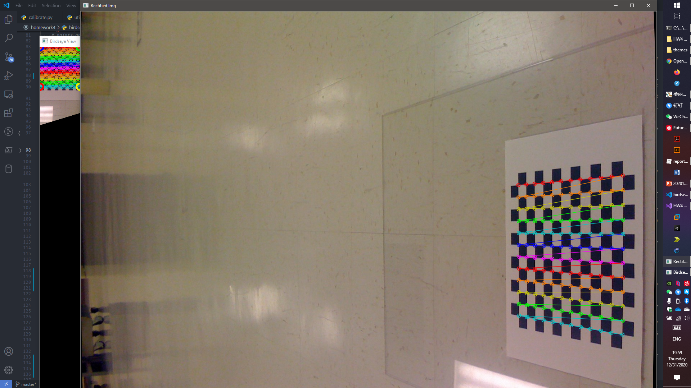

# Camera Calibration & Birdseye View

[toc]

## Basic Information

- Student ID: 3180105504

- Student Name: Xu Zhen

- Instructor Name: Song Mingli

- Course Name: Computer Vision

- Homework Name: ==Camera Calibration & Birdseye View==

- Basic Requirements:

    1. Use checkerboard images to calibrate a camera.

        Example: *Learning OpenCV 18-1*

        Write the intrinsic parameters to `intrinsics.xml` or another file specified

        Refer to the checkboard images at `Learning OpenCV/LearningOpenCV_Code/LearningOpenCV_Code/calibration` as examples

    2. Do a perspective warp on images calibrated using the intrinsic parameters provided by the previous step

        Example: *Learning OpenCV 19-1*

        Refer to the test images in `Learning OpenCV/LearningOpenCV_Code/LearningOpenCV_Code/birdseye` as examples

- Notes:

    1. Use the example code unchanged if you prefer, and analyze principles of it in your report if you do
    2. Specify usage of your program and expected results
    3. Submit a experiment report, the source code and a packaged executable

- Reference:

    [Learning OpenCV Examples](https://github.com/oreillymedia/Learning-OpenCV-3_examples)

## Experiment Principles

### Calibration

The calibrator uses OpenCV's API `findChessboardCorners` to find all chessboard corners and try to reorder them as the user specifies the size of the board

> The function attempts to determine whether the input image is a view of the chessboard pattern and locate the internal chessboard corners. The function returns a non-zero value if all of the corners are found and they are placed in a certain order (row by row, left to right in every row). Otherwise, if the function fails to find all the corners or reorder them, it returns 0. For example, a regular chessboard has 8 x 8 squares and 7 x 7 internal corners, that is, points where the black squares touch each other. The detected coordinates are approximate, and to determine their positions more accurately, the function calls `cornerSubPix`. You also may use the function `cornerSubPix` with different parameters if returned coordinates are not accurate enough.

Basically, this function generates quads (distorted squares) approximately and return the detected corner locations.

```python
def findChessboardCorners(image, patternSize, corners=..., flags=...) -> typing.Any:
    """
findChessboardCorners(image, patternSize[, corners[, flags]]) -> retval, corners
.   @brief Finds the positions of internal corners of the chessboard.
.
.   @param image Source chessboard view. It must be an 8-bit grayscale or color image.
.   @param patternSize Number of inner corners per a chessboard row and column
.   ( patternSize = cv::Size(points_per_row,points_per_colum) = cv::Size(columns,rows) ).
.   @param corners Output array of detected corners.
.   @param flags Various operation flags that can be zero or a combination of the following values:
.   -   **CALIB_CB_ADAPTIVE_THRESH** Use adaptive thresholding to convert the image to black
.   and white, rather than a fixed threshold level (computed from the average image brightness).
.   -   **CALIB_CB_NORMALIZE_IMAGE** Normalize the image gamma with equalizeHist before
.   applying fixed or adaptive thresholding.
.   -   **CALIB_CB_FILTER_QUADS** Use additional criteria (like contour area, perimeter,
.   square-like shape) to filter out false quads extracted at the contour retrieval stage.
.   -   **CALIB_CB_FAST_CHECK** Run a fast check on the image that looks for chessboard corners,
.   and shortcut the call if none is found. This can drastically speed up the call in the
.   degenerate condition when no chessboard is observed.
"""
```

For every image in the specified folder, we find the checkerboard corners and refine them using `cornersSubPix`

Refines the corner locations.

The function iterates to find the sub-pixel accurate location of corners or radial saddle points as described in [[76]](https://docs.opencv.org/master/d0/de3/citelist.html#CITEREF_forstner1987fast), and as shown on the figure below.


$$
\epsilon _i = {DI_{p_i}}^T  \cdot (q - p_i)
$$
We also found a very helpful blog at explain how the corner refinement actually work

[A good blog](https://aishack.in/tutorials/subpixel-corners-increasing-accuracy/)

Takeaway: **The corner of a square is a point where all other's points gradient are orthogonal to the vector between the corner and the point in question**

Then we used `calibrateCamera` to calculate the camera intrinsic parameters and distortion coefficients used to describe the projection of that camera.

We don't use the strange flags in our implementation because they seem to make the rectification process unacceptable

```python
def calibrateCamera(objectPoints, imagePoints, imageSize, cameraMatrix, distCoeffs, rvecs=..., tvecs=..., flags=..., criteria=...) -> typing.Any:
    """
calibrateCameraExtended(objectPoints, imagePoints, imageSize, cameraMatrix, distCoeffs[, rvecs[, tvecs[, stdDeviationsIntrinsics[, stdDeviationsExtrinsics[, perViewErrors[, flags[, criteria]]]]]]]) -> retval, cameraMatrix, distCoeffs, rvecs, tvecs, stdDeviationsIntrinsics, stdDeviationsExtrinsics, perViewErrors
.   @brief Finds the camera intrinsic and extrinsic parameters from several views of a calibration
.   pattern.
.
.   @param objectPoints In the new interface it is a vector of vectors of calibration pattern points in       
.   the calibration pattern coordinate space (e.g. std::vector<std::vector<cv::Vec3f>>). The outer
.   vector contains as many elements as the number of pattern views. If the same calibration pattern
.   is shown in each view and it is fully visible, all the vectors will be the same. Although, it is
.   possible to use partially occluded patterns or even different patterns in different views. Then,
.   the vectors will be different. Although the points are 3D, they all lie in the calibration pattern's      
.   XY coordinate plane (thus 0 in the Z-coordinate), if the used calibration pattern is a planar rig.        
.   In the old interface all the vectors of object points from different views are concatenated
.   together.
.   @param imagePoints In the new interface it is a vector of vectors of the projections of calibration       
.   pattern points (e.g. std::vector<std::vector<cv::Vec2f>>). imagePoints.size() and
.   objectPoints.size(), and imagePoints[i].size() and objectPoints[i].size() for each i, must be equal,      
.   respectively. In the old interface all the vectors of object points from different views are
.   concatenated together.
.   @param imageSize Size of the image used only to initialize the intrinsic camera matrix.
"""
```


Then we use `FileStorage` to write the parameters and coefficients to the specified file.

If the user wants so, we can also use `undistort` to undistort a image using the parameters calculated earlier.

Or, if we prefer a more manual approach, we can use `initUndistortRectifyMap` and `remap` to undistort the image

### Birdseye View

Similar as before, we use `FileStorage` to load the saved parameters and coefficients from the file provided by the user.

Then we use `findChessboardCorners` and `cornerSubPix` to find subpixel locations of the checkerboard corners for the image.

Using the parameters, we `undistort` the image first.

And we use `getPerspectiveTransform` to compute perspective transform from one set of 4 points to another

```python
def getPerspectiveTransform(src, dst, solveMethod=...) -> typing.Any:
    """
getPerspectiveTransform(src, dst[, solveMethod]) -> retval
.   @brief Calculates a perspective transform from four pairs of the corresponding points.
.
.   The function calculates the 3x3 matrix of a perspective transform
.
.   @param src Coordinates of quadrangle vertices in the source image.
.   @param dst Coordinates of the corresponding quadrangle vertices in the destination image.
.   @param solveMethod method passed to cv::solve (#DecompTypes)
"""
```

Later for the images we use `warpPerspectiveTransform` to apply the transform obtained earlier

Note that:

```python
# dst(x, y) are defined by src(homo(matmul(M, (x, y, 1))))
# so the transformation actually acts on the coordinates of the dstination image
# thus OpenCV would firstly apply a inversion by default
```

So we'd have to set the flag  `WARP_INVERSE_MAP` if we want to manipulate the transform matrix by hand


When the transformation matrix is computed, we'd actually like to manipulate it by hand because the user may want to set the zooming scale or the Birdseye View height

We utilized the fact that transform as a matrix can be layered together by matrix multiplication.


We used OpenCV's `HighGUI` for simple user interaction:

- User can adjust the scale factor with <kbd>i</kbd> (scale up: zoom in) or <kbd>o</kbd> (scale down: zoom out) key
- User can adjust the view height using <kbd>u</kbd> (for up) and <kbd>d</kbd> (for down)
- <kbd>ESC</kbd> to quit and <kbd>n</kbd> for next image
- <kbd>t</kbd> to toggle for the checkerboard indicator
- <kbd>r</kbd> to reset stuff

## Experiment Implementation & Procedures

In our implementation, we provided with the code reviewer a significant dose of redundant comment so that you can understand what we wanted to do.

Here we'll just post the implementation with **comments, log info and help messages**

We're pretty sure it'll be enough

### Utilities

This file contains some utilities for our implementation

```python
import coloredlogs
import argparse
import matplotlib as mpl


class CustomFormatter(argparse.ArgumentDefaultsHelpFormatter, argparse.RawDescriptionHelpFormatter):
    pass


# initailization for plotting and logging
# Setting up font for matplotlib
mpl.rc("font", family=["Josefin Sans", "Trebuchet MS", "Inconsolata"], weight="medium")

coloredlogs.install(level='INFO')  # Change this to DEBUG to see more info.
```

### Calibration

#### Imports

```python
#! python
# python calibrate.py -i calibration -c 12 -r 12 -o intrinsics.xml
# python calibrate.py -i calibration -c 12 -r 12 -o intrinsics.xml -s
import cv2
import matplotlib.pyplot as plt
import numpy as np
import os
from utils import *

import logging
# Setting up logger for the project
log = logging.getLogger(__name__)
```

#### Command Line Arguments

```python
# Adding argument parser
parser = argparse.ArgumentParser(description="""Do a calibration using a bunch of checker board images in a folder provided by the user
User can choose to view the calibrated images or not
The camera instrinsics parameters and distortion coefficients are stored in a file whose name is specified by the user
""", formatter_class=CustomFormatter)
parser.add_argument("-i", "--input_path", default="./calibration", help="The folder containing all images to be used to calibrate the camera")
parser.add_argument("-c", "--columns", type=int, default=12, help="The width of the checkerboard. (Points to be detected along a horizontal line)")
parser.add_argument("-r", "--rows", type=int, default=12, help="The height of the checkerboard. (Points to be detected along a vertical line)")
parser.add_argument("-o", "--output_file", default="intrinsics.xml", help="The output file to save the camera intrinsics and distortion coefficients")
parser.add_argument("-s", "--should_check", action="store_true", help="Should the user check all calibrated/rectified checkerboard image?")

args = parser.parse_args()
```

#### Initialization

```python
# parse and process the parsed arguments
path = args.input_path
fpaths = [os.path.join(path, fname) for fname in os.listdir(path)]  # all image paths
board_w = args.columns
board_h = args.rows
board_n = board_w*board_h
board_sz = (board_w, board_h)
show_imgs = args.should_check
output = args.output_file

# initializating stuff
criteria = (cv2.TERM_CRITERIA_EPS + cv2.TERM_CRITERIA_MAX_ITER, 30, 0.001)  # criteria for subPix corners finder
img_pts = []  # image points in calibrate camera
obj_pts = []  # world points in calibrate camera
img_shp = ()  # size/shape of the image to be used for calibrattion
objp = np.zeros((board_n, 3), "float32")  # all object/world points are the same set
objp[:, :2] = np.mgrid[0:board_h, 0:board_w].T.reshape(-1, 2)
imgs = []  # so we don't have to read all images in again
files = []  # valid filenames
```

#### Image Points Loop

```python
# find all checker board corners and add corresponding 3D space locations
for fpath in fpaths:
    log.info(f"Begin processing {fpath}")
    img = cv2.imread(fpath)
    if img is None:
        log.warning(f"Cannot read image {fpath}, is this really a image?")
        break
    img_shp = img.shape[:2][::-1]  # OpenCV wants (width, height)
    found, corners = cv2.findChessboardCorners(
        img,  # the BGR image to be used to find checker board corners on
        board_sz,  # (board_w, board_h)
        flags=cv2.CALIB_CB_ADAPTIVE_THRESH | cv2.CALIB_CB_NORMALIZE_IMAGE
        # do a normalization beforehand
        # CALIB_CB_ADAPTIVE_THRESH Use adaptive thresholding to convert the image to black and white, rather than a fixed threshold level (computed from the average image brightness).
        # use adaptive threashold to BW image instead of a fixed one
        # CALIB_CB_NORMALIZE_IMAGE Normalize the image gamma with equalizeHist before applying fixed or adaptive thresholding.
    )
    if not found:
        log.warning(f"Cannot find checker board from image {fpath}, is there really a checker board? Do your width/height match?")
        break

    log.info(f"Found {corners.shape[0]} checkerboard corners")
    gray = cv2.cvtColor(img, cv2.COLOR_BGR2GRAY)
    corners = cv2.cornerSubPix(
        gray,  # cornersSubPix only wants one-channel image
        corners,  # already found corners to be refined on
        (11, 11),  # winSize	Half of the side length of the search window. For example, if winSize=Size(5,5) , then a (5∗2+1)×(5∗2+1)=11×11 search window is used.
        (-1, -1),  # zeroZone Half of the size of the dead region in the middle of the search zone over which the summation in the formula below is not done. It is used sometimes to avoid possible singularities of the autocorrelation matrix. The value of (-1,-1) indicates that there is no such a size.
        criteria
    )
    log.info(f"Refined {corners.shape[0]} checkerboard corners")
    imgs.append(img)
    files.append(fpath)
    img_pts.append(corners)
    obj_pts.append(objp)
```

#### Camera Calibration

```python
# cv2.calibrateCamera only accepts float32 as numpy array
obj_pts = np.array(obj_pts).astype("float32")

log.info(f"Beginning calibration using images in: {path}, files: {files}")
# do the calibration
err, intr, dist, rota, tran = cv2.calibrateCamera(
    obj_pts,  # object points in 3D
    img_pts,  # corner points in 2D
    img_shp,  # shape of the image to be calibrated
    None,  # setting to None to let the function return them
    None,  # setting to None to let the function return them
    # flags=cv2.CALIB_ZERO_TANGENT_DIST | cv2.CALIB_FIX_PRINCIPAL_POINT
    # CALIB_ZERO_TANGENT_DIST Tangential distortion coefficients (p1,p2) are set to zeros and stay zero
    # The principal point is not changed during the global optimization. It stays at the center
)

log.info(f"Got camera intrinsics:\n{intr} and distortion coefficients:\n{dist}")
```

#### Save Results

```python
log.info(f"Opening {output} for output")
# store camera intrinsics and distortion coefficients
fs = cv2.FileStorage(output, cv2.FILE_STORAGE_WRITE)
fs.write("image_width", img_shp[0])
fs.write("image_height", img_shp[1])
fs.write("camera_matrix", intr)
fs.write("distortion_coefficients", dist)
fs.release()
log.info(f"camera_matrix and distortion_coefficients stored to {output}")
```

#### Undistort And Previews

```python
# if the user wants, let he/she examine the rectified images
if show_imgs:
    # mapx, mapy = cv2.initUndistortRectifyMap(intr, dist, None, intr, img_shp, cv2.CV_16SC2)
    for i in range(len(imgs)):
        img = imgs[i]
        corners = img_pts[i]
        file = files[i]
        log.info(f"Showing {file}")
        cv2.drawChessboardCorners(img, board_sz, corners, True)
        # dst = cv2.remap(img, mapx, mapy, cv2.INTER_LINEAR)
        dst = cv2.undistort(img, intr, dist)
        plt.subplot(121)
        # plt.figure("Original")
        plt.imshow(img[:, :, ::-1])
        plt.title("Original")
        plt.subplot(122)
        # plt.figure("Rectified")
        plt.imshow(dst[:, :, ::-1])
        plt.title("Rectified")
        plt.show()
```

### Birdseye View

#### Imports

```python
#! python
# python birdseye.py -i intrinsics.xml -d birdseye -c 12 -r 12
import cv2
import numpy as np
import os
from utils import *

import logging
# Setting up logger for the project
log = logging.getLogger(__name__)
```

#### Command Line Arguments

```python
# Adding argument parser
parser = argparse.ArgumentParser(description="""Using the instrinsics parameters provided (by an XML file), show birdseye view of all images in a folder
The birdseye view are generated so that the checker board position match with an actual board
User can adjust the scale factor with 'i' (scale up: zoom in) or 'o' (scale down: zoom out) key
User can adjust the view height using 'u' (for up) and 'd' (for down)
ESC to quit and 'n' for next image
't' to toggle for the checkerboard indicator
If you want OpenCV to receive keyboard commands, you should firstly set focus on the window in question
""", formatter_class=CustomFormatter)
parser.add_argument("-d", "--directory", default="./birdseye", help="The folder containing all images to be used to generate birdseye view")
parser.add_argument("-c", "--columns", type=int, default=12, help="The width of the checkerboard. (Points to be detected along a horizontal line)")
parser.add_argument("-r", "--rows", type=int, default=12, help="The height of the checkerboard. (Points to be detected along a vertical line)")
parser.add_argument("-i", "--input_file", default="intrinsics.xml", help="The intrinsics.xml that file path(with file name) that contains camera calibration information: intrinsics and distortion coefficients")
```

#### Initialization

```python
# parse the arguments
args = parser.parse_args()
intrfile = args.input_file
path = args.directory
board_w = args.columns
board_h = args.rows
# compute things from the arguments
fpaths = [os.path.join(path, fname) for fname in os.listdir(path)]
board_n = board_w*board_h
board_sz = (board_w, board_h)
```

#### Load Coefficients And Parameters

```python
# read in camera calibration information:
# camera intrinsics and distortion coefficients
fs = cv2.FileStorage(intrfile, cv2.FILE_STORAGE_READ)
img_shp = tuple(map(int, (fs.getNode("image_width").real(), fs.getNode("image_height").real())))
intr = fs.getNode("camera_matrix").mat()
dist = fs.getNode("distortion_coefficients").mat()
```

#### Prepare For Transform

```python
# initializating stuff
criteria = (cv2.TERM_CRITERIA_EPS + cv2.TERM_CRITERIA_MAX_ITER, 30, 0.001)  # criteria in subPix corner refinemnet
# the iteration of cornerSubPix stops when criteria.maxIter is reached or the corner position moves less than epsilon

objPts = np.zeros((4, 2), "float32")  # object points to be used to generate birdseye view
# currently using the borad's default coordinates
objPts[0][0] = 0
objPts[0][1] = 0
objPts[1][0] = board_w - 1
objPts[1][1] = 0
objPts[2][0] = 0
objPts[2][1] = board_h - 1
objPts[3][0] = board_w - 1
objPts[3][1] = board_h - 1

# image points
imgPts = np.zeros((4, 2), "float32")
```

#### Actual Transform And Interaction Loop

```python
for fpath in fpaths:
    log.info(f"Begin processing {fpath}")
    img_dist = cv2.imread(fpath)
    if img_dist is None:
        log.warning(f"Cannot read image {fpath}, is this really a image?")
        break
    img = cv2.undistort(img_dist, intr, dist)  # do an undistortion using the parameters obtained from calibrate.py
    log.info(f"{fpath} undistorded")
    img_shp = img.shape[:2][::-1]  # OpenCV wants (width, height)
    found, corners = cv2.findChessboardCorners(img, board_sz, None, cv2.CALIB_CB_ADAPTIVE_THRESH | cv2.CALIB_CB_NORMALIZE_IMAGE)  # approximate checker board location
    if not found:
        log.warning(f"Cannot find checker board from image {fpath}, is there really a checker board? Do your width/height match?")
        break
    log.info(f"Found {corners.shape[0]} checkerboard corners of shape: {corners.shape}")
    gray = cv2.cvtColor(img, cv2.COLOR_BGR2GRAY)  # OpenCV wants gray image for subPix detection
    corners = cv2.cornerSubPix(gray, corners, (11, 11), (-1, -1), criteria)  # refine checker board location
    log.info(f"Refined {corners.shape[0]} checkerboard corners of shape: {corners.shape}")
    corners = np.squeeze(corners)
    log.info(f"Corners squeezed to {corners.shape}")
    # points on the image plane
    imgPts[0] = corners[0]
    imgPts[1] = corners[board_w - 1]
    imgPts[2] = corners[(board_h - 1) * board_w]
    imgPts[3] = corners[(board_h - 1) * board_w + board_w - 1]

    # draw the checker board to amuse the user
    cv2.drawChessboardCorners(img, board_sz, corners, found)
    log.info(f"imgPts shape: {imgPts.shape}, objPts shape: {objPts.shape}")
    H = cv2.getPerspectiveTransform(objPts, imgPts)  # transform matrix, from objPts to imgPts (map points in objPts to imgPts)
    Z = H[2, 2]  # Z value, view height
    # Z = 2.0  # Z value, view height
    S = 10.0  # Scale value
    C = True
    quit = False  # should we quit?
    shape = img.shape[:2][::-1]  # img shape
    log.info("Press 'd' for lower birdseye view, and 'u' for higher (it adjusts the apparent 'Z' height), Esc to exit, 'n' for the next image and 'i' to zoom in, 'o' to zoom out and 't' to toggle checkerboard's indicator")
    log.info(f"Getting shape: {shape} for image {fpath}")
    while True:
        H[2, 2] = Z
        log.info(f"Getting H of {H}, Z of {Z}")
        # when the flag WARP_INVERSE_MAP is set. Otherwise, the transformation is first inverted with invert and then put in the formula above instead of M. The function cannot operate in-place.
        scale = np.diag([1/S, 1/S, 1])  # scale matrix, scale down the matrix to make the result scale up

        M = np.matmul(H, scale)
        invM = np.linalg.inv(M)
        ones = np.ones((1, board_n))
        log.info(f"Getting corners.T of shape {corners.T.shape} and ones of shape {ones.shape}")
        expC = np.concatenate([corners.T, ones], 0)
        log.info(f"Getting expanded corners of shape {expC.shape}")
        invC = np.matmul(invM, expC).T
        invC[:, 0] /= invC[:, 2]
        invC[:, 1] /= invC[:, 2]
        invC = invC[:, :2]
        invC = invC.astype("float32") # mark: strange error if you don't convert stuff to float32
        log.info(f"Getting inverted corners of shape {invC.shape}")
        # update obj points base on the user's specification of Z and S value
        imgPts[0] = invC[0]
        imgPts[1] = invC[board_w - 1]
        imgPts[2] = invC[(board_h - 1) * board_w]
        imgPts[3] = invC[(board_h - 1) * board_w + board_w - 1]
        # dst(x, y) are defined by src(homo(matmul(H, (x, y, 1))))
        # so the transformation actually acts on the coordinates of the dstination image
        # thus OpenCV would firstly apply a inversion by default
        birdseye = cv2.warpPerspective(
            img, M, shape,
            flags=cv2.INTER_LINEAR | cv2.WARP_INVERSE_MAP,  # don't do matrix inverse before transform
            borderMode=cv2.BORDER_CONSTANT  # use constant value to fill the border
        )
        if C: # whether user want to display the checker board points or not
            cv2.drawChessboardCorners(birdseye, board_sz, invC, True)
            # mark the image points to be used to generate birdseye view
            cv2.circle(birdseye, tuple(imgPts[0].astype(int).tolist()), 9, (255, 0, 0), 3)
            cv2.circle(birdseye, tuple(imgPts[1].astype(int).tolist()), 9, (0, 255, 0), 3)
            cv2.circle(birdseye, tuple(imgPts[2].astype(int).tolist()), 9, (0, 0, 255), 3)
            cv2.circle(birdseye, tuple(imgPts[3].astype(int).tolist()), 9, (0, 255, 255), 3)
        # give the user two image to savor on
        cv2.imshow("Rectified Img", img)
        cv2.imshow("Birdseye View", birdseye)

        k = cv2.waitKey() & 0xff
        log.info(f"Getting key: {chr(k)} or order {k}")

        # update view height
        if k == ord('u'):
            Z += 0.1
        if k == ord('d'):
            Z -= 0.1

        # update scale factor
        if k == ord('i'):
            S += 0.5
        if k == ord('o'):
            S -= 0.5

        # toggle checker board
        if k == ord('t'):
            C = not C

        # next image or
        # just quit already...
        if k == ord('n'):
            break
        if k == 27:
            quit = True
            cv2.destroyAllWindows()  # clean up before exiting
            break
    if quit:
        break
```

## Experiment Results

==If you're unsure of the calling procedure of the implementation, you can always to a `python calibrate.py -h` and `python birdseye.py -h` to get some help==

### Calibration

We first used `python calibrate.py -i calibration -c 12 -r 12 -o intrinsics.xml` to test `calibrate.py`

And we cross compare the result of our own `Python` version with the implementation in `C++`

We modified the code provided with the Learning OpenCV example to make it run on windows

You can check it out at the appendix

Here we'll post the most important parts

```c++
// Returns a list of files in a directory (except the ones that begin with a dot)
int readFilenames(vector<string> &filenames, const string &directory)
{
    for (const auto &entry : fs::directory_iterator(directory))
        filenames.push_back(entry.path().string());

    std::sort(filenames.begin(), filenames.end());  // optional, sort the filenames
    return (filenames.size());                      // return how many we found
}  // GetFilesInDirectory
```

```c++
cv::Mat gray_image, image, image0 = cv::imread(folder + filenames[i]);
board_count += 1;
if (!image0.data) {  // protect against no file
    cerr << folder + filenames[i] << ", file #" << i << ", is not an image" << endl;
    continue;
}
image_size = image0.size();
cv::resize(image0, image, cv::Size(), image_sf, image_sf, cv::INTER_LINEAR);

// Find the board
//
vector<cv::Point2f> corners;
cv::cvtColor(image, gray_image, cv::COLOR_BGRA2GRAY);

// GET THE CHECKERBOARD ON THE PLANE
//
bool found = cv::findChessboardCorners(  // True if found
    gray_image,                          // Input image
    board_sz,                            // Pattern size
    corners,                             // Results
    cv::CALIB_CB_ADAPTIVE_THRESH | cv::CALIB_CB_NORMALIZE_IMAGE
);
if (!found) {
    cout << "Couldn't acquire checkerboard on " << folder + filenames[i] << ", only found "
        << corners.size() << " of " << board_n << " corners\n";
    return -1;
}

// Get Subpixel accuracy on those corners
//
cv::cornerSubPix(
    gray_image,        // Input image
    corners,           // Initial guesses, also output
    cv::Size(11, 11),  // Search window size
    cv::Size(-1, -1),  // Zero zone (in this case, don't use)
    cv::TermCriteria(cv::TermCriteria::EPS | cv::TermCriteria::COUNT, 30, 0.1));
```

```c++
/////////// CALIBRATE //////////////////////////////////////////////
// CALIBRATE THE CAMERA!
//
cv::Mat intrinsic_matrix, distortion_coeffs;
double err = cv::calibrateCamera(
    object_points, image_points, image_size, intrinsic_matrix,
    distortion_coeffs, cv::noArray(), cv::noArray());
//cv::CALIB_ZERO_TANGENT_DIST | cv::CALIB_FIX_PRINCIPAL_POINT);
```

To make the two versions work roughly the same way, we passed in similar flags for computation

As you can see

The result XML of the python version

```xml
<?xml version="1.0"?>
<opencv_storage>
<image_width>1600</image_width>
<image_height>1200</image_height>
<camera_matrix type_id="opencv-matrix">
  <rows>3</rows>
  <cols>3</cols>
  <dt>d</dt>
  <data>
    1.7665001338953443e+03 0. 8.1748885922181228e+02 0.
    1.7625332664967364e+03 6.7114547661015047e+02 0. 0. 1.</data></camera_matrix>
<distortion_coefficients type_id="opencv-matrix">
  <rows>1</rows>
  <cols>5</cols>
  <dt>d</dt>
  <data>
    3.5524903501380108e-02 -2.7852779022867025e-01
    1.1476899486326580e-02 2.5880591934448211e-03 8.8162612866523837e-01</data></distortion_coefficients>
</opencv_storage>
```

Result XML of C++ version

```xml
<?xml version="1.0"?>
<opencv_storage>
<image_width>1600</image_width>
<image_height>1200</image_height>
<camera_matrix type_id="opencv-matrix">
  <rows>3</rows>
  <cols>3</cols>
  <dt>d</dt>
  <data>
    1.7665028157253139e+03 0. 8.1750608847526075e+02 0.
    1.7625312840224985e+03 6.7113322113294157e+02 0. 0. 1.</data></camera_matrix>
<distortion_coefficients type_id="opencv-matrix">
  <rows>1</rows>
  <cols>5</cols>
  <dt>d</dt>
  <data>
    3.5508504849890023e-02 -2.7677197011938937e-01
    1.1471796669889742e-02 2.5915997817074904e-03 8.7147079116075210e-01</data></distortion_coefficients>
</opencv_storage>
```

Except for the floating points errors, the results are the same. Thus verifying our implementation.

And here's some undistorted images and logs we get using:

```shell
python calibrate.py -i calibration -c 12 -r 12 -o intrinsics.xml -s
```


This one was pretty fine before calibration


This one's **pin cushion** distortion is visually corrected


### Birdseye View

We tested this implementation using

```shell
python birdseye.py -i intrinsics.xml -d birdseye -c 12 -r 12
```

Note that we saved the camera intrinsic parameters and distortion coefficients to `intrinsics.xml` in our first implementation


And it opens up the first image with a birds eye transform to

```python
objPts = np.zeros((4, 2), "float32")  # object points to be used to generate birdseye view
# currently using the borad's default coordinates
objPts[0][0] = 0
objPts[0][1] = 0
objPts[1][0] = board_w - 1
objPts[1][1] = 0
objPts[2][0] = 0
objPts[2][1] = board_h - 1
objPts[3][0] = board_w - 1
objPts[3][1] = board_h - 1
...
objPts *= 10
```


We used OpenCV's `HighGUI` for simple user interaction:

- User can adjust the scale factor with <kbd>i</kbd> (scale up: zoom in) or <kbd>o</kbd> (scale down: zoom out) key
- User can adjust the view height using <kbd>u</kbd> (for up) and <kbd>d</kbd> (for down)
- <kbd>ESC</kbd> to quit and <kbd>n</kbd> for next image
- <kbd>t</kbd> to toggle for the checkerboard indicator
- <kbd>r</kbd> to reset stuff

#### Rectified Original Image



####  <kbd>i</kbd> or <kbd>o</kbd> for Zoom


#### <kbd>u</kbd> or <kbd>d</kbd> for Up/Down


#### <kbd>t</kbd> for Toggle Checkerboard Marker


#### <kbd>r</kbd> for Resetting


#### <kbd>n</kbd> for Next Image in Folder


#### <kbd>ESC</kbd> to Exit the Program


# Appendix

## Source Code

### `utils.py`

```python
import coloredlogs
import argparse
import matplotlib as mpl


class CustomFormatter(argparse.ArgumentDefaultsHelpFormatter, argparse.RawDescriptionHelpFormatter):
    pass


# initailization for plotting and logging
# Setting up font for matplotlib
mpl.rc("font", family=["Josefin Sans", "Trebuchet MS", "Inconsolata"], weight="medium")

coloredlogs.install(level='INFO')  # Change this to DEBUG to see more info.
```

### `calibrate.py`

```python
#! python
# python calibrate.py -i calibration -c 12 -r 12 -o intrinsics.xml
# python calibrate.py -i calibration -c 12 -r 12 -o intrinsics.xml -s
import cv2
import matplotlib.pyplot as plt
import numpy as np
import os
from utils import *

import logging
# Setting up logger for the project
log = logging.getLogger(__name__)

# Adding argument parser
parser = argparse.ArgumentParser(description="""Do a calibration using a bunch of checker board images in a folder provided by the user
User can choose to view the calibrated images or not
The camera instrinsics parameters and distortion coefficients are stored in a file whose name is specified by the user
""", formatter_class=CustomFormatter)
parser.add_argument("-i", "--input_path", default="./calibration", help="The folder containing all images to be used to calibrate the camera")
parser.add_argument("-c", "--columns", type=int, default=12, help="The width of the checkerboard. (Points to be detected along a horizontal line)")
parser.add_argument("-r", "--rows", type=int, default=12, help="The height of the checkerboard. (Points to be detected along a vertical line)")
parser.add_argument("-o", "--output_file", default="intrinsics.xml", help="The output file to save the camera intrinsics and distortion coefficients")
parser.add_argument("-s", "--should_check", action="store_true", help="Should the user check all calibrated/rectified checkerboard image?")

args = parser.parse_args()


# parse and process the parsed arguments
path = args.input_path
fpaths = [os.path.join(path, fname) for fname in os.listdir(path)]  # all image paths
board_w = args.columns
board_h = args.rows
board_n = board_w*board_h
board_sz = (board_w, board_h)
show_imgs = args.should_check
output = args.output_file

# initializating stuff
criteria = (cv2.TERM_CRITERIA_EPS + cv2.TERM_CRITERIA_MAX_ITER, 30, 0.001)  # criteria for subPix corners finder
img_pts = []  # image points in calibrate camera
obj_pts = []  # world points in calibrate camera
img_shp = ()  # size/shape of the image to be used for calibrattion
objp = np.zeros((board_n, 3), "float32")  # all object/world points are the same set
objp[:, :2] = np.mgrid[0:board_h, 0:board_w].T.reshape(-1, 2)
imgs = []  # so we don't have to read all images in again
files = []  # valid filenames

# find all checker board corners and add corresponding 3D space locations
for fpath in fpaths:
    log.info(f"Begin processing {fpath}")
    img = cv2.imread(fpath)
    if img is None:
        log.warning(f"Cannot read image {fpath}, is this really a image?")
        break
    img_shp = img.shape[:2][::-1]  # OpenCV wants (width, height)
    found, corners = cv2.findChessboardCorners(
        img,  # the BGR image to be used to find checker board corners on
        board_sz,  # (board_w, board_h)
        flags=cv2.CALIB_CB_ADAPTIVE_THRESH | cv2.CALIB_CB_NORMALIZE_IMAGE
        # do a normalization beforehand
        # CALIB_CB_ADAPTIVE_THRESH Use adaptive thresholding to convert the image to black and white, rather than a fixed threshold level (computed from the average image brightness).
        # use adaptive threashold to BW image instead of a fixed one
        # CALIB_CB_NORMALIZE_IMAGE Normalize the image gamma with equalizeHist before applying fixed or adaptive thresholding.
    )
    if not found:
        log.warning(f"Cannot find checker board from image {fpath}, is there really a checker board? Do your width/height match?")
        break

    log.info(f"Found {corners.shape[0]} checkerboard corners")
    gray = cv2.cvtColor(img, cv2.COLOR_BGR2GRAY)
    corners = cv2.cornerSubPix(
        gray,  # cornersSubPix only wants one-channel image
        corners,  # already found corners to be refined on
        (11, 11),  # winSize	Half of the side length of the search window. For example, if winSize=Size(5,5) , then a (5∗2+1)×(5∗2+1)=11×11 search window is used.
        (-1, -1),  # zeroZone Half of the size of the dead region in the middle of the search zone over which the summation in the formula below is not done. It is used sometimes to avoid possible singularities of the autocorrelation matrix. The value of (-1,-1) indicates that there is no such a size.
        criteria
    )
    log.info(f"Refined {corners.shape[0]} checkerboard corners")
    imgs.append(img)
    files.append(fpath)
    img_pts.append(corners)
    obj_pts.append(objp)

# cv2.calibrateCamera only accepts float32 as numpy array
obj_pts = np.array(obj_pts).astype("float32")

log.info(f"Beginning calibration using images in: {path}, files: {files}")
# do the calibration
err, intr, dist, rota, tran = cv2.calibrateCamera(
    obj_pts,  # object points in 3D
    img_pts,  # corner points in 2D
    img_shp,  # shape of the image to be calibrated
    None,  # setting to None to let the function return them
    None,  # setting to None to let the function return them
    # flags=cv2.CALIB_ZERO_TANGENT_DIST | cv2.CALIB_FIX_PRINCIPAL_POINT
    # CALIB_ZERO_TANGENT_DIST Tangential distortion coefficients (p1,p2) are set to zeros and stay zero
    # The principal point is not changed during the global optimization. It stays at the center
)

log.info(f"Got camera intrinsics:\n{intr} and distortion coefficients:\n{dist}")

log.info(f"Opening {output} for output")
# store camera intrinsics and distortion coefficients
fs = cv2.FileStorage(output, cv2.FILE_STORAGE_WRITE)
fs.write("image_width", img_shp[0])
fs.write("image_height", img_shp[1])
fs.write("camera_matrix", intr)
fs.write("distortion_coefficients", dist)
fs.release()
log.info(f"camera_matrix and distortion_coefficients stored to {output}")

# if the user wants, let he/she examine the rectified images
if show_imgs:
    # mapx, mapy = cv2.initUndistortRectifyMap(intr, dist, None, intr, img_shp, cv2.CV_16SC2)
    for i in range(len(imgs)):
        img = imgs[i]
        corners = img_pts[i]
        file = files[i]
        log.info(f"Showing {file}")
        cv2.drawChessboardCorners(img, board_sz, corners, True)
        # dst = cv2.remap(img, mapx, mapy, cv2.INTER_LINEAR)
        dst = cv2.undistort(img, intr, dist)
        plt.subplot(121)
        # plt.figure("Original")
        plt.imshow(img[:, :, ::-1])
        plt.title("Original")
        plt.subplot(122)
        # plt.figure("Rectified")
        plt.imshow(dst[:, :, ::-1])
        plt.title("Rectified")
        plt.show()
```

### `birdseye.py`

```python
#! python
# python birdseye.py -i intrinsics.xml -d birdseye -c 12 -r 12
import cv2
import numpy as np
import os
from utils import *

import logging
# Setting up logger for the project
log = logging.getLogger(__name__)

# Adding argument parser
parser = argparse.ArgumentParser(description="""Using the instrinsics parameters provided (by an XML file), show birdseye view of all images in a folder
The birdseye view are generated so that the checker board position match with an actual board
User can adjust the scale factor with 'i' (scale up: zoom in) or 'o' (scale down: zoom out) key
User can adjust the view height using 'u' (for up) and 'd' (for down)
ESC to quit and 'n' for next image
't' to toggle for the checkerboard indicator
‘r’ to reset stuff
If you want OpenCV to receive keyboard commands, you should firstly set focus on the window in question
""", formatter_class=CustomFormatter)
parser.add_argument("-d", "--directory", default="./birdseye", help="The folder containing all images to be used to generate birdseye view")
parser.add_argument("-c", "--columns", type=int, default=12, help="The width of the checkerboard. (Points to be detected along a horizontal line)")
parser.add_argument("-r", "--rows", type=int, default=12, help="The height of the checkerboard. (Points to be detected along a vertical line)")
parser.add_argument("-i", "--input_file", default="intrinsics.xml", help="The intrinsics.xml that file path(with file name) that contains camera calibration information: intrinsics and distortion coefficients")

# parse the arguments
args = parser.parse_args()
intrfile = args.input_file
path = args.directory
board_w = args.columns
board_h = args.rows
# compute things from the arguments
fpaths = [os.path.join(path, fname) for fname in os.listdir(path)]
board_n = board_w*board_h
board_sz = (board_w, board_h)

# read in camera calibration information:
# camera intrinsics and distortion coefficients
fs = cv2.FileStorage(intrfile, cv2.FILE_STORAGE_READ)
img_shp = tuple(map(int, (fs.getNode("image_width").real(), fs.getNode("image_height").real())))
intr = fs.getNode("camera_matrix").mat()
dist = fs.getNode("distortion_coefficients").mat()

# initializating stuff
criteria = (cv2.TERM_CRITERIA_EPS + cv2.TERM_CRITERIA_MAX_ITER, 30, 0.001)  # criteria in subPix corner refinemnet
# the iteration of cornerSubPix stops when criteria.maxIter is reached or the corner position moves less than epsilon

objPts = np.zeros((4, 2), "float32")  # object points to be used to generate birdseye view
# currently using the borad's default coordinates
objPts[0][0] = 0
objPts[0][1] = 0
objPts[1][0] = board_w - 1
objPts[1][1] = 0
objPts[2][0] = 0
objPts[2][1] = board_h - 1
objPts[3][0] = board_w - 1
objPts[3][1] = board_h - 1

# image points
imgPts = np.zeros((4, 2), "float32")

for fpath in fpaths:
    log.info(f"Begin processing {fpath}")
    img_dist = cv2.imread(fpath)
    if img_dist is None:
        log.warning(f"Cannot read image {fpath}, is this really a image?")
        break
    img = cv2.undistort(img_dist, intr, dist)  # do an undistortion using the parameters obtained from calibrate.py
    log.info(f"{fpath} undistorded")
    img_shp = img.shape[:2][::-1]  # OpenCV wants (width, height)
    found, corners = cv2.findChessboardCorners(img, board_sz, None, cv2.CALIB_CB_ADAPTIVE_THRESH | cv2.CALIB_CB_NORMALIZE_IMAGE)  # approximate checker board location
    if not found:
        log.warning(f"Cannot find checker board from image {fpath}, is there really a checker board? Do your width/height match?")
        break
    log.info(f"Found {corners.shape[0]} checkerboard corners of shape: {corners.shape}")
    gray = cv2.cvtColor(img, cv2.COLOR_BGR2GRAY)  # OpenCV wants gray image for subPix detection
    corners = cv2.cornerSubPix(gray, corners, (11, 11), (-1, -1), criteria)  # refine checker board location
    log.info(f"Refined {corners.shape[0]} checkerboard corners of shape: {corners.shape}")
    corners = np.squeeze(corners)
    log.info(f"Corners squeezed to {corners.shape}")
    # points on the image plane
    imgPts[0] = corners[0]
    imgPts[1] = corners[board_w - 1]
    imgPts[2] = corners[(board_h - 1) * board_w]
    imgPts[3] = corners[(board_h - 1) * board_w + board_w - 1]

    # draw the checker board to amuse the user
    cv2.drawChessboardCorners(img, board_sz, corners, found)
    log.info(f"imgPts shape: {imgPts.shape}, objPts shape: {objPts.shape}")
    H = cv2.getPerspectiveTransform(objPts, imgPts)  # transform matrix, from objPts to imgPts (map points in objPts to imgPts)
    Z = H[2, 2]  # Z value, view height
    # Z = 2.0  # Z value, view height
    S = 10.0  # Scale value
    C = True
    quit = False  # should we quit?
    shape = img.shape[:2][::-1]  # img shape
    log.info("Press 'd' for lower birdseye view, and 'u' for higher (it adjusts the apparent 'Z' height), Esc to exit, 'n' for the next image and 'i' to zoom in, 'o' to zoom out and 't' to toggle checkerboard's indicator")
    log.info(f"Getting shape: {shape} for image {fpath}")
    while True:
        # construct the scale image for image
        scale = np.diag([1/S, 1/S, 1])  # scale matrix, scale down the matrix to make the result scale up

        # Get the actual transform by modifying the Z value and do a scale up
        M = np.matmul(H, scale)
        M[2, 2] = Z
        # update Z value of the transform matrix
        log.info(f"Getting H of {M}, Z of {Z}")

        # This is actually the basic procedure of what warpPerspective
        # except that it maps from dstination coordinates to src image coordinates and get the color values
        # Get the inverse of the mapping matrix
        invM = np.linalg.inv(M)  # this one maps coordinates in src image to coordinates in dst image
        ones = np.ones((1, board_n))  # to make stuff homographic
        log.info(f"Getting corners.T of shape {corners.T.shape} and ones of shape {ones.shape}")
        expC = np.concatenate([corners.T, ones], 0)  # construct the homographic original corner points
        log.info(f"Getting expanded corners of shape {expC.shape}")
        invC = np.matmul(invM, expC).T  # get the mapped coordinates of the corners
        invC[:, 0] /= invC[:, 2]  # apply Z value to corners
        invC[:, 1] /= invC[:, 2]  # apply Z value to corners
        invC = invC[:, :2]  # get only the first two columns
        invC = invC.astype("float32")  # mark: strange error if you don't convert stuff to float32
        log.info(f"Getting inverted corners of shape {invC.shape}")

        # update significant corner points base on the user's specification of Z and S value
        # to draw circles on later
        imgPts[0] = invC[0]
        imgPts[1] = invC[board_w - 1]
        imgPts[2] = invC[(board_h - 1) * board_w]
        imgPts[3] = invC[(board_h - 1) * board_w + board_w - 1]
        # when the flag WARP_INVERSE_MAP is set. Otherwise, the transformation is first inverted with invert and then put in the formula above instead of M. The function cannot operate in-place.
        # dst(x, y) are defined by src(homo(matmul(H, (x, y, 1))))
        # so the transformation actually acts on the coordinates of the dstination image
        # thus OpenCV would firstly apply a inversion by default
        birdseye = cv2.warpPerspective(
            img, M, shape,
            flags=cv2.INTER_LINEAR | cv2.WARP_INVERSE_MAP,  # don't do matrix inverse before transform
            borderMode=cv2.BORDER_CONSTANT  # use constant value to fill the border
        )
        if C:  # whether user want to display the checker board points or not
            cv2.drawChessboardCorners(birdseye, board_sz, invC, True)
            # mark the image points to be used to generate birdseye view
            cv2.circle(birdseye, tuple(imgPts[0].astype(int).tolist()), 9, (255, 0, 0), 3)
            cv2.circle(birdseye, tuple(imgPts[1].astype(int).tolist()), 9, (0, 255, 0), 3)
            cv2.circle(birdseye, tuple(imgPts[2].astype(int).tolist()), 9, (0, 0, 255), 3)
            cv2.circle(birdseye, tuple(imgPts[3].astype(int).tolist()), 9, (0, 255, 255), 3)
        # give the user two image to savor on
        cv2.imshow("Rectified Img", img)
        cv2.imshow("Birdseye View", birdseye)

        k = cv2.waitKey() & 0xff
        log.info(f"Getting key: {chr(k)} or order {k}")

        # update view height
        if k == ord('u'):
            Z += 0.1
        if k == ord('d'):
            Z -= 0.1

        # update scale factor
        if k == ord('i'):
            S += 0.5
        if k == ord('o'):
            S -= 0.5

        # toggle checker board
        if k == ord('t'):
            C = not C

        # reset
        if k == ord('r'):
            Z = H[2, 2]
            S = 10.0

        # next image or
        # just quit already...
        if k == ord('n'):
            break
        if k == 27:
            quit = True
            cv2.destroyAllWindows()  # clean up before exiting
            break
    if quit:
        break
```

## Cross Validation

### `calibrate.cpp`

```c++
// Example 18-1. Reading a chessboard’s width and height, reading them from disk and calibrating
// the requested number of views, and calibrating the camera

// You need these includes for the function
#define WINDOWS
#include <windows.h>  // for windows systems
// #include <dirent.h>     // for linux systems
#include <sys/stat.h>  // for linux systems

#include <algorithm>  // std::sort
#include <filesystem>
#include <iostream>  // cout
#include <opencv2/opencv.hpp>
namespace fs = std::filesystem;

using std::cerr;
using std::cout;
using std::endl;
using std::string;
using std::vector;

// Returns a list of files in a directory (except the ones that begin with a dot)
int readFilenames(vector<string> &filenames, const string &directory)
{
    for (const auto &entry : fs::directory_iterator(directory))
        filenames.push_back(entry.path().string());

    std::sort(filenames.begin(), filenames.end());  // optional, sort the filenames
    return (filenames.size());                      // return how many we found
}  // GetFilesInDirectory

void help(const char **argv)
{
    cout << "\n\n"
         << "Example 18-1 (from disk):\Enter a chessboard's width and height,\n"
         << "              reading in a directory of chessboard images,\n"
         << "              and calibrating the camera\n\n"
         << "Call:\n"
         << argv[0] << " <1board_width> <2board_height> <3number_of_boards>"
         << " <4ms_delay_framee_capture> <5image_scaling_factor> <6path_to_calibration_images>\n\n"
         << "\nExample:\n"
         << "./example_18-01_from_disk 9 6 14 100 1.0 ../stereoData/\nor:\n"
         << "./example_18-01_from_disk 12 12 28 100 0.5 ../calibration/\n\n"
         << " * First it reads in checker boards and calibrates itself\n"
         << " * Then it saves and reloads the calibration matricies\n"
         << " * Then it creates an undistortion map and finaly\n"
         << " * It displays an undistorted image\n"
         << endl;
}

int main(int argc, const char *argv[])
{
    float image_sf = 0.5f;  // image scaling factor
    int delay = 250;        // miliseconds
    int board_w = 0;
    int board_h = 0;

    if (argc != 7) {
        cout << "\nERROR: Wrong number (" << argc - 1
             << ") of arguments, should be (6) input parameters\n";
        help(argv);
        return -1;
    }

    board_w = atoi(argv[1]);
    board_h = atoi(argv[2]);
    int n_boards = atoi(argv[3]);  // how many boards max to read
    delay = atof(argv[4]);         // milisecond delay
    image_sf = atof(argv[5]);
    int board_n = board_w * board_h;                 // number of corners
    cv::Size board_sz = cv::Size(board_w, board_h);  // width and height of the board

    string folder = argv[6];
    cout << "Reading in directory " << folder << endl;
    vector<string> filenames;
    int num_files = readFilenames(filenames, folder);
    cout << "   ... Done. Number of files = " << num_files << "\n"
         << endl;

    // PROVIDE PPOINT STORAGE
    //
    vector<vector<cv::Point2f> > image_points;
    vector<vector<cv::Point3f> > object_points;

    /////////// COLLECT //////////////////////////////////////////////
    // Capture corner views: loop through all calibration images
    // collecting all corners on the boards that are found
    //
    cv::Size image_size;
    int board_count = 0;
    for (size_t i = 0; (i < filenames.size()) && (board_count < n_boards); ++i) {
        cv::Mat gray_image, image, image0 = cv::imread(folder + filenames[i]);
        board_count += 1;
        if (!image0.data) {  // protect against no file
            cerr << folder + filenames[i] << ", file #" << i << ", is not an image" << endl;
            continue;
        }
        image_size = image0.size();
        cv::resize(image0, image, cv::Size(), image_sf, image_sf, cv::INTER_LINEAR);

        // Find the board
        //
        vector<cv::Point2f> corners;
        cv::cvtColor(image, gray_image, cv::COLOR_BGRA2GRAY);

        // GET THE CHECKERBOARD ON THE PLANE
        //
        bool found = cv::findChessboardCorners(  // True if found
            gray_image,                          // Input image
            board_sz,                            // Pattern size
            corners,                             // Results
            cv::CALIB_CB_ADAPTIVE_THRESH | cv::CALIB_CB_NORMALIZE_IMAGE
            );
        if (!found) {
            cout << "Couldn't acquire checkerboard on " << folder + filenames[i] << ", only found "
                 << corners.size() << " of " << board_n << " corners\n";
            return -1;
        }

        // Get Subpixel accuracy on those corners
        //
        cv::cornerSubPix(
            gray_image,        // Input image
            corners,           // Initial guesses, also output
            cv::Size(11, 11),  // Search window size
            cv::Size(-1, -1),  // Zero zone (in this case, don't use)
            cv::TermCriteria(cv::TermCriteria::EPS | cv::TermCriteria::COUNT, 30,
                             0.1));

        // Draw it
        //
        drawChessboardCorners(image, board_sz, corners, found);  // will draw only if found

        // If we got a good board, add it to our data
        //
        if (found) {
            image ^= cv::Scalar::all(255);
            cv::Mat mcorners(corners);

            // do not copy the data
            mcorners *= (1.0 / image_sf);

            // scale the corner coordinates
            image_points.push_back(corners);
            object_points.push_back(vector<cv::Point3f>());
            vector<cv::Point3f> &opts = object_points.back();

            opts.resize(board_n);
            for (int j = 0; j < board_n; j++) {
                opts[j] = cv::Point3f(static_cast<float>(j / board_w),
                                      static_cast<float>(j % board_w), 0.0f);
            }
            cout << "Collected " << static_cast<int>(image_points.size())
                 << "total boards. This one from chessboard image #"
                 << i << ", " << folder + filenames[i] << endl;
        }
        cv::imshow("Calibration", image);

        // show in color if we did collect the image
        if ((cv::waitKey(delay) & 255) == 27) {
            return -1;
        }
    }

    // END COLLECTION WHILE LOOP.
    cv::destroyWindow("Calibration");
    cout << "\n\n*** CALIBRATING THE CAMERA...\n"
         << endl;

    /////////// CALIBRATE //////////////////////////////////////////////
    // CALIBRATE THE CAMERA!
    //
    cv::Mat intrinsic_matrix, distortion_coeffs;
    double err = cv::calibrateCamera(
        object_points, image_points, image_size, intrinsic_matrix,
        distortion_coeffs, cv::noArray(), cv::noArray());
    //cv::CALIB_ZERO_TANGENT_DIST | cv::CALIB_FIX_PRINCIPAL_POINT);

    // SAVE THE INTRINSICS AND DISTORTIONS
    cout << " *** DONE!\n\nReprojection error is " << err
         << "\nStoring Intrinsics.xml and Distortions.xml files\n\n";
    cv::FileStorage fs("intrinsics.xml", cv::FileStorage::WRITE);
    fs << "image_width" << image_size.width << "image_height" << image_size.height
       << "camera_matrix" << intrinsic_matrix << "distortion_coefficients"
       << distortion_coeffs;
    fs.release();

    // EXAMPLE OF LOADING THESE MATRICES BACK IN:
    fs.open("intrinsics.xml", cv::FileStorage::READ);
    cout << "\nimage width: " << static_cast<int>(fs["image_width"]);
    cout << "\nimage height: " << static_cast<int>(fs["image_height"]);
    cv::Mat intrinsic_matrix_loaded, distortion_coeffs_loaded;
    fs["camera_matrix"] >> intrinsic_matrix_loaded;
    fs["distortion_coefficients"] >> distortion_coeffs_loaded;
    cout << "\nintrinsic matrix:" << intrinsic_matrix_loaded;
    cout << "\ndistortion coefficients: " << distortion_coeffs_loaded << "\n"
         << endl;

    // Build the undistort map which we will use for all
    // subsequent frames.
    //
    cv::Mat map1, map2;
    cv::initUndistortRectifyMap(intrinsic_matrix_loaded, distortion_coeffs_loaded,
                                cv::Mat(), intrinsic_matrix_loaded, image_size,
                                CV_16SC2, map1, map2);

    ////////// DISPLAY //////////////////////////////////////////////
    cout << "*****************\nPRESS A KEY TO SEE THE NEXT IMAGE, ESQ TO QUIT\n"
         << "****************\n"
         << endl;
    board_count = 0;  // resent max boards to read
    for (size_t i = 0; (i < filenames.size()) && (board_count < n_boards); ++i) {
        cv::Mat image, image0 = cv::imread(folder + filenames[i]);
        ++board_count;
        if (!image0.data) {  // protect against no file
            cerr << folder + filenames[i] << ", file #" << i << ", is not an image" << endl;
            continue;
        }
        // Just run the camera to the screen, now showing the raw and
        // the undistorted image.
        //
        cv::remap(image0, image, map1, map2, cv::INTER_LINEAR,
                  cv::BORDER_CONSTANT, cv::Scalar());
        cv::imshow("Original", image0);
        cv::imshow("Undistorted", image);
        if ((cv::waitKey(0) & 255) == 27) {
            break;
        }
    }
    return 0;
}
```

