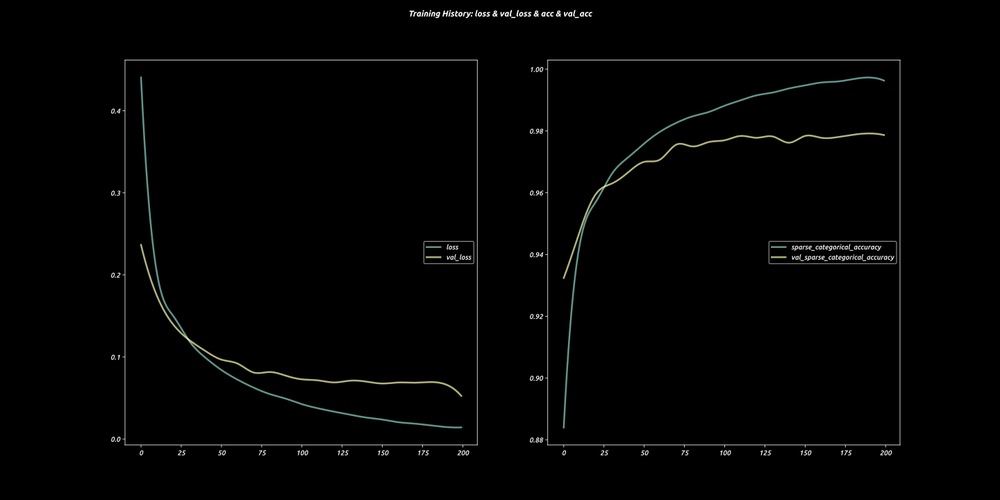

# Homework 5

[toc]


## Basic Information

- Student ID: 3180105504

- Student Name: Xu Zhen

- Instructor Name: Song Mingli

- Course Name: Computer Vision

- Homework Name: ==CNN==


## Implementation

We used `keras` to simplify the implementation (although we used `tensorflow.keras` eventually)

We used `tensorflow 2` as the `keras` backbone

And we used `matplotlib` to provide support for plotting and drawing

We also used some other small packages

```python
#! python
import numpy as np
from scipy import interpolate
import matplotlib.pyplot as plt
import matplotlib as mpl

import tensorflow as tf
from tensorflow.keras.callbacks import TensorBoard, ModelCheckpoint, Callback, LearningRateScheduler, ReduceLROnPlateau
from tensorflow.keras.layers import Input, Dense, Flatten, Dropout, Activation, Conv2D, MaxPool2D, AveragePooling2D, BatchNormalization
from tensorflow.keras.models import Model, load_model, save_model
from tensorflow.keras.optimizers import Adam
from tensorflow.keras.losses import SparseCategoricalCrossentropy
from tensorflow.keras.metrics import SparseCategoricalAccuracy
import tensorflow_datasets as tfds

import coloredlogs
import logging
```


`matplotlib` and `coloredlogs` need to be configured:

```python
# initailization for plotting and logging
# Setting up font for matplotlib
mpl.rc("font", family=["Josefin Sans", "Consolas", "Ubuntu", "Fira Code", "Inconsolata"], weight="medium", style="italic")
plt.style.use('dark_background')

coloredlogs.install("INFO")
log = logging.getLogger(__name__)
```


To prevent `tensorflow` from consuming all of our GPU memory (in practice it needs only like 900MB of GPU Memory and we have a 2080ti with 11GB Memory), we tell it to grow its memory usage:

```python
def growth():
    gpus = tf.config.experimental.list_physical_devices('GPU')
    if gpus:
        try:
            # Currently, memory growth needs to be the same across GPUs
            for gpu in gpus:
                tf.config.experimental.set_memory_growth(gpu, True)
            logical_gpus = tf.config.experimental.list_logical_devices('GPU')
            log.info(f"{len(gpus)} Physical GPUs, {len(logical_gpus)} Logical GPUs")
        except RuntimeError as e:
            # Memory growth must be set before GPUs have been initialized
            log.error(e)
```

After calling this function, you can see that the GPU memory will NOT be fully consumed:


We provided two implementation:

1. Classical LeNet-5 with convolutional layers

    ```python
    def lenet5(input_shape, n_classes, lr):
    
        inputs = Input(shape=input_shape)
        model = Conv2D(6, kernel_size=(5, 5), strides=(1, 1), activation='tanh', input_shape=input_shape, padding="same")(inputs)
        model = AveragePooling2D(pool_size=(2, 2), strides=(2, 2), padding='valid')(model)
        model = Conv2D(16, kernel_size=(5, 5), strides=(1, 1), activation='tanh', padding='valid')(model)
        model = AveragePooling2D(pool_size=(2, 2), strides=(2, 2), padding='valid')(model)
        model = Flatten()(model)
        model = Dense(120, activation='tanh')(model)
        model = Dense(84, activation='tanh')(model)
        model = Dense(n_classes, activation='softmax')(model)
        model = Model(inputs, model)
        model.compile(
            optimizer=Adam(lr=lr),
            loss=SparseCategoricalCrossentropy(from_logits=True),
            metrics=[SparseCategoricalAccuracy()])
        return model
    ```

    Model summary:

    ```
    Model: "model"
    _________________________________________________________________
    Layer (type)                 Output Shape              Param #   
    =================================================================
    input_1 (InputLayer)         [(None, 28, 28, 1)]       0         
    _________________________________________________________________
    conv2d (Conv2D)              (None, 28, 28, 6)         156       
    _________________________________________________________________
    average_pooling2d (AveragePo (None, 14, 14, 6)         0         
    _________________________________________________________________
    conv2d_1 (Conv2D)            (None, 10, 10, 16)        2416      
    _________________________________________________________________
    average_pooling2d_1 (Average (None, 5, 5, 16)          0         
    _________________________________________________________________
    flatten (Flatten)            (None, 400)               0         
    _________________________________________________________________
    dense (Dense)                (None, 120)               48120     
    _________________________________________________________________
    dense_1 (Dense)              (None, 84)                10164     
    _________________________________________________________________
    dense_2 (Dense)              (None, 10)                850       
    =================================================================
    Total params: 61,706
    Trainable params: 61,706
    Non-trainable params: 0
    _________________________________________________________________
    ```

2. Classical fully connected neural network implementation

    ```python
    def dense(input_shape, n_classes, lr):
        model = tf.keras.models.Sequential([
            tf.keras.layers.Flatten(input_shape=input_shape),
            tf.keras.layers.Dense(128, activation='relu'),
            tf.keras.layers.Dense(n_classes)
        ])
        model.compile(
            optimizer=tf.keras.optimizers.Adam(lr),
            loss=tf.keras.losses.SparseCategoricalCrossentropy(from_logits=True),
            metrics=[tf.keras.metrics.SparseCategoricalAccuracy()],
        )
        return model
    ```

    Model summary:

    ```
    Model: "sequential"
    _________________________________________________________________
    Layer (type)                 Output Shape              Param #   
    =================================================================
    flatten_1 (Flatten)          (None, 784)               0         
    _________________________________________________________________
    dense_3 (Dense)              (None, 128)               100480    
    _________________________________________________________________
    dense_4 (Dense)              (None, 10)                1290      
    =================================================================
    Total params: 101,770
    Trainable params: 101,770
    Non-trainable params: 0
    _________________________________________________________________
    ```

We used two different kinds of `keras`/`tensorflow` grammar to construct our neural network

As you can see the number of parameters differ greatly

Testing and training are all done with both of the model type


We used `tensorflow-datasets` to load the MNIST dataset, some enhancement are also done to it:

```python
def load_mnist(batch_size=256):
    (ds_train, ds_test, ds_val), ds_info = tfds.load(
        'mnist',
        split=[
            tfds.Split.TRAIN,
            tfds.Split.TEST.subsplit(tfds.percent[:50]),
            tfds.Split.TEST.subsplit(tfds.percent[50:]),
        ],
        shuffle_files=True,
        as_supervised=True,
        with_info=True,
    )

    def normalize_img(image, label):
        """Normalizes images: `uint8` -> `float32`."""
        return tf.cast(image, tf.float32) / 255., label

    # Applying normalization before `ds.cache()` to re-use it.
    # Note: Random transformations (e.g. images augmentations) should be applied
    # after both `ds.cache()` (to avoid caching randomness) and `ds.batch()` (for
    # vectorization [1]).
    ds_train = ds_train.map(normalize_img, num_parallel_calls=tf.data.experimental.AUTOTUNE)
    ds_train = ds_train.cache()
    # For true randomness, we set the shuffle buffer to the full dataset size.
    ds_train = ds_train.shuffle(ds_info.splits['train'].num_examples)
    # Batch after shuffling to get unique batches at each epoch.
    ds_train = ds_train.batch(batch_size)
    ds_train = ds_train.prefetch(tf.data.experimental.AUTOTUNE)

    ds_test = ds_test.map(normalize_img, num_parallel_calls=tf.data.experimental.AUTOTUNE)
    ds_test = ds_test.batch(batch_size)
    ds_test = ds_test.cache()
    ds_test = ds_test.prefetch(tf.data.experimental.AUTOTUNE)

    ds_val = ds_val.map(normalize_img, num_parallel_calls=tf.data.experimental.AUTOTUNE)
    ds_val = ds_val.batch(batch_size)
    ds_val = ds_val.cache()
    ds_val = ds_val.prefetch(tf.data.experimental.AUTOTUNE)

    return ds_train, ds_test, ds_val, ds_info
```

We split the `test` set provided by MNIST more thoroughly into `5000` validation images and `5000` test images.

Validations are to be used in training to save the best model (not used in this example)

(Gradient descent is done on training set, but the model with best validation accuracy are to be saved)

Tests are wild images that the network has never seen.


The main training logic would be:

```python
def main(use_dense=False, index=0):
    input_shape = (28, 28, 1)
    n_classes = 10
    batch_size = 256
    lr = 1e-3
    n_epoch = 20

    result_dir = "results"
    modelname = f"{result_dir}/models/{'dense' if use_dense else 'lenet5'}_{index}.pth"
    figname = f"{result_dir}/logs/{'dense' if use_dense else 'lenet5'}_{index}.svg"
    prediction_figname = f"prediction_{'dense' if use_dense else 'lenet5'}_{index}.svg"

    log.info("Loading MNIST dataset")
    ds_train, ds_test, ds_val, ds_info = load_mnist(batch_size)

    log.info("Constructing LeNet-5")

    construct_model = dense if use_dense else lenet5
    model = construct_model(input_shape, n_classes, lr)
    model.summary()

    log.info("Training...")
    history = model.fit(
        ds_train,
        epochs=n_epoch,
        validation_data=ds_val,
    )

    log.info("Plotting training history...")
    try:
        plot_training_history(history, figname)
    except Exception as e:
        log.error("Cannot plot the training history (are you on GUI?), however the figure is still saved to results/logs/{}_{}")

    log.info("Evaluating...")
    model.evaluate(ds_test)

    log.info("Saving model...")

    save_model(model, modelname)

    log.info("Predicting on random images...")
    predict_mnist(model, ds_test, prediction_figname)

    return model, history, ds_train, ds_test, ds_val, ds_info
```

`lr`: learning rate, this is a hyperparameter. We found `1e-4` too slow

`batch_size`: this is also a hyperparameter. Training set of MNIST contains 60000 images of `28*28`. We can set the `batch_size` to 60000 if we want because this 2080ti do have the ability to handle that kind of input (consuming roughly 9000MB GPU Memory). But we such a huge batch size the learning gets quite slow across epochs. Probably due to the fact that hand-written number varies just a little bit

In practice, we found `256` a fairly fast (in terms of both epoch time and loss descend) `batch_size`

`n_epoch` is the number of iterations we should run on the whole training set

In practice, one epoch of with a batch size of 256 would yield 85% accuracy across training set and validation set. The second epoch would yield nearly 95% of accuracy.


To plot the training history, we provide:

```python
def plot_training_history(res, figname, limit_acc_tick=False):
    def plot_key(key):
        length = len(res.history[key])
        inter = (interpolate.CubicSpline(np.linspace(0, length, length, endpoint=False), res.history[key]))(np.linspace(0, length, length*10, endpoint=False))
        plt.plot(inter, label=key, linewidth=2.5, alpha=0.7)

    plt.figure(figsize=(20, 10))
    plt.suptitle("Training History: loss & val_loss & acc & val_acc", fontweight="bold")
    plt.subplot(121)
    key = 'loss'
    plot_key(key)
    key = 'val_loss'
    plot_key(key)
    plt.legend(loc='right')

    plt.subplot(122)
    key = 'sparse_categorical_accuracy'
    plot_key(key)
    key = 'val_sparse_categorical_accuracy'
    plot_key(key)
    plt.legend(loc='right')
    if limit_acc_tick:
        plt.yticks(np.linspace(0, 1, 11, endpoint=True))

    plt.savefig(figname)
    plt.show()
```

Note that, we typically run this code without a GUI (`GNOME` or `Jupyter Notebook`), so we'd also save the figure to disk before trying to show it.


Similarly, we'd also provided a functions to do some prediction:

```python
def predict_mnist(model, ds_test, figname='prediction.svg'):
    try:
        ds_test = ds_test.unbatch()
    plt.figure(figsize=(10, 10))
    plt.suptitle("Prediction & Ground Truth", fontweight="bold")
    for i, (img, label) in enumerate(ds_test.take(9)):
        plt.subplot(33*10 + i + 1)
        img = np.expand_dims(img, 0)
        result = model.predict(img)
        result = np.argmax(result)
        log.info(f"img shape: {img.shape}, label: {label}. predicted: {result}")
        plt.imshow(img.squeeze())
        plt.title(f"Prediction Index: {i}, Prediction: {result}, Truth: {label}")

    plt.tight_layout()
    plt.savefig(figname)
    plt.show()
```


## Results

A full training loop:

```
2021-01-16 13:25:32.766233: I tensorflow/stream_executor/platform/default/dso_loader.cc:44] Successfully opened dynamic library libcuda.so.1
2021-01-16 13:25:32.795200: I tensorflow/stream_executor/cuda/cuda_gpu_executor.cc:981] successful NUMA node read from SysFS had negative value (-1), but there must be at least one NUMA node, so returning NUMA node zero
2021-01-16 13:25:32.795525: I tensorflow/core/common_runtime/gpu/gpu_device.cc:1561] Found device 0 with properties: 
pciBusID: 0000:01:00.0 name: GeForce RTX 2080 Ti computeCapability: 7.5
coreClock: 1.545GHz coreCount: 68 deviceMemorySize: 10.75GiB deviceMemoryBandwidth: 573.69GiB/s
2021-01-16 13:25:32.795674: I tensorflow/stream_executor/platform/default/dso_loader.cc:44] Successfully opened dynamic library libcudart.so.10.1
2021-01-16 13:25:32.796654: I tensorflow/stream_executor/platform/default/dso_loader.cc:44] Successfully opened dynamic library libcublas.so.10
2021-01-16 13:25:32.797596: I tensorflow/stream_executor/platform/default/dso_loader.cc:44] Successfully opened dynamic library libcufft.so.10
2021-01-16 13:25:32.797765: I tensorflow/stream_executor/platform/default/dso_loader.cc:44] Successfully opened dynamic library libcurand.so.10
2021-01-16 13:25:32.798743: I tensorflow/stream_executor/platform/default/dso_loader.cc:44] Successfully opened dynamic library libcusolver.so.10
2021-01-16 13:25:32.799294: I tensorflow/stream_executor/platform/default/dso_loader.cc:44] Successfully opened dynamic library libcusparse.so.10
2021-01-16 13:25:32.801423: I tensorflow/stream_executor/platform/default/dso_loader.cc:44] Successfully opened dynamic library libcudnn.so.7
2021-01-16 13:25:32.801535: I tensorflow/stream_executor/cuda/cuda_gpu_executor.cc:981] successful NUMA node read from SysFS had negative value (-1), but there must be at least one NUMA node, so returning NUMA node zero
2021-01-16 13:25:32.801890: I tensorflow/stream_executor/cuda/cuda_gpu_executor.cc:981] successful NUMA node read from SysFS had negative value (-1), but there must be at least one NUMA node, so returning NUMA node zero
2021-01-16 13:25:32.802180: I tensorflow/core/common_runtime/gpu/gpu_device.cc:1703] Adding visible gpu devices: 0
2021-01-16 13:25:32.802417: I tensorflow/core/platform/cpu_feature_guard.cc:143] Your CPU supports instructions that this TensorFlow binary was not compiled to use: SSE4.1 SSE4.2 AVX AVX2 FMA
2021-01-16 13:25:32.806249: I tensorflow/core/platform/profile_utils/cpu_utils.cc:102] CPU Frequency: 3000000000 Hz
2021-01-16 13:25:32.806487: I tensorflow/compiler/xla/service/service.cc:168] XLA service 0x5652d08e4fc0 initialized for platform Host (this does not guarantee that XLA will be used). Devices:
2021-01-16 13:25:32.806520: I tensorflow/compiler/xla/service/service.cc:176]   StreamExecutor device (0): Host, Default Version
2021-01-16 13:25:32.806654: I tensorflow/stream_executor/cuda/cuda_gpu_executor.cc:981] successful NUMA node read from SysFS had negative value (-1), but there must be at least one NUMA node, so returning NUMA node zero
2021-01-16 13:25:32.806987: I tensorflow/core/common_runtime/gpu/gpu_device.cc:1561] Found device 0 with properties: 
pciBusID: 0000:01:00.0 name: GeForce RTX 2080 Ti computeCapability: 7.5
coreClock: 1.545GHz coreCount: 68 deviceMemorySize: 10.75GiB deviceMemoryBandwidth: 573.69GiB/s
2021-01-16 13:25:32.807016: I tensorflow/stream_executor/platform/default/dso_loader.cc:44] Successfully opened dynamic library libcudart.so.10.1
2021-01-16 13:25:32.807044: I tensorflow/stream_executor/platform/default/dso_loader.cc:44] Successfully opened dynamic library libcublas.so.10
2021-01-16 13:25:32.807068: I tensorflow/stream_executor/platform/default/dso_loader.cc:44] Successfully opened dynamic library libcufft.so.10
2021-01-16 13:25:32.807093: I tensorflow/stream_executor/platform/default/dso_loader.cc:44] Successfully opened dynamic library libcurand.so.10
2021-01-16 13:25:32.807104: I tensorflow/stream_executor/platform/default/dso_loader.cc:44] Successfully opened dynamic library libcusolver.so.10
2021-01-16 13:25:32.807114: I tensorflow/stream_executor/platform/default/dso_loader.cc:44] Successfully opened dynamic library libcusparse.so.10
2021-01-16 13:25:32.807138: I tensorflow/stream_executor/platform/default/dso_loader.cc:44] Successfully opened dynamic library libcudnn.so.7
2021-01-16 13:25:32.807187: I tensorflow/stream_executor/cuda/cuda_gpu_executor.cc:981] successful NUMA node read from SysFS had negative value (-1), but there must be at least one NUMA node, so returning NUMA node zero
2021-01-16 13:25:32.807486: I tensorflow/stream_executor/cuda/cuda_gpu_executor.cc:981] successful NUMA node read from SysFS had negative value (-1), but there must be at least one NUMA node, so returning NUMA node zero
2021-01-16 13:25:32.807791: I tensorflow/core/common_runtime/gpu/gpu_device.cc:1703] Adding visible gpu devices: 0
2021-01-16 13:25:32.807825: I tensorflow/stream_executor/platform/default/dso_loader.cc:44] Successfully opened dynamic library libcudart.so.10.1
2021-01-16 13:25:32.874355: I tensorflow/core/common_runtime/gpu/gpu_device.cc:1102] Device interconnect StreamExecutor with strength 1 edge matrix:
2021-01-16 13:25:32.874390: I tensorflow/core/common_runtime/gpu/gpu_device.cc:1108]      0 
2021-01-16 13:25:32.874395: I tensorflow/core/common_runtime/gpu/gpu_device.cc:1121] 0:   N 
2021-01-16 13:25:32.874556: I tensorflow/stream_executor/cuda/cuda_gpu_executor.cc:981] successful NUMA node read from SysFS had negative value (-1), but there must be at least one NUMA node, so returning NUMA node zero
2021-01-16 13:25:32.874901: I tensorflow/stream_executor/cuda/cuda_gpu_executor.cc:981] successful NUMA node read from SysFS had negative value (-1), but there must be at least one NUMA node, so returning NUMA node zero
2021-01-16 13:25:32.875213: I tensorflow/stream_executor/cuda/cuda_gpu_executor.cc:981] successful NUMA node read from SysFS had negative value (-1), but there must be at least one NUMA node, so returning NUMA node zero
2021-01-16 13:25:32.875508: I tensorflow/core/common_runtime/gpu/gpu_device.cc:1247] Created TensorFlow device (/job:localhost/replica:0/task:0/device:GPU:0 with 10094 MB memory) -> physical GPU (device: 0, name: GeForce RTX 2080 Ti, pci bus id: 0000:01:00.0, compute capability: 7.5)
2021-01-16 13:25:32.876812: I tensorflow/compiler/xla/service/service.cc:168] XLA service 0x5652d42dc050 initialized for platform CUDA (this does not guarantee that XLA will be used). Devices:
2021-01-16 13:25:32.876822: I tensorflow/compiler/xla/service/service.cc:176]   StreamExecutor device (0): GeForce RTX 2080 Ti, Compute Capability 7.5
1 Physical GPUs, 1 Logical GPUs
2021-01-16 13:25:32 xzdd-ubuntu __main__[167776] INFO Loading MNIST dataset
2021-01-16 13:25:32 xzdd-ubuntu absl[167776] INFO Overwrite dataset info from restored data version.
2021-01-16 13:25:32 xzdd-ubuntu absl[167776] INFO Reusing dataset mnist (/home/xzdd/tensorflow_datasets/mnist/1.0.0)
2021-01-16 13:25:32 xzdd-ubuntu absl[167776] INFO Constructing tf.data.Dataset for split [NamedSplit('train'), NamedSplit('test')(tfds.percent[:50]), NamedSplit('test')(tfds.percent[50:])], from /home/xzdd/tensorflow_datasets/mnist/1.0.0
2021-01-16 13:25:33 xzdd-ubuntu __main__[167776] INFO Constructing LeNet-5
Model: "model"
_________________________________________________________________
Layer (type)                 Output Shape              Param #   
=================================================================
input_1 (InputLayer)         [(None, 28, 28, 1)]       0         
_________________________________________________________________
conv2d (Conv2D)              (None, 28, 28, 6)         156       
_________________________________________________________________
average_pooling2d (AveragePo (None, 14, 14, 6)         0         
_________________________________________________________________
conv2d_1 (Conv2D)            (None, 10, 10, 16)        2416      
_________________________________________________________________
average_pooling2d_1 (Average (None, 5, 5, 16)          0         
_________________________________________________________________
flatten (Flatten)            (None, 400)               0         
_________________________________________________________________
dense (Dense)                (None, 120)               48120     
_________________________________________________________________
dense_1 (Dense)              (None, 84)                10164     
_________________________________________________________________
dense_2 (Dense)              (None, 10)                850       
=================================================================
Total params: 61,706
Trainable params: 61,706
Non-trainable params: 0
_________________________________________________________________
2021-01-16 13:25:33 xzdd-ubuntu __main__[167776] INFO Training...
Epoch 1/20
2021-01-16 13:25:33.610233: I tensorflow/stream_executor/platform/default/dso_loader.cc:44] Successfully opened dynamic library libcublas.so.10
2021-01-16 13:25:34.677403: I tensorflow/stream_executor/platform/default/dso_loader.cc:44] Successfully opened dynamic library libcudnn.so.7
2021-01-16 13:25:35.275715: W tensorflow/stream_executor/gpu/asm_compiler.cc:81] Running ptxas --version returned 256
2021-01-16 13:25:35.304668: W tensorflow/stream_executor/gpu/redzone_allocator.cc:314] Internal: ptxas exited with non-zero error code 256, output: 
Relying on driver to perform ptx compilation. 
Modify $PATH to customize ptxas location.
This message will be only logged once.
235/235 [==============================] - 6s 26ms/step - loss: 1.6721 - sparse_categorical_accuracy: 0.8184 - val_loss: 1.5410 - val_sparse_categorical_accuracy: 0.9308
Epoch 2/20
235/235 [==============================] - 1s 4ms/step - loss: 1.5264 - sparse_categorical_accuracy: 0.9432 - val_loss: 1.5089 - val_sparse_categorical_accuracy: 0.9604
Epoch 3/20
235/235 [==============================] - 2s 7ms/step - loss: 1.5047 - sparse_categorical_accuracy: 0.9622 - val_loss: 1.4958 - val_sparse_categorical_accuracy: 0.9700
Epoch 4/20
235/235 [==============================] - 1s 5ms/step - loss: 1.4943 - sparse_categorical_accuracy: 0.9712 - val_loss: 1.4928 - val_sparse_categorical_accuracy: 0.9712
Epoch 5/20
235/235 [==============================] - 1s 3ms/step - loss: 1.4881 - sparse_categorical_accuracy: 0.9766 - val_loss: 1.4860 - val_sparse_categorical_accuracy: 0.9782
Epoch 6/20
235/235 [==============================] - 1s 5ms/step - loss: 1.4838 - sparse_categorical_accuracy: 0.9805 - val_loss: 1.4844 - val_sparse_categorical_accuracy: 0.9798
Epoch 7/20
235/235 [==============================] - 1s 5ms/step - loss: 1.4806 - sparse_categorical_accuracy: 0.9830 - val_loss: 1.4809 - val_sparse_categorical_accuracy: 0.9828
Epoch 8/20
235/235 [==============================] - 2s 7ms/step - loss: 1.4784 - sparse_categorical_accuracy: 0.9850 - val_loss: 1.4804 - val_sparse_categorical_accuracy: 0.9822
Epoch 9/20
235/235 [==============================] - 2s 7ms/step - loss: 1.4763 - sparse_categorical_accuracy: 0.9868 - val_loss: 1.4802 - val_sparse_categorical_accuracy: 0.9828
Epoch 10/20
235/235 [==============================] - 1s 4ms/step - loss: 1.4748 - sparse_categorical_accuracy: 0.9879 - val_loss: 1.4807 - val_sparse_categorical_accuracy: 0.9814
Epoch 11/20
235/235 [==============================] - 2s 6ms/step - loss: 1.4735 - sparse_categorical_accuracy: 0.9892 - val_loss: 1.4784 - val_sparse_categorical_accuracy: 0.9840
Epoch 12/20
235/235 [==============================] - 2s 7ms/step - loss: 1.4725 - sparse_categorical_accuracy: 0.9900 - val_loss: 1.4794 - val_sparse_categorical_accuracy: 0.9832
Epoch 13/20
235/235 [==============================] - 1s 3ms/step - loss: 1.4711 - sparse_categorical_accuracy: 0.9916 - val_loss: 1.4776 - val_sparse_categorical_accuracy: 0.9848
Epoch 14/20
235/235 [==============================] - 1s 2ms/step - loss: 1.4707 - sparse_categorical_accuracy: 0.9916 - val_loss: 1.4781 - val_sparse_categorical_accuracy: 0.9848
Epoch 15/20
235/235 [==============================] - 1s 3ms/step - loss: 1.4698 - sparse_categorical_accuracy: 0.9925 - val_loss: 1.4776 - val_sparse_categorical_accuracy: 0.9848
Epoch 16/20
235/235 [==============================] - 1s 3ms/step - loss: 1.4694 - sparse_categorical_accuracy: 0.9927 - val_loss: 1.4780 - val_sparse_categorical_accuracy: 0.9834
Epoch 17/20
235/235 [==============================] - 1s 6ms/step - loss: 1.4685 - sparse_categorical_accuracy: 0.9935 - val_loss: 1.4771 - val_sparse_categorical_accuracy: 0.9842
Epoch 18/20
235/235 [==============================] - 1s 5ms/step - loss: 1.4683 - sparse_categorical_accuracy: 0.9936 - val_loss: 1.4777 - val_sparse_categorical_accuracy: 0.9846
Epoch 19/20
235/235 [==============================] - 1s 2ms/step - loss: 1.4672 - sparse_categorical_accuracy: 0.9946 - val_loss: 1.4757 - val_sparse_categorical_accuracy: 0.9866
Epoch 20/20
235/235 [==============================] - 1s 4ms/step - loss: 1.4671 - sparse_categorical_accuracy: 0.9949 - val_loss: 1.4764 - val_sparse_categorical_accuracy: 0.9858
2021-01-16 13:26:05 xzdd-ubuntu __main__[167776] INFO Plotting training history...
2021-01-16 13:26:05 xzdd-ubuntu __main__[167776] INFO Evaluating...
20/20 [==============================] - 0s 7ms/step - loss: 1.4758 - sparse_categorical_accuracy: 0.9866
2021-01-16 13:26:05 xzdd-ubuntu __main__[167776] INFO Saving model...
2021-01-16 13:26:06.153277: W tensorflow/python/util/util.cc:329] Sets are not currently considered sequences, but this may change in the future, so consider avoiding using them.
WARNING:tensorflow:From /home/xzdd/miniconda3/envs/py38/lib/python3.8/site-packages/tensorflow/python/ops/resource_variable_ops.py:1813: calling BaseResourceVariable.__init__ (from tensorflow.python.ops.resource_variable_ops) with constraint is deprecated and will be removed in a future version.
Instructions for updating:
If using Keras pass *_constraint arguments to layers.
2021-01-16 13:26:06 xzdd-ubuntu tensorflow[167776] WARNING From /home/xzdd/miniconda3/envs/py38/lib/python3.8/site-packages/tensorflow/python/ops/resource_variable_ops.py:1813: calling BaseResourceVariable.__init__ (from tensorflow.python.ops.resource_variable_ops) with constraint is deprecated and will be removed in a future version.
Instructions for updating:
If using Keras pass *_constraint arguments to layers.
INFO:tensorflow:Assets written to: results/models/lenet5_0.pth/assets
2021-01-16 13:26:06 xzdd-ubuntu tensorflow[167776] INFO Assets written to: results/models/lenet5_0.pth/assets
2021-01-16 13:26:06 xzdd-ubuntu __main__[167776] INFO Predicting on random images...
2021-01-16 13:26:08 xzdd-ubuntu __main__[167776] INFO img shape: (1, 28, 28, 1), label: 3. predicted: 3
2021-01-16 13:26:08 xzdd-ubuntu __main__[167776] INFO img shape: (1, 28, 28, 1), label: 6. predicted: 6
2021-01-16 13:26:08 xzdd-ubuntu __main__[167776] INFO img shape: (1, 28, 28, 1), label: 7. predicted: 7
2021-01-16 13:26:08 xzdd-ubuntu __main__[167776] INFO img shape: (1, 28, 28, 1), label: 2. predicted: 2
2021-01-16 13:26:08 xzdd-ubuntu __main__[167776] INFO img shape: (1, 28, 28, 1), label: 3. predicted: 3
2021-01-16 13:26:08 xzdd-ubuntu __main__[167776] INFO img shape: (1, 28, 28, 1), label: 2. predicted: 2
2021-01-16 13:26:08 xzdd-ubuntu __main__[167776] INFO img shape: (1, 28, 28, 1), label: 4. predicted: 4
2021-01-16 13:26:08 xzdd-ubuntu __main__[167776] INFO img shape: (1, 28, 28, 1), label: 7. predicted: 7
2021-01-16 13:26:08 xzdd-ubuntu __main__[167776] INFO img shape: (1, 28, 28, 1), label: 9. predicted: 9
2021-01-16 13:26:08 xzdd-ubuntu __main__[167776] INFO Loading MNIST dataset
2021-01-16 13:26:08 xzdd-ubuntu absl[167776] INFO Overwrite dataset info from restored data version.
2021-01-16 13:26:08 xzdd-ubuntu absl[167776] INFO Reusing dataset mnist (/home/xzdd/tensorflow_datasets/mnist/1.0.0)
2021-01-16 13:26:08 xzdd-ubuntu absl[167776] INFO Constructing tf.data.Dataset for split [NamedSplit('train'), NamedSplit('test')(tfds.percent[:50]), NamedSplit('test')(tfds.percent[50:])], from /home/xzdd/tensorflow_datasets/mnist/1.0.0
2021-01-16 13:26:08 xzdd-ubuntu __main__[167776] INFO Constructing LeNet-5
Model: "sequential"
_________________________________________________________________
Layer (type)                 Output Shape              Param #   
=================================================================
flatten_1 (Flatten)          (None, 784)               0         
_________________________________________________________________
dense_3 (Dense)              (None, 128)               100480    
_________________________________________________________________
dense_4 (Dense)              (None, 10)                1290      
=================================================================
Total params: 101,770
Trainable params: 101,770
Non-trainable params: 0
_________________________________________________________________
2021-01-16 13:26:08 xzdd-ubuntu __main__[167776] INFO Training...
Epoch 1/20
235/235 [==============================] - 0s 2ms/step - loss: 0.4406 - sparse_categorical_accuracy: 0.8840 - val_loss: 0.2366 - val_sparse_categorical_accuracy: 0.9324
Epoch 2/20
235/235 [==============================] - 0s 2ms/step - loss: 0.2010 - sparse_categorical_accuracy: 0.9434 - val_loss: 0.1740 - val_sparse_categorical_accuracy: 0.9476
Epoch 3/20
235/235 [==============================] - 0s 1ms/step - loss: 0.1501 - sparse_categorical_accuracy: 0.9571 - val_loss: 0.1396 - val_sparse_categorical_accuracy: 0.9596
Epoch 4/20
235/235 [==============================] - 0s 1ms/step - loss: 0.1194 - sparse_categorical_accuracy: 0.9662 - val_loss: 0.1206 - val_sparse_categorical_accuracy: 0.9630
Epoch 5/20
235/235 [==============================] - 0s 1ms/step - loss: 0.0991 - sparse_categorical_accuracy: 0.9714 - val_loss: 0.1072 - val_sparse_categorical_accuracy: 0.9666
Epoch 6/20
235/235 [==============================] - 0s 1ms/step - loss: 0.0840 - sparse_categorical_accuracy: 0.9760 - val_loss: 0.0967 - val_sparse_categorical_accuracy: 0.9700
Epoch 7/20
235/235 [==============================] - 0s 1ms/step - loss: 0.0723 - sparse_categorical_accuracy: 0.9798 - val_loss: 0.0919 - val_sparse_categorical_accuracy: 0.9708
Epoch 8/20
235/235 [==============================] - 0s 1ms/step - loss: 0.0626 - sparse_categorical_accuracy: 0.9826 - val_loss: 0.0810 - val_sparse_categorical_accuracy: 0.9756
Epoch 9/20
235/235 [==============================] - 0s 1ms/step - loss: 0.0548 - sparse_categorical_accuracy: 0.9847 - val_loss: 0.0816 - val_sparse_categorical_accuracy: 0.9750
Epoch 10/20
235/235 [==============================] - 0s 1ms/step - loss: 0.0491 - sparse_categorical_accuracy: 0.9861 - val_loss: 0.0771 - val_sparse_categorical_accuracy: 0.9764
Epoch 11/20
235/235 [==============================] - 0s 1ms/step - loss: 0.0425 - sparse_categorical_accuracy: 0.9882 - val_loss: 0.0727 - val_sparse_categorical_accuracy: 0.9770
Epoch 12/20
235/235 [==============================] - 0s 2ms/step - loss: 0.0374 - sparse_categorical_accuracy: 0.9900 - val_loss: 0.0715 - val_sparse_categorical_accuracy: 0.9784
Epoch 13/20
235/235 [==============================] - 0s 1ms/step - loss: 0.0333 - sparse_categorical_accuracy: 0.9916 - val_loss: 0.0690 - val_sparse_categorical_accuracy: 0.9778
Epoch 14/20
235/235 [==============================] - 0s 1ms/step - loss: 0.0296 - sparse_categorical_accuracy: 0.9925 - val_loss: 0.0711 - val_sparse_categorical_accuracy: 0.9782
Epoch 15/20
235/235 [==============================] - 0s 1ms/step - loss: 0.0261 - sparse_categorical_accuracy: 0.9938 - val_loss: 0.0700 - val_sparse_categorical_accuracy: 0.9762
Epoch 16/20
235/235 [==============================] - 0s 2ms/step - loss: 0.0237 - sparse_categorical_accuracy: 0.9948 - val_loss: 0.0676 - val_sparse_categorical_accuracy: 0.9784
Epoch 17/20
235/235 [==============================] - 0s 1ms/step - loss: 0.0204 - sparse_categorical_accuracy: 0.9957 - val_loss: 0.0689 - val_sparse_categorical_accuracy: 0.9778
Epoch 18/20
235/235 [==============================] - 0s 1ms/step - loss: 0.0187 - sparse_categorical_accuracy: 0.9960 - val_loss: 0.0686 - val_sparse_categorical_accuracy: 0.9780
Epoch 19/20
235/235 [==============================] - 0s 2ms/step - loss: 0.0166 - sparse_categorical_accuracy: 0.9968 - val_loss: 0.0694 - val_sparse_categorical_accuracy: 0.9788
Epoch 20/20
235/235 [==============================] - 0s 2ms/step - loss: 0.0145 - sparse_categorical_accuracy: 0.9973 - val_loss: 0.0660 - val_sparse_categorical_accuracy: 0.9792
2021-01-16 13:26:18 xzdd-ubuntu __main__[167776] INFO Plotting training history...
2021-01-16 13:26:18 xzdd-ubuntu __main__[167776] INFO Evaluating...
20/20 [==============================] - 0s 7ms/step - loss: 0.0736 - sparse_categorical_accuracy: 0.9780
2021-01-16 13:26:18 xzdd-ubuntu __main__[167776] INFO Saving model...
INFO:tensorflow:Assets written to: results/models/dense_0.pth/assets
2021-01-16 13:26:18 xzdd-ubuntu tensorflow[167776] INFO Assets written to: results/models/dense_0.pth/assets
2021-01-16 13:26:18 xzdd-ubuntu __main__[167776] INFO Predicting on random images...
2021-01-16 13:26:18 xzdd-ubuntu __main__[167776] INFO img shape: (1, 28, 28, 1), label: 3. predicted: 3
2021-01-16 13:26:18 xzdd-ubuntu __main__[167776] INFO img shape: (1, 28, 28, 1), label: 7. predicted: 7
2021-01-16 13:26:18 xzdd-ubuntu __main__[167776] INFO img shape: (1, 28, 28, 1), label: 6. predicted: 6
2021-01-16 13:26:18 xzdd-ubuntu __main__[167776] INFO img shape: (1, 28, 28, 1), label: 2. predicted: 2
2021-01-16 13:26:18 xzdd-ubuntu __main__[167776] INFO img shape: (1, 28, 28, 1), label: 2. predicted: 2
2021-01-16 13:26:18 xzdd-ubuntu __main__[167776] INFO img shape: (1, 28, 28, 1), label: 2. predicted: 2
2021-01-16 13:26:19 xzdd-ubuntu __main__[167776] INFO img shape: (1, 28, 28, 1), label: 3. predicted: 3
2021-01-16 13:26:19 xzdd-ubuntu __main__[167776] INFO img shape: (1, 28, 28, 1), label: 4. predicted: 4
2021-01-16 13:26:19 xzdd-ubuntu __main__[167776] INFO img shape: (1, 28, 28, 1), label: 7. predicted: 7
```


==Figures in **Training** and **Prediction** sections are all of vector format, zoom in if you feel uncomfortable==

### Training




### Evaluation

#### LeNet-5


#### Dense


### Prediction


